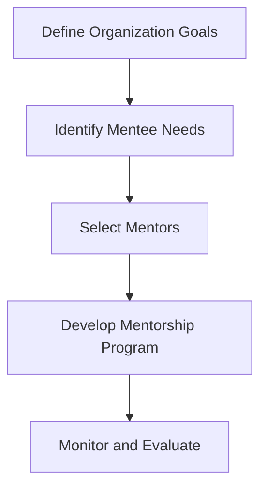
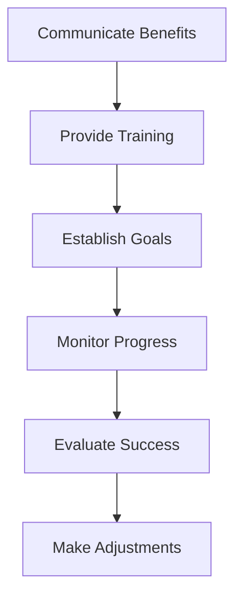

A high-performing mentorship framework is crucial for the growth and development of employees within an organization. It not only enhances their skills and knowledge but also boosts their confidence and job satisfaction. In this article, we will delve into the world of mentorship frameworks, exploring how to integrate them into existing workflows, and provide actionable strategies for leaders and managers to foster a culture of mentorship.

## Table of Contents
1. [Introduction to Mentorship Frameworks](#introduction-to-mentorship-frameworks)
2. [Benefits of Mentorship Frameworks](#benefits-of-mentorship-frameworks)
3. [Designing a High-Performing Mentorship Framework](#designing-a-high-performing-mentorship-framework)
4. [Integrating Mentorship Frameworks into Existing Workflows](#integrating-mentorship-frameworks-into-existing-workflows)
5. [Overcoming Challenges and Measuring Success](#overcoming-challenges-and-measuring-success)
6. [Visual Insights Gallery](#visual-insights-gallery)
7. [Summary and Conclusion](#summary-and-conclusion)
8. [FAQ](#faq)

## Introduction to Mentorship Frameworks
Mentorship frameworks are structured programs that pair experienced employees (mentors) with less experienced ones (mentees) to facilitate learning, growth, and development. These frameworks can be formal or informal, depending on the organization's size, culture, and goals. 

## Benefits of Mentorship Frameworks
The benefits of mentorship frameworks are numerous. They include improved job satisfaction, increased employee retention, enhanced skills and knowledge, and better career advancement opportunities. Mentorship frameworks also promote a culture of learning, innovation, and collaboration within the organization.

## Designing a High-Performing Mentorship Framework
Designing a high-performing mentorship framework requires careful consideration of several factors, including the organization's goals, the needs of the mentees, and the skills and expertise of the mentors. The framework should be tailored to the organization's unique culture and requirements.

## Integrating Mentorship Frameworks into Existing Workflows
Integrating mentorship frameworks into existing workflows requires a strategic approach. Leaders and managers should communicate the benefits of the framework to all stakeholders, provide training and support to mentors and mentees, and establish clear goals and expectations.

> **Tip:** Regular feedback and evaluation are crucial to the success of a mentorship framework. Leaders and managers should regularly assess the effectiveness of the framework and make adjustments as needed.

## Overcoming Challenges and Measuring Success
Despite the benefits of mentorship frameworks, there are several challenges that leaders and managers may face when implementing them. These challenges include resistance to change, lack of resources, and difficulty in measuring success. To overcome these challenges, leaders and managers should be flexible, adapt to changing circumstances, and use data and metrics to measure the effectiveness of the framework.

## Visual Insights Gallery
### Images showcasing the importance of mentorship frameworks

## Summary and Conclusion
In conclusion, integrating a high-performing mentorship framework into existing workflows is crucial for the growth and development of employees within an organization. By designing a tailored framework, communicating its benefits, providing training and support, and regularly evaluating its effectiveness, leaders and managers can foster a culture of mentorship that promotes learning, innovation, and collaboration.

## FAQ
1. **What is a mentorship framework?**
A mentorship framework is a structured program that pairs experienced employees with less experienced ones to facilitate learning, growth, and development.
2. **What are the benefits of mentorship frameworks?**
The benefits of mentorship frameworks include improved job satisfaction, increased employee retention, enhanced skills and knowledge, and better career advancement opportunities.
3. **How can leaders and managers overcome challenges when implementing mentorship frameworks?**
Leaders and managers can overcome challenges by being flexible, adapting to changing circumstances, and using data and metrics to measure the effectiveness of the framework.