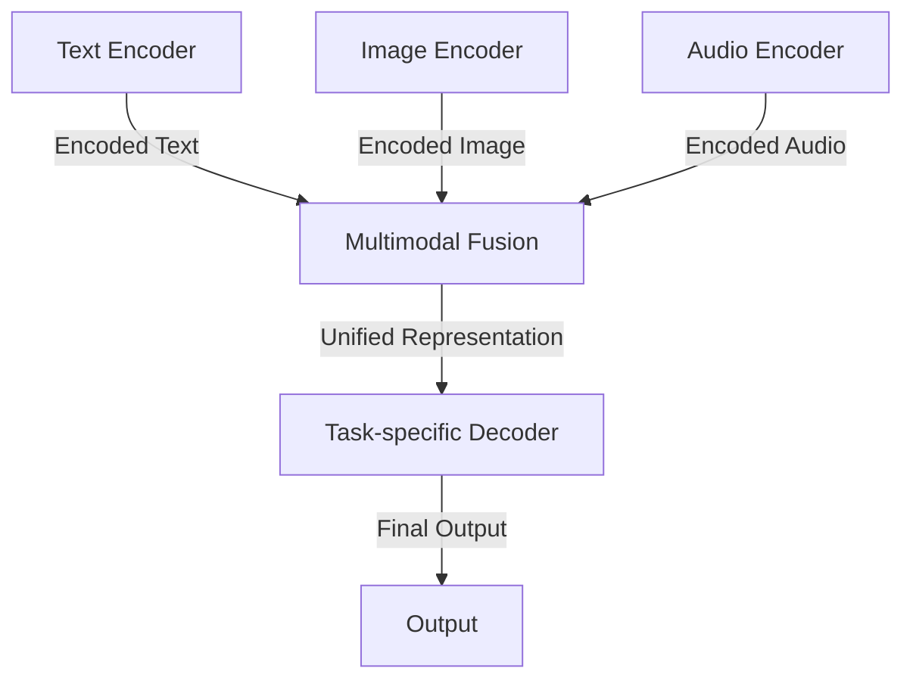
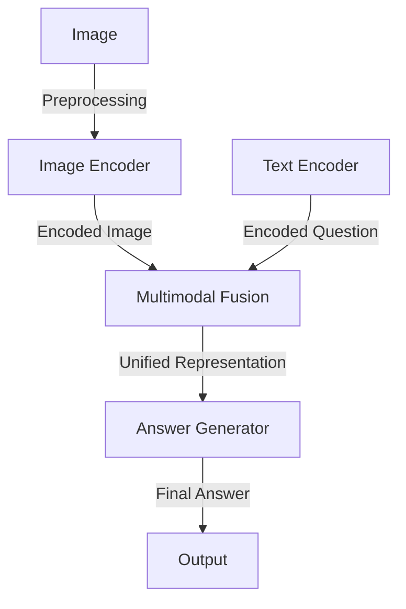

A comprehensive guide to seamlessly integrating multimodal neural architecture into your existing workflows, enhancing your AI and machine learning capabilities.

## Introduction to Multimodal Neural Architecture
Multimodal neural architecture has revolutionized the field of artificial intelligence by enabling models to process and generate multiple forms of data, such as text, images, and audio. This technology has numerous applications, including but not limited to, visual question answering, image captioning, and multimodal sentiment analysis.

## Understanding the Benefits of Multimodal Neural Architecture
The integration of multimodal neural architecture into existing workflows can bring about significant benefits, including:
* Enhanced model performance and accuracy
* Improved ability to handle diverse data types
* Increased efficiency in data processing and analysis
* Better decision-making capabilities

## Architecture Overview
The architecture of a multimodal neural network typically consists of multiple components, including:
* **Modal-specific encoders**: These are used to encode the input data from each modality (e.g., text, images, audio) into a common representation space.
* **Multimodal fusion module**: This module is responsible for combining the encoded representations from each modality to produce a unified representation.
* **Task-specific decoder**: This decoder takes the unified representation as input and generates the final output for the specific task at hand.

## Integrating Multimodal Neural Architecture into Existing Workflows
To integrate multimodal neural architecture into existing workflows, follow these steps:
1. **Assess your current workflow**: Identify the specific tasks and processes that can benefit from multimodal neural architecture.
2. **Prepare your data**: Collect and preprocess the necessary data for each modality.
3. **Choose a suitable architecture**: Select a pre-trained multimodal neural architecture or design your own based on your specific needs.
4. **Train and fine-tune the model**: Train the model on your dataset and fine-tune it as necessary to achieve optimal performance.
5. **Deploy the model**: Integrate the trained model into your existing workflow and deploy it in a production-ready environment.

## Example Use Case: Visual Question Answering
Visual question answering is a classic example of a task that can benefit from multimodal neural architecture. In this task, the model is given an image and a question about the image, and it must generate an answer based on the visual content.

## Overcoming Challenges and Limitations
When integrating multimodal neural architecture into existing workflows, you may encounter several challenges and limitations, including:
* **Data quality and availability**: Multimodal neural architecture requires large amounts of high-quality data for each modality.
* **Computational resources**: Training and deploying multimodal neural models can be computationally expensive.
* **Model interpretability**: Multimodal neural models can be complex and difficult to interpret.

> **Tip:** To overcome these challenges, consider using pre-trained models, data augmentation techniques, and model pruning methods to reduce computational costs and improve model interpretability.

## Visual Insights Gallery
## Visual Insights Gallery

## Summary and Conclusion
In conclusion, integrating multimodal neural architecture into existing workflows can bring about significant benefits, including enhanced model performance and accuracy, improved ability to handle diverse data types, and increased efficiency in data processing and analysis. By following the steps outlined in this guide and overcoming the challenges and limitations, you can successfully integrate multimodal neural architecture into your existing workflows and unlock the full potential of your AI and machine learning capabilities.

## FAQ
1. **What is multimodal neural architecture?**
Multimodal neural architecture refers to the use of neural networks that can process and generate multiple forms of data, such as text, images, and audio.
2. **What are the benefits of integrating multimodal neural architecture into existing workflows?**
The benefits include enhanced model performance and accuracy, improved ability to handle diverse data types, and increased efficiency in data processing and analysis.
3. **What are the challenges and limitations of integrating multimodal neural architecture into existing workflows?**
The challenges and limitations include data quality and availability, computational resources, and model interpretability.