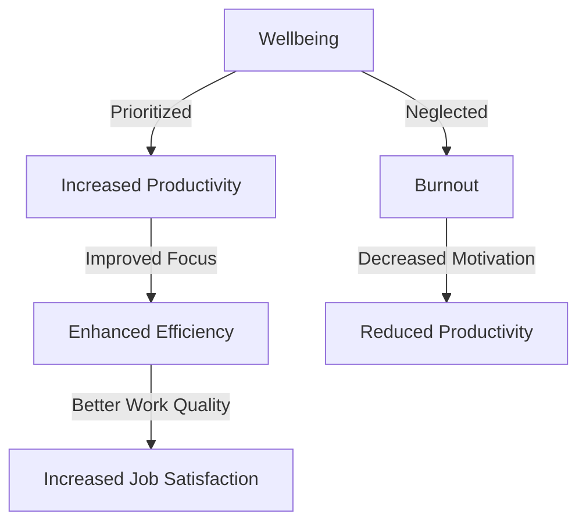
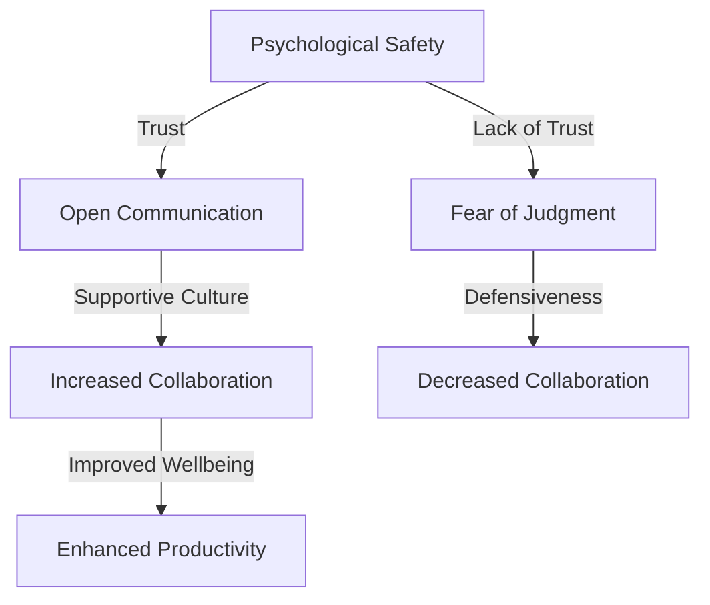

Integrating psychologically safe developer wellbeing into existing workflows is crucial for fostering a healthy and productive work environment. In this article, we will delve into the importance of developer wellbeing, its impact on productivity, and provide actionable strategies for seamlessly integrating wellbeing into your existing workflows.

## Table of Contents
1. [Introduction to Developer Wellbeing](#introduction-to-developer-wellbeing)
2. [The Impact of Developer Wellbeing on Productivity](#the-impact-of-developer-wellbeing-on-productivity)
3. [Strategies for Integrating Wellbeing into Existing Workflows](#strategies-for-integrating-wellbeing-into-existing-workflows)
4. [Creating a Psychologically Safe Work Environment](#creating-a-psychologically-safe-work-environment)
5. [Measuring the Success of Wellbeing Initiatives](#measuring-the-success-of-wellbeing-initiatives)

## Introduction to Developer Wellbeing

Developer wellbeing encompasses a range of factors that contribute to a developer's overall mental and physical health. This includes stress management, work-life balance, and access to resources that support their growth and development. By prioritizing developer wellbeing, organizations can reap numerous benefits, including improved productivity, increased job satisfaction, and reduced turnover rates.

## The Impact of Developer Wellbeing on Productivity

Research has shown that developers who prioritize their wellbeing are more productive, efficient, and effective in their work. Conversely, neglecting wellbeing can lead to burnout, decreased motivation, and a decline in overall performance. To illustrate the impact of wellbeing on productivity, consider the following Mermaid.js diagram:

As shown in the diagram, prioritizing wellbeing has a positive impact on productivity, while neglecting it can lead to negative consequences.

## Strategies for Integrating Wellbeing into Existing Workflows

To integrate wellbeing into existing workflows, consider the following strategies:
| Strategy | Description |
| --- | --- |
| Regular Check-Ins | Schedule regular one-on-one meetings with team members to discuss their wellbeing and provide support. |
| Flexible Work Arrangements | Offer flexible work arrangements, such as remote work or flexible hours, to promote work-life balance. |
| Access to Resources | Provide access to resources that support developer growth and development, such as training programs, mentorship, and mental health support. |
> **Tip:** Encourage team members to prioritize self-care by providing access to wellness programs, such as meditation or yoga classes.

## Creating a Psychologically Safe Work Environment

Creating a psychologically safe work environment is critical for promoting developer wellbeing. This involves fostering an open and supportive culture, where team members feel comfortable sharing their concerns and vulnerabilities. To illustrate the importance of psychological safety, consider the following Mermaid.js diagram:

As shown in the diagram, psychological safety is essential for promoting open communication, collaboration, and overall wellbeing.

## Measuring the Success of Wellbeing Initiatives

To measure the success of wellbeing initiatives, consider tracking metrics such as:
* Employee satisfaction and engagement
* Productivity and efficiency
* Turnover rates and retention
* Access to resources and support
> **Note:** Regularly survey team members to gather feedback and insights on the effectiveness of wellbeing initiatives.

## Visual Insights Gallery

## Summary/Conclusion
In conclusion, integrating psychologically safe developer wellbeing into existing workflows is crucial for promoting a healthy and productive work environment. By prioritizing wellbeing, organizations can reap numerous benefits, including improved productivity, increased job satisfaction, and reduced turnover rates. Remember to create a psychologically safe work environment, provide access to resources, and measure the success of wellbeing initiatives.

## FAQ
Q: What is developer wellbeing?
A: Developer wellbeing encompasses a range of factors that contribute to a developer's overall mental and physical health.
Q: Why is psychological safety important for developer wellbeing?
A: Psychological safety is essential for promoting open communication, collaboration, and overall wellbeing.
Q: How can I measure the success of wellbeing initiatives?
A: Consider tracking metrics such as employee satisfaction and engagement, productivity and efficiency, turnover rates and retention, and access to resources and support.