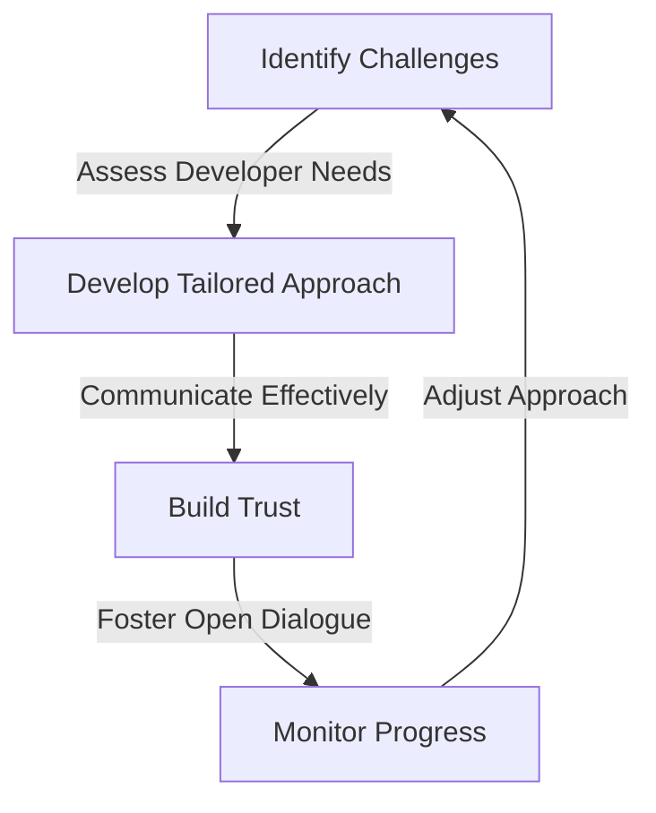
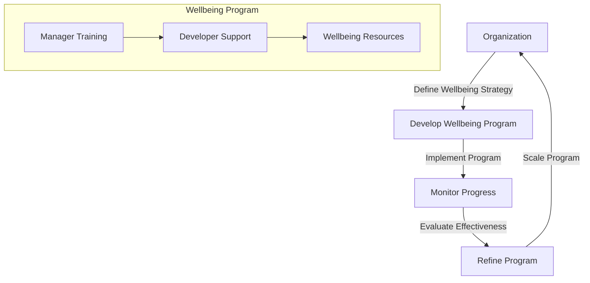

## Introduction to Advanced Strategies

In the first part of this series, we explored the importance of integrating psychologically safe developer wellbeing into existing workflows. In this article, we will delve deeper into advanced edge-cases and deeper architecture, including real-world case studies and new trends.

## Overcoming Common Challenges
One of the most significant challenges organizations face when implementing wellbeing initiatives is resistance from developers. This can be due to various reasons, including lack of awareness, fear of being perceived as vulnerable, or concerns about the impact on productivity. To overcome this challenge, organizations can use the following flowchart to develop a tailored approach:

By following this flowchart, organizations can develop a comprehensive approach that addresses the unique needs and concerns of their developers.

## Implementing Wellbeing Initiatives at Scale
Implementing wellbeing initiatives at scale requires a structured approach that takes into account the organization's size, culture, and existing workflows. The following diagram illustrates a possible architecture for implementing wellbeing initiatives at scale:

By using this architecture, organizations can develop a comprehensive wellbeing program that supports the unique needs of their developers.

## Real-World Case Studies
Several organizations have successfully implemented wellbeing initiatives that have resulted in significant improvements in developer wellbeing and productivity. For example,  and  demonstrate the effectiveness of tailored approaches to wellbeing.

## New Trends in Developer Wellbeing
The COVID-19 pandemic has accelerated the shift to remote work, highlighting the need for organizations to prioritize developer wellbeing in a virtual environment.  Some of the new trends in developer wellbeing include the use of virtual reality to reduce stress and improve focus, and the implementation of AI-powered mental health tools to support developers.

## Visual Insights Gallery
### Image 1: Developer Wellbeing

### Image 2: Productivity

### Image 3: Wellbeing Initiatives

## Conclusion
Integrating psychologically safe developer wellbeing into existing workflows is crucial for fostering a healthy and productive work environment. By using advanced strategies, overcoming common challenges, and implementing wellbeing initiatives at scale, organizations can support the unique needs of their developers and improve overall wellbeing and productivity.