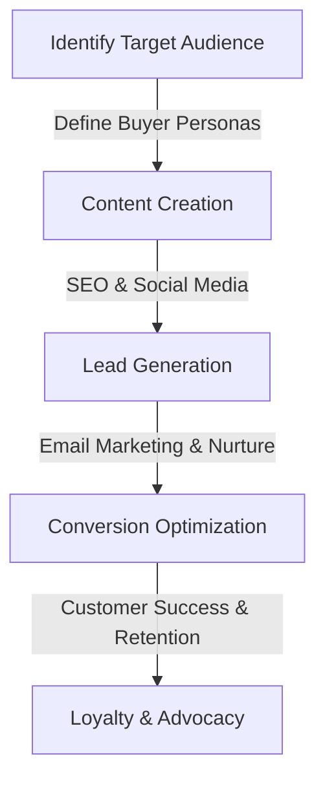
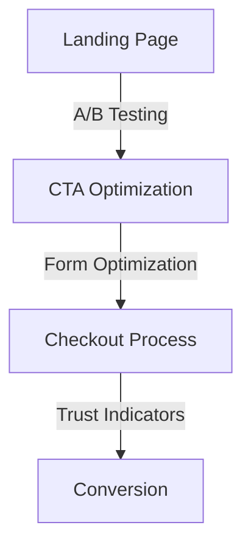

The modern SaaS landscape is highly competitive, with numerous solutions vying for the attention of potential customers. To stand out and drive growth, businesses must optimize their marketing strategies, ensuring that every step of the customer journey is meticulously crafted to convert leads into paying customers. Integrating a SaaS-focused marketing funnel into existing workflows is crucial for achieving this goal. In this article, we will delve into the intricacies of creating and integrating such a funnel, exploring real-world architectures, patterns, and strategies.

## Understanding the SaaS Marketing Funnel

The SaaS marketing funnel is a structured approach to guiding potential customers through the buying process, from initial awareness to conversion and retention. It typically consists of several stages: Awareness, Interest, Desire, Action (AIDA), and Retention. Each stage requires tailored marketing strategies to effectively move leads through the funnel.

## Architecting the Funnel for Integration

To integrate the SaaS marketing funnel into existing workflows, it's essential to architect the process around the customer journey. This involves identifying the target audience, creating relevant content, generating leads, optimizing for conversions, and focusing on customer success and retention.

## Implementing the Funnel: Strategies and Patterns
### Content Strategy
Content is the backbone of the SaaS marketing funnel. It should be informative, engaging, and tailored to each stage of the customer journey. Blog posts, whitepapers, webinars, and social media content are all effective tools for moving leads through the funnel.

### Lead Generation and Nurturing

Lead generation and nurturing are critical components of the SaaS marketing funnel. This involves using landing pages, email marketing campaigns, and lead scoring to identify and nurture leads until they are ready to convert.

### Conversion Rate Optimization (CRO)

CRO is the process of systematically improving the performance of the marketing funnel to increase conversions. This can involve A/B testing, CTA optimization, form optimization, and ensuring that trust indicators are present throughout the checkout process.

## Integrating with Existing Workflows
Integrating the SaaS marketing funnel with existing workflows requires careful planning and execution. This involves:
- **Automation**: Using marketing automation tools to streamline repetitive tasks and ensure consistency across the funnel.
- **Data Analysis**: Continuously analyzing data to understand the performance of the funnel and make data-driven decisions.
- **Team Collaboration**: Ensuring that all teams, from marketing to sales and customer success, are aligned and working towards the same goals.

## Visual Insights Gallery
## Visual Insights Gallery

## Summary/Conclusion
Integrating a SaaS-focused marketing funnel into existing workflows is a complex process that requires a deep understanding of the customer journey, marketing strategies, and technological integration. By architecting the funnel around the customer journey, implementing effective strategies and patterns, and ensuring seamless integration with existing workflows, businesses can significantly enhance their growth potential. Remember, the key to success lies in continuous optimization and improvement, driven by data analysis and customer insights.

## FAQ
- **Q: What is the primary goal of a SaaS marketing funnel?**
  A: The primary goal of a SaaS marketing funnel is to guide potential customers through the buying process, from awareness to conversion and retention.
- **Q: How do I measure the success of my SaaS marketing funnel?**
  A: The success of a SaaS marketing funnel can be measured by tracking key performance indicators (KPIs) such as conversion rates, customer acquisition costs, and customer lifetime value.
- **Q: What role does content play in the SaaS marketing funnel?**
  A: Content plays a crucial role in the SaaS marketing funnel, serving as the primary means of attracting, engaging, and retaining customers throughout their journey.