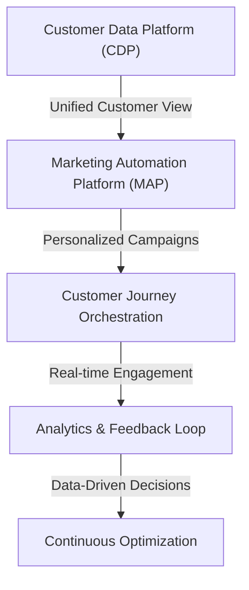
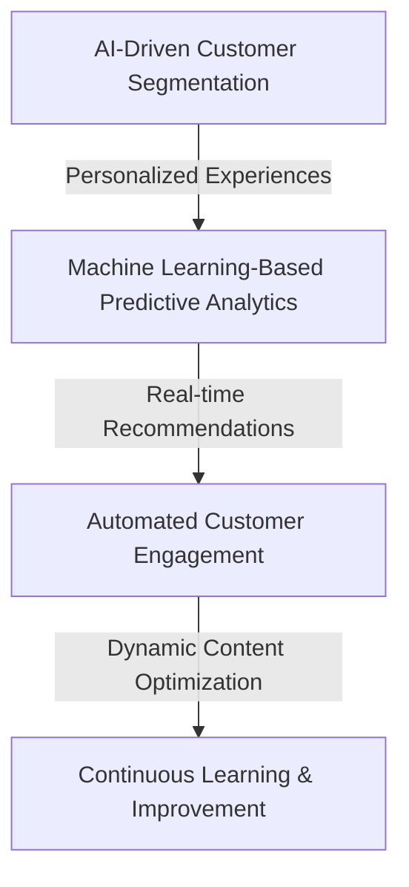

## Part 2: Advanced SaaS Marketing Funnel Integration - Edge Cases and Deep Dive Architecture

In the first part of this series, we explored the fundamentals of integrating a SaaS-focused marketing funnel into existing workflows. We discussed the importance of understanding the customer journey, architecting the funnel, and implementing strategies for each stage. However, as with any complex system, there are edge cases and deeper architectural considerations that require attention to ensure the funnel operates efficiently and effectively. This article delves into these advanced topics, providing insights and strategies for overcoming common challenges and optimizing the SaaS marketing funnel.

## Handling Edge Cases in the Funnel
Edge cases refer to unusual or exceptional situations that can occur within the marketing funnel, potentially disrupting the customer journey. These might include scenarios such as:
- **Abandoned carts**: Customers who add products to their cart but fail to complete the purchase.
- **Free trial conversions**: Users who sign up for a free trial but do not convert to paying customers.
- **Customer churn**: Paying customers who stop using the service or cancel their subscription.

To manage these edge cases, marketers must develop targeted strategies. For instance, implementing retargeting ads for abandoned carts, offering personalized promotions for free trial users, and enhancing customer support for at-risk customers can significantly improve conversion rates and reduce churn.

## Deep Dive into Funnel Architecture

A deeper dive into the architecture of the SaaS marketing funnel reveals the importance of technology and data in facilitating the customer journey. Key components include:
- **Customer Data Platform (CDP)**: Unifies customer data from various sources, providing a single, comprehensive view of each customer.
- **Marketing Automation Platform (MAP)**: Automates and personalizes marketing campaigns based on customer data and behaviors.
- **Customer Journey Orchestration**: Manages the customer journey across multiple touchpoints and channels.
- **Analytics & Feedback Loop**: Provides insights into customer behavior and campaign effectiveness, enabling data-driven decisions.
- **Continuous Optimization**: Enables the ongoing refinement of the marketing funnel based on performance data and customer feedback.

## Advanced Metrics for Funnel Optimization

To optimize the SaaS marketing funnel effectively, it's crucial to track and analyze advanced metrics that provide insights into customer behavior and funnel performance. These metrics include:
- **Customer Acquisition Cost (CAC)**: The cost of acquiring a new customer.
- **Customer Lifetime Value (CLV)**: The total value a customer is expected to bring to the business over their lifetime.
- **Conversion Rate**: The percentage of customers who complete a desired action.
- **Retention Rate**: The percentage of customers who continue to use the service over time.

## Leveraging AI and Machine Learning in the Funnel

The integration of Artificial Intelligence (AI) and Machine Learning (ML) into the SaaS marketing funnel can significantly enhance its efficiency and effectiveness. AI can be used for customer segmentation, predictive analytics, and real-time recommendations, while ML can drive automated customer engagement, dynamic content optimization, and continuous learning and improvement.

## Visual Insights Gallery
## Visual Insights Gallery
The following images provide additional insights into advanced SaaS marketing funnel integration:
- 
- 
- 