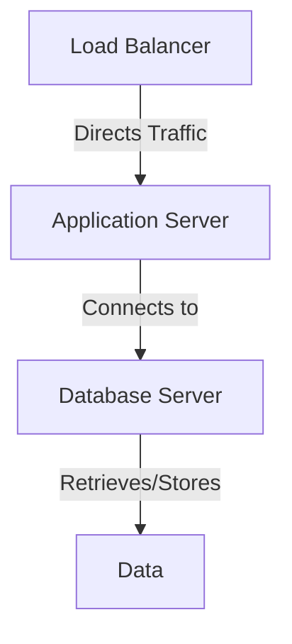
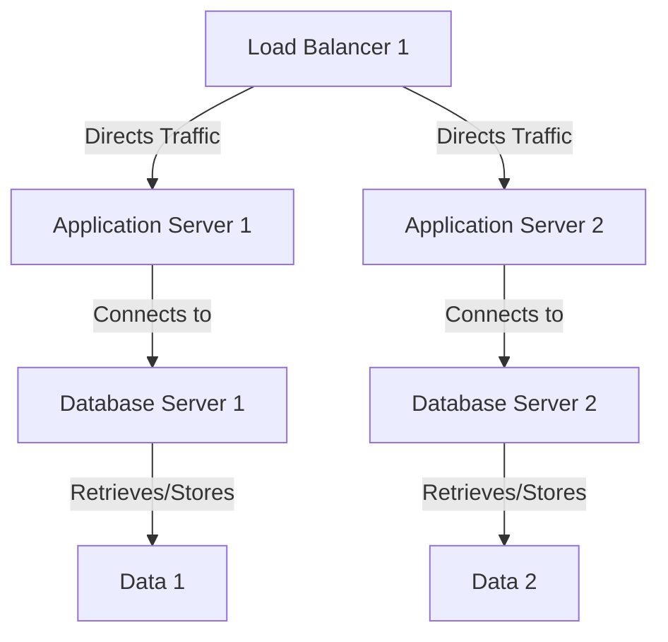

A scalable database shard is crucial for handling large volumes of data and high traffic in modern applications. This article provides a comprehensive guide on how to integrate scalable database shards into existing workflows, ensuring a seamless and efficient data management system.

## Table of Contents
1. [Introduction to Database Sharding](#introduction-to-database-sharding)
2. [Benefits of Database Sharding](#benefits-of-database-sharding)
3. [Architecture for Scalable Database Sharding](#architecture-for-scalable-database-sharding)
4. [Implementing Database Sharding in Existing Workflows](#implementing-database-sharding-in-existing-workflows)
5. [Best Practices for Database Sharding](#best-practices-for-database-sharding)
6. [Visual Insights Gallery](#visual-insights-gallery)
7. [Summary and Conclusion](#summary-and-conclusion)
8. [FAQ](#faq)

## Introduction to Database Sharding
Database sharding is a technique used to distribute large amounts of data across multiple servers, making it easier to manage and scale. This approach allows for horizontal partitioning of data, where each shard contains a subset of the overall data.

## Benefits of Database Sharding
The benefits of database sharding include improved scalability, increased performance, and enhanced data management. By distributing data across multiple servers, database sharding enables applications to handle large volumes of data and high traffic, making it an essential technique for modern applications.

## Architecture for Scalable Database Sharding
The architecture for scalable database sharding typically involves a combination of load balancers, application servers, and database servers. The load balancer directs incoming traffic to the application servers, which then connect to the database servers to retrieve or store data.

A more complex architecture may involve multiple load balancers, application servers, and database servers, as shown below:

> **Note:** The architecture for scalable database sharding may vary depending on the specific requirements of the application.

## Implementing Database Sharding in Existing Workflows
Implementing database sharding in existing workflows involves several steps, including:
* Identifying the data to be sharded
* Determining the sharding strategy
* Configuring the load balancers and application servers
* Creating the database shards
* Migrating the data to the shards
> **Tip:** It is essential to carefully plan and execute the implementation of database sharding to minimize downtime and ensure a seamless transition.

## Best Practices for Database Sharding
Best practices for database sharding include:
| Best Practice | Description |
| --- | --- |
| Monitor Performance | Monitor the performance of the database shards to ensure they are operating efficiently. |
| Optimize Queries | Optimize queries to minimize the number of database calls and improve performance. |
| Use Indexing | Use indexing to improve query performance and reduce the load on the database shards. |
> **Warning:** Failing to monitor performance, optimize queries, and use indexing can lead to decreased performance and increased latency.

## Visual Insights Gallery
## Visual Insights Gallery

## Summary and Conclusion
In conclusion, integrating scalable database shards into existing workflows is a complex process that requires careful planning and execution. By following the best practices outlined in this article and using the right architecture, applications can handle large volumes of data and high traffic, making them more efficient and scalable.

## FAQ
Q: What is database sharding?
A: Database sharding is a technique used to distribute large amounts of data across multiple servers, making it easier to manage and scale.
Q: What are the benefits of database sharding?
A: The benefits of database sharding include improved scalability, increased performance, and enhanced data management.
Q: How do I implement database sharding in existing workflows?
A: Implementing database sharding in existing workflows involves several steps, including identifying the data to be sharded, determining the sharding strategy, configuring the load balancers and application servers, creating the database shards, and migrating the data to the shards.