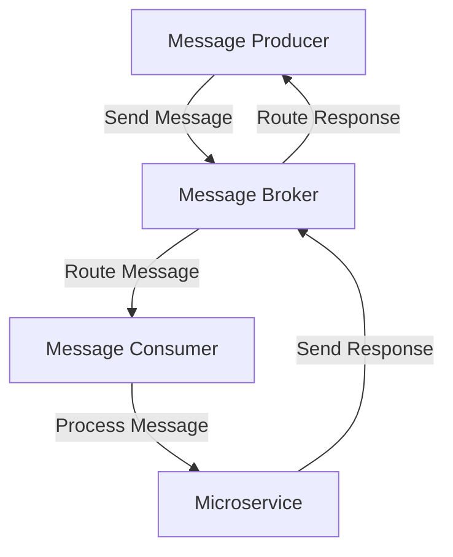

A scalable message broker is a critical component in modern software architecture, enabling efficient and reliable communication between microservices. In this article, we will explore the benefits of integrating a scalable message broker into existing workflows and provide a step-by-step guide on how to do it.

## Introduction to Message Brokers
Message brokers are specialized software systems that enable message passing between different components of a distributed system. They provide a centralized hub for message exchange, allowing microservices to communicate with each other asynchronously. 


## Benefits of Scalable Message Brokers
Scalable message brokers offer several benefits, including:
* **Decoupling**: Microservices can operate independently, without being tightly coupled to each other.
* **Fault Tolerance**: If one microservice fails, the message broker can buffer messages until the service is available again.
* **Scalability**: Message brokers can handle high volumes of messages, making them ideal for large-scale distributed systems.
* **Flexibility**: Message brokers support multiple messaging patterns, such as pub-sub, request-response, and message queuing.

## Choosing a Scalable Message Broker
When selecting a scalable message broker, consider the following factors:
* **Performance**: Look for a message broker that can handle high message throughput and low latency.
* **Scalability**: Choose a message broker that can scale horizontally to handle increasing message volumes.
* **Reliability**: Select a message broker that provides high availability and fault tolerance features.
* **Security**: Ensure the message broker supports encryption, authentication, and authorization.

```markdown
| Message Broker | Performance | Scalability | Reliability | Security |
| --- | --- | --- | --- | --- |
| Apache Kafka | High | High | High | High |
| RabbitMQ | High | Medium | High | High |
| Amazon SQS | High | High | High | High |
```

## Integrating a Scalable Message Broker into Existing Workflows
To integrate a scalable message broker into existing workflows, follow these steps:
1. **Identify Messaging Patterns**: Determine the messaging patterns required by your microservices, such as pub-sub or request-response.
2. **Choose a Message Broker**: Select a scalable message broker that meets your performance, scalability, reliability, and security requirements.
3. **Design Message Formats**: Define the format of messages exchanged between microservices, including payload, headers, and metadata.
4. **Implement Message Producers**: Develop message producers that send messages to the message broker.
5. **Implement Message Consumers**: Develop message consumers that receive messages from the message broker.



## Handling Message Failures and Retries
To handle message failures and retries, consider the following strategies:
* **Exponential Backoff**: Implement exponential backoff to retry failed messages with increasing delays.
* **Dead Letter Queues**: Use dead letter queues to store messages that cannot be processed by the message consumer.
* **Message Acknowledgment**: Implement message acknowledgment to ensure that messages are processed successfully by the message consumer.

```mermaid
flowchart TD
    id["Message Producer"] -->|Send Message| mb["Message Broker"]
    mb -->|Route Message| id2["Message Consumer"]
    id2 -->|Process Message| id3["Microservice"]
    id2 -.->>|Failed|> dlq["Dead Letter Queue"]
    id3 -.->>|Failed|> id2
    id2 -->|Retry Message| mb
```

## Visual Insights Gallery
## Visual Insights Gallery


## Summary and Conclusion
In this article, we explored the benefits of integrating a scalable message broker into existing workflows and provided a step-by-step guide on how to do it. By choosing the right message broker and implementing messaging patterns, message formats, and message producers and consumers, you can build a scalable and reliable distributed system.

## FAQ
* **What is a message broker?**: A message broker is a software system that enables message passing between different components of a distributed system.
* **What are the benefits of scalable message brokers?**: Scalable message brokers offer decoupling, fault tolerance, scalability, and flexibility benefits.
* **How do I choose a scalable message broker?**: Consider performance, scalability, reliability, and security factors when selecting a scalable message broker.