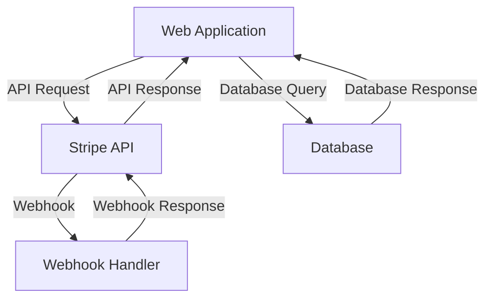

Stripe is a powerful online payment processing system that provides a robust set of tools for managing payments, subscriptions, and other financial transactions. Integrating Stripe into existing workflows can be a complex process, requiring careful consideration of security, compliance, and technical requirements. In this article, we will explore the key steps and best practices for integrating secure Stripe integration into existing workflows.

## Introduction to Stripe Integration

Stripe provides a range of APIs and libraries for integrating payment processing into web and mobile applications. To integrate Stripe into an existing workflow, developers must first create a Stripe account and obtain an API key. This key is used to authenticate requests to the Stripe API and authorize transactions.

### Stripe API Overview
The Stripe API provides a range of endpoints for managing payments, customers, and subscriptions. The API is organized into several categories, including:
* **Payments**: Create, retrieve, and update payments
* **Customers**: Create, retrieve, and update customer information
* **Subscriptions**: Create, retrieve, and update subscription plans
* **Webhooks**: Receive notifications for events such as payment successes and failures

## Security Considerations for Stripe Integration

Security is a critical consideration when integrating Stripe into an existing workflow. Stripe provides several security features, including:
* **Encryption**: Stripe encrypts all payment information, including credit card numbers and expiration dates
* **Tokenization**: Stripe provides a tokenization system for securely storing payment information
* **PCI Compliance**: Stripe is PCI Level 1 compliant, ensuring that all payment processing meets the highest security standards

### Security Best Practices
To ensure the security of Stripe integration, developers should follow several best practices, including:
* **Use HTTPS**: Always use HTTPS when communicating with the Stripe API
* **Validate User Input**: Validate all user input to prevent SQL injection and cross-site scripting (XSS) attacks
* **Use Secure Tokenization**: Use Stripe's tokenization system to securely store payment information

```markdown
### Example: Secure Tokenization with Stripe
```javascript
// Import the Stripe library
const stripe = require('stripe')('YOUR_API_KEY');

// Create a payment method
const paymentMethod = await stripe.paymentMethods.create({
  type: 'card',
  card: {
    number: '4242424242424242',
    exp_month: 12,
    exp_year: 2025,
    cvc: '123',
  },
});

// Create a payment intent
const paymentIntent = await stripe.paymentIntents.create({
  amount: 1000,
  currency: 'usd',
  payment_method_types: ['card'],
});

// Confirm the payment intent
const confirmation = await stripe.paymentIntents.confirm(
  paymentIntent.id,
  { payment_method: paymentMethod.id }
);
```

## Architectural Overview of Stripe Integration

The architecture of Stripe integration typically involves several components, including:
* **Web Application**: The web application that integrates with Stripe
* **Stripe API**: The Stripe API that provides payment processing and other financial services
* **Database**: The database that stores customer and payment information

### Mermaid.js Diagram: Stripe Integration Architecture


## Compliance Considerations for Stripe Integration

Compliance is a critical consideration when integrating Stripe into an existing workflow. Stripe provides several compliance features, including:
* **PCI Compliance**: Stripe is PCI Level 1 compliant, ensuring that all payment processing meets the highest security standards
* **GDPR Compliance**: Stripe is GDPR compliant, ensuring that all customer data is handled in accordance with EU regulations

### Compliance Best Practices
To ensure compliance with Stripe integration, developers should follow several best practices, including:
* **Use Stripe's Compliance Features**: Use Stripe's compliance features, such as PCI compliance and GDPR compliance
* **Validate User Input**: Validate all user input to prevent SQL injection and cross-site scripting (XSS) attacks
* **Use Secure Tokenization**: Use Stripe's tokenization system to securely store payment information

## Visual Insights Gallery
## Visual Insights Gallery


## Summary and Conclusion
Integrating secure Stripe integration into existing workflows requires careful consideration of security, compliance, and technical requirements. By following best practices and using Stripe's compliance features, developers can ensure the security and compliance of their payment processing systems.

## FAQ
* **Q: What is Stripe integration?**
A: Stripe integration is the process of integrating Stripe's payment processing and other financial services into an existing workflow.
* **Q: What are the security considerations for Stripe integration?**
A: Security considerations for Stripe integration include encryption, tokenization, and PCI compliance.
* **Q: What are the compliance considerations for Stripe integration?**
A: Compliance considerations for Stripe integration include PCI compliance and GDPR compliance.
* **Q: How do I integrate Stripe into my web application?**
A: To integrate Stripe into your web application, you will need to create a Stripe account, obtain an API key, and use the Stripe API to authenticate requests and authorize transactions.