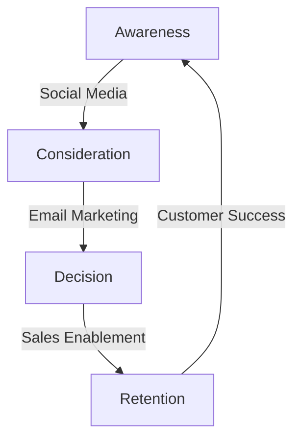
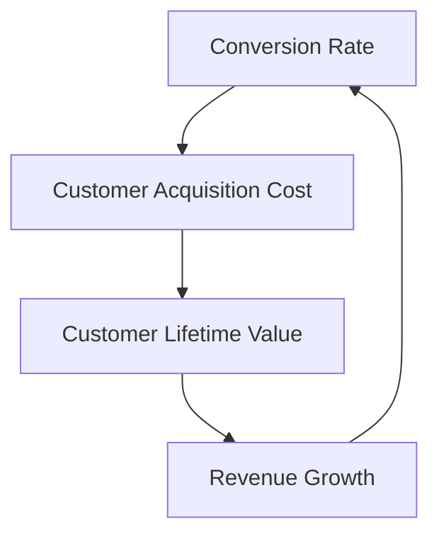

A well-designed marketing funnel is crucial for businesses to convert leads into customers and drive revenue growth. In this article, we will explore how to integrate a strategic marketing funnel into existing workflows, providing a comprehensive framework for marketers to optimize their marketing strategies.

## Introduction to Marketing Funnel
The marketing funnel is a model that describes the customer journey from initial awareness to conversion. It typically consists of four stages: awareness, consideration, decision, and retention. 


To create an effective marketing funnel, businesses need to understand their target audience, define their unique value proposition, and develop a content strategy that resonates with their audience.

## Understanding the Customer Journey
The customer journey is a critical component of the marketing funnel. It involves understanding the customer's needs, preferences, and pain points at each stage of the funnel. 
```markdown
| Stage | Customer Needs | Marketing Strategies |
| --- | --- | --- |
| Awareness | Education, Awareness | Content Marketing, Social Media |
| Consideration | Evaluation, Comparison | Email Marketing, Case Studies |
| Decision | Purchase, Conversion | Sales Enablement, Special Offers |
| Retention | Support, Loyalty | Customer Success, Referral Programs |
```
By understanding the customer journey, businesses can develop targeted marketing strategies that address the customer's needs and preferences at each stage of the funnel.

## Integrating Marketing Funnel into Existing Workflows
To integrate the marketing funnel into existing workflows, businesses need to identify the key touchpoints and interactions with their customers. This can be achieved by mapping the customer journey and identifying the key stages and milestones. 

By integrating the marketing funnel into existing workflows, businesses can create a seamless customer experience that drives conversion and revenue growth.

## Measuring and Optimizing the Marketing Funnel
To measure and optimize the marketing funnel, businesses need to track key performance indicators (KPIs) such as conversion rates, customer acquisition costs, and customer lifetime value. 

By tracking these KPIs, businesses can identify areas for improvement and optimize their marketing strategies to drive better results.

## Best Practices for Implementing a Marketing Funnel
To implement a marketing funnel effectively, businesses should follow best practices such as:
* Developing a unique value proposition that resonates with their target audience
* Creating a content strategy that addresses the customer's needs and preferences at each stage of the funnel
* Using data and analytics to track and optimize the marketing funnel
* Continuously testing and refining the marketing funnel to drive better results

> **Tip:** Use A/B testing to experiment with different marketing strategies and identify what works best for your business.

> **Warning:** Failing to track and optimize the marketing funnel can result in poor conversion rates and revenue growth.

## Visual Insights Gallery
## Visual Insights Gallery


## Summary and Conclusion
In conclusion, integrating a strategic marketing funnel into existing workflows is crucial for businesses to drive conversion and revenue growth. By understanding the customer journey, developing targeted marketing strategies, and tracking key performance indicators, businesses can create a seamless customer experience that drives better results. Remember to continuously test and refine the marketing funnel to drive better results and stay ahead of the competition.

## FAQ
Q: What is a marketing funnel?
A: A marketing funnel is a model that describes the customer journey from initial awareness to conversion.
Q: How do I integrate a marketing funnel into my existing workflow?
A: To integrate a marketing funnel into your existing workflow, identify the key touchpoints and interactions with your customers and develop targeted marketing strategies that address the customer's needs and preferences at each stage of the funnel.
Q: What are the key performance indicators (KPIs) to track when measuring and optimizing the marketing funnel?
A: The key performance indicators (KPIs) to track when measuring and optimizing the marketing funnel include conversion rates, customer acquisition costs, and customer lifetime value.