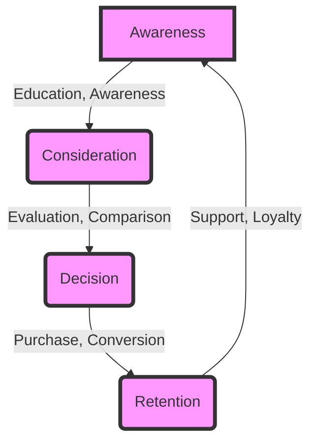

## Part 2: Advanced Marketing Funnel Optimization Techniques
In our previous article, we explored the fundamentals of integrating a strategic marketing funnel into existing workflows. In this follow-up article, we will delve deeper into advanced techniques for optimizing the marketing funnel, including edge cases and deeper architecture.

## Advanced Customer Journey Mapping
To further optimize the marketing funnel, businesses need to create advanced customer journey maps that take into account the complexities of the customer's decision-making process. This involves identifying key touchpoints, pain points, and moments of truth that can make or break the customer's experience. 


By using tools like customer journey mapping software, businesses can create visual representations of the customer's journey and identify areas for improvement.

## Edge Cases in Marketing Funnel Optimization
There are several edge cases that businesses need to consider when optimizing their marketing funnel. These include:
* Handling multiple customer personas and journeys
* Managing complex sales cycles with multiple stakeholders
* Optimizing for mobile and offline channels
* Integrating with existing CRM and sales systems

To address these edge cases, businesses need to develop flexible and adaptable marketing funnel architectures that can accommodate different customer segments and sales cycles. 
```markdown
| Edge Case | Description | Solution |
| --- | --- | --- |
| Multiple Personas | Different customer segments with unique needs and preferences | Develop persona-based marketing funnels |
| Complex Sales Cycles | Multiple stakeholders and decision-makers involved in the sales process | Implement account-based marketing and sales enablement strategies |
| Mobile and Offline Channels | Customers interacting with the brand through multiple channels | Develop omnichannel marketing strategies and integrate with offline channels |
| CRM and Sales System Integration | Integrating marketing funnel with existing CRM and sales systems | Use APIs and data integration tools to connect marketing funnel with CRM and sales systems |
```

## Deeper Architecture: Using Mermaid.js to Visualize Marketing Funnel
To better understand the architecture of the marketing funnel, we can use Mermaid.js to create a visual representation of the funnel. 

This visual representation can help businesses identify areas for improvement and optimize their marketing funnel for better performance.

## Real-World Case Studies
Several businesses have successfully optimized their marketing funnels using advanced techniques and tools. For example, a leading e-commerce company used customer journey mapping to identify key touchpoints and improve their mobile user experience, resulting in a 25% increase in conversions. 


Another company used account-based marketing and sales enablement strategies to optimize their complex sales cycles, resulting in a 30% increase in revenue.

## Conclusion
In conclusion, optimizing the marketing funnel requires advanced techniques and tools, including customer journey mapping, edge case analysis, and deeper architecture. By using these techniques and tools, businesses can create flexible and adaptable marketing funnel architectures that drive revenue growth and customer satisfaction.

## Visual Insights Gallery
* [Customer Journey Mapping](https://picsum.photos/seed/customer-journey-mapping/800/400)
* [Marketing Funnel Optimization](https://picsum.photos/seed/marketing-funnel-optimization/800/400)
* [Account-Based Marketing](https://picsum.photos/seed/account-based-marketing/800/400)
* [Sales Enablement Strategies](https://picsum.photos/seed/sales-enablement-strategies/800/400)
* [Omnichannel Marketing](https://picsum.photos/seed/omnichannel-marketing/800/400)