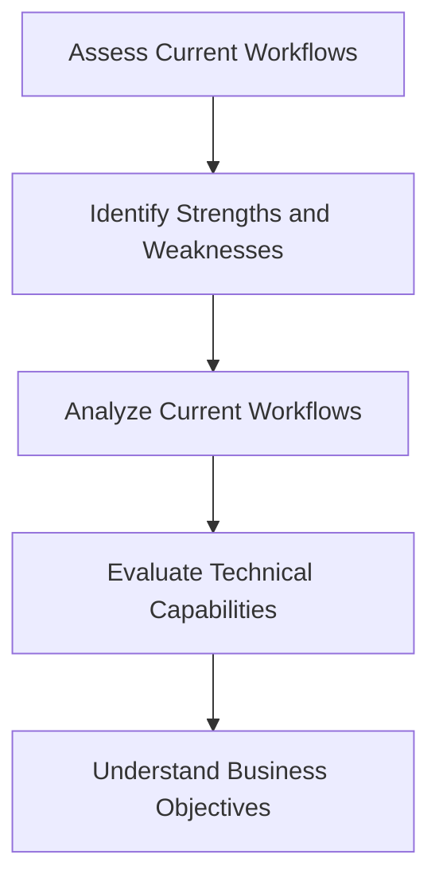
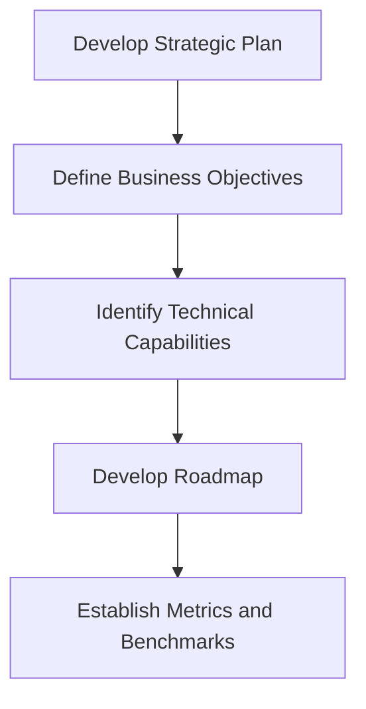

In today's fast-paced technological landscape, integrating strategic technical leadership into existing workflows is crucial for driving innovation, improving efficiency, and scaling businesses. As organizations grow and evolve, they must adapt their leadership strategies to stay competitive. In this article, we will explore the importance of strategic technical leadership and provide a step-by-step guide on how to integrate it into existing workflows.

## Table of Contents
1. [Introduction to Strategic Technical Leadership](#introduction-to-strategic-technical-leadership)
2. [Benefits of Strategic Technical Leadership](#benefits-of-strategic-technical-leadership)
3. [Assessing Current Workflows](#assessing-current-workflows)
4. [Developing a Strategic Technical Leadership Plan](#developing-a-strategic-technical-leadership-plan)
5. [Implementing Strategic Technical Leadership](#implementing-strategic-technical-leadership)
6. [Visual Insights Gallery](#visual-insights-gallery)
7. [Summary and Conclusion](#summary-and-conclusion)
8. [FAQ](#faq)

## Introduction to Strategic Technical Leadership
Strategic technical leadership is the process of aligning technical capabilities with business objectives to drive growth, innovation, and competitiveness. It involves leveraging technical expertise to inform business decisions, drive strategic initiatives, and foster a culture of innovation. 


> **Note:** Strategic technical leadership is not just about technical expertise; it's about understanding the business and using technical capabilities to drive strategic outcomes.

## Benefits of Strategic Technical Leadership
The benefits of strategic technical leadership are numerous. Some of the key benefits include:
* Improved innovation and competitiveness
* Enhanced technical capabilities and expertise
* Better alignment between technical and business objectives
* Increased efficiency and productivity
* Improved decision-making and problem-solving
```markdown
| Benefits | Description |
| --- | --- |
| Innovation and Competitiveness | Drive growth and stay ahead of the competition |
| Technical Capabilities | Develop and leverage technical expertise |
| Alignment | Align technical and business objectives |
| Efficiency and Productivity | Improve processes and workflows |
| Decision-Making | Inform business decisions with technical expertise |
```


## Assessing Current Workflows
Before integrating strategic technical leadership into existing workflows, it's essential to assess the current state of the organization. This involves:
* Identifying strengths and weaknesses
* Analyzing current workflows and processes
* Evaluating technical capabilities and expertise
* Understanding business objectives and goals



## Developing a Strategic Technical Leadership Plan
Developing a strategic technical leadership plan involves:
* Defining business objectives and goals
* Identifying technical capabilities and expertise needed to achieve objectives
* Developing a roadmap for integrating strategic technical leadership
* Establishing metrics and benchmarks for success



## Implementing Strategic Technical Leadership
Implementing strategic technical leadership involves:
* Integrating technical expertise into business decision-making
* Developing and leveraging technical capabilities
* Fostering a culture of innovation and experimentation
* Continuously monitoring and evaluating progress
> **Tip:** Start small and scale up. Begin with a pilot project or a small team to test and refine your approach.

## Visual Insights Gallery
Here are some visual insights to help illustrate the concepts:


## Summary and Conclusion
Integrating strategic technical leadership into existing workflows is crucial for driving innovation, improving efficiency, and scaling businesses. By assessing current workflows, developing a strategic technical leadership plan, and implementing strategic technical leadership, organizations can leverage technical capabilities to drive business outcomes. Remember to start small, scale up, and continuously monitor and evaluate progress.

## FAQ
Q: What is strategic technical leadership?
A: Strategic technical leadership is the process of aligning technical capabilities with business objectives to drive growth, innovation, and competitiveness.
Q: How do I assess current workflows?
A: Assess current workflows by identifying strengths and weaknesses, analyzing current workflows and processes, evaluating technical capabilities and expertise, and understanding business objectives and goals.
Q: What are the benefits of strategic technical leadership?
A: The benefits of strategic technical leadership include improved innovation and competitiveness, enhanced technical capabilities and expertise, better alignment between technical and business objectives, increased efficiency and productivity, and improved decision-making and problem-solving.