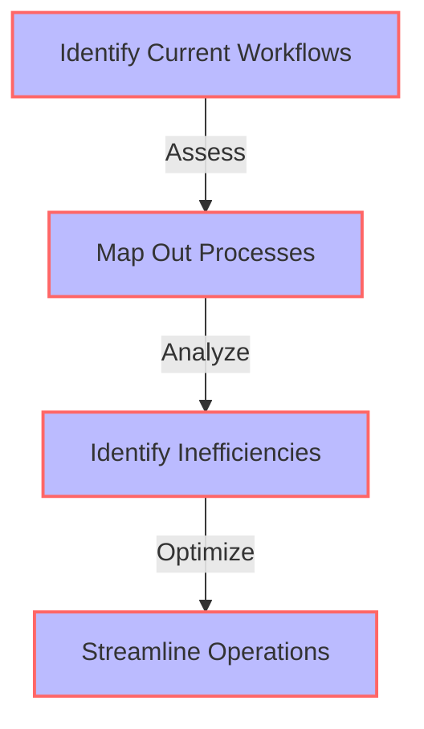

As a founder, navigating the complexities of startup growth while maintaining a clear vision for your company's future can be daunting. The value-driven founder roadmap is a strategic tool designed to help entrepreneurs align their daily operations with long-term objectives, ensuring that every step taken contributes to the overall mission. In this article, we'll explore how to seamlessly integrate this roadmap into your existing workflows, enhancing your startup's trajectory towards success.

## Table of Contents
1. [Understanding the Value-driven Founder Roadmap](#understanding-the-value-driven-founder-roadmap)
2. [Assessing Current Workflows](#assessing-current-workflows)
3. [Integration Strategies](#integration-strategies)
4. [Implementing Change](#implementing-change)
5. [Monitoring Progress](#monitoring-progress)

## Understanding the Value-driven Founder Roadmap
The value-driven founder roadmap is a bespoke plan that outlines how a startup intends to achieve its mission and vision. It's a dynamic document that evolves with the company, ensuring that every resource allocation, product development, and customer engagement strategy aligns with the founder's core values and long-term goals.


## Assessing Current Workflows
Before integrating the value-driven founder roadmap, it's crucial to assess your current workflows. This involves mapping out all existing processes, from product development and marketing to sales and customer support. Understanding how different departments interact and where inefficiencies lie is key to successful integration.



## Integration Strategies
Integration of the value-driven founder roadmap into existing workflows requires a strategic approach. This involves:
- **Aligning Team Goals:** Ensuring that every team member understands how their tasks contribute to the overall mission.
- **Prioritizing Value-driven Initiatives:** Focusing on projects and tasks that directly align with the founder's roadmap.
- **Adopting Agile Methodologies:** Implementing flexible workflows that can quickly adapt to changes in the market or the company's strategy.

> **Tip:** Regular town hall meetings and departmental workshops can help in aligning team goals and fostering a culture of transparency and collaboration.

## Implementing Change
Implementing the value-driven founder roadmap is not a one-time task but an ongoing process. It requires continuous monitoring of workflows, feedback from stakeholders, and the ability to pivot when necessary. The use of project management tools and regular check-ins can facilitate this process.

```mermaid
flowchart TD
    A["Define Roadmap"] -->|Implement| B["Monitor Progress"]
    B -->|Feedback| C["Adjust Strategies"]
    C -->|Pivot| D["Realign Workflows"]
    A["Define Roadmap"] -.->>|Continuous|> D["Realign Workflows"]
    style A fill:#f9f,stroke:#333,stroke-width:2px
    style B fill:#f9f,stroke:#333,stroke-width:2px
    style C fill:#f9f,stroke:#333,stroke-width:2px
    style D fill:#f9f,stroke:#333,stroke-width:2px
```

## Monitoring Progress
Monitoring progress against the value-driven founder roadmap involves setting clear, measurable goals and using data analytics to track performance. Regular review sessions with the team and stakeholders can help in identifying areas of improvement and making informed decisions.

| **Metric** | **Target** | **Current Status** | **Action Plan** |
|-----------|------------|--------------------|-----------------|
| Revenue Growth | 20% YoY | 15% YoY | Enhance Marketing Efforts |
| Customer Satisfaction | 90% | 85% | Improve Support Channels |
| Product Development | Launch 2 New Features | 1 New Feature Launched | Accelerate Development Cycle |

> **Warning:** Overemphasis on metrics can lead to tunnel vision. Ensure that qualitative factors, such as team morale and customer feedback, are also considered.

## Visual Insights Gallery


## Summary/Conclusion
Integrating a value-driven founder roadmap into existing workflows is a strategic move that can significantly enhance a startup's growth trajectory. By understanding the roadmap, assessing current workflows, implementing change, and continuously monitoring progress, founders can ensure that every step their company takes aligns with its mission and vision. This approach not only fosters a culture of purpose and efficiency but also positions the startup for long-term success.

## FAQ Section
- **Q: What is a value-driven founder roadmap?**
  - A: A bespoke plan outlining how a startup achieves its mission and vision.
- **Q: Why is it important to align team goals with the founder's roadmap?**
  - A: To ensure every team member understands their contribution to the company's mission.
- **Q: How often should progress against the roadmap be monitored?**
  - A: Regularly, with the frequency depending on the company's size and stage of growth.