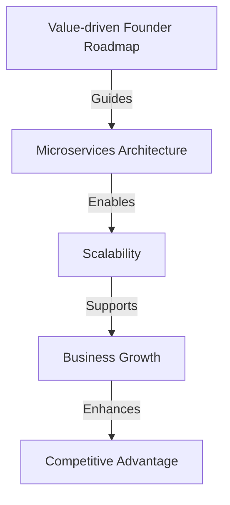
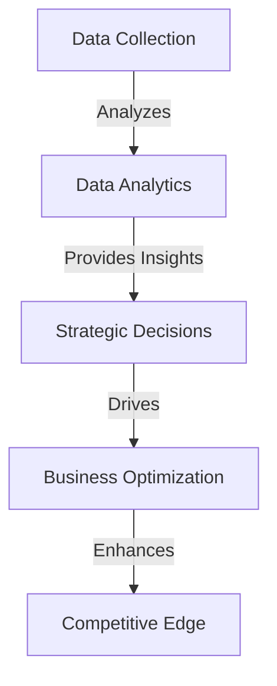

## Part 2: Advanced Integration of Value-driven Founder Roadmap into Existing Workflows
### Introduction to Advanced Concepts
In the first part of this series, we explored the fundamentals of integrating a value-driven founder roadmap into existing workflows. This follow-up article delves into advanced edge-cases, deeper architectural considerations, and real-world examples to further enhance your startup's strategic alignment and growth trajectory.

## Architectural Considerations for Scalability
As your startup grows, the complexity of your workflows and the demand for resources increase. It's essential to consider scalability when integrating your value-driven founder roadmap. This involves designing systems that can adapt to changing needs without compromising the core values and mission of your company.

### Microservices Architecture
One approach to achieving scalability is through a microservices architecture. This involves breaking down your workflow into smaller, independent services that can be developed, deployed, and scaled individually.

## Case Studies in Real-world Integration
Let's examine a couple of real-world scenarios where startups have successfully integrated their value-driven founder roadmaps into existing workflows, overcoming unique challenges and achieving significant growth.

### Case Study 1: SaaS Company
A SaaS company aimed to expand its customer base while maintaining a high level of customer satisfaction. By integrating its value-driven founder roadmap, which emphasized customer-centricity and continuous improvement, the company was able to align its product development and marketing strategies. This resulted in a 30% increase in customer acquisition and a 25% increase in customer retention.

### Case Study 2: E-commerce Platform
An e-commerce platform sought to enhance its supply chain management and logistics. By integrating its value-driven founder roadmap, which focused on efficiency and reliability, the platform was able to streamline its operations, reducing delivery times by 40% and increasing customer satisfaction ratings by 20%.

## Advanced Monitoring and Feedback Loops
Effective integration of a value-driven founder roadmap requires not only the initial alignment of workflows but also ongoing monitoring and adaptation. Advanced monitoring involves setting up feedback loops that provide insights into the performance of your workflows and the impact of your strategies on your mission and vision.

### Data Analytics
Utilizing data analytics tools can help you gather insights from various aspects of your business, from customer behavior to operational efficiency. This data can then be used to refine your strategies and make informed decisions.

## Visual Insights Gallery
Here are some visual insights into the advanced integration of value-driven founder roadmaps:
- 
- 
- 