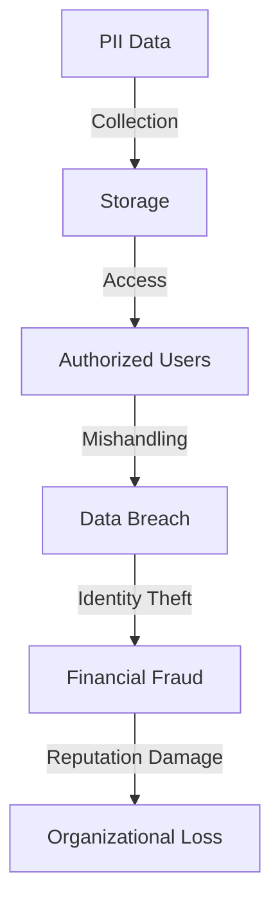
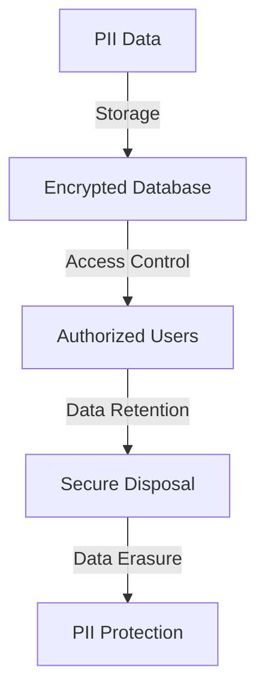

In today's digital age, the protection of Personally Identifiable Information (PII) is a critical concern for organizations across the globe. PII includes sensitive data such as names, addresses, social security numbers, and financial information, which can be used to identify, contact, or locate an individual. The safe handling of PII is essential to prevent identity theft, financial fraud, and other malicious activities. In this article, we will delve into the best practices for safely handling PII, including encryption, access control, and secure storage.

## Understanding PII and its Risks

PII can be categorized into two main types: sensitive and non-sensitive. Sensitive PII includes data that is highly confidential and can cause significant harm if compromised, such as social security numbers, credit card numbers, and financial information. Non-sensitive PII, on the other hand, includes data that is less confidential, such as names, addresses, and phone numbers. However, even non-sensitive PII can be used to launch targeted attacks, such as phishing and social engineering.

To understand the risks associated with PII, let's consider the following Mermaid.js diagram:

As shown in the diagram, the mishandling of PII can lead to a data breach, which can result in identity theft, financial fraud, and significant reputational damage to the organization.

## Encryption and Access Control

Encryption is a critical component of PII protection. It involves converting plaintext data into unreadable ciphertext, making it inaccessible to unauthorized users. There are several encryption techniques, including symmetric and asymmetric encryption, that can be used to protect PII.

To implement encryption and access control, consider the following best practices:

| Best Practice | Description |
| --- | --- |
| Use Strong Encryption | Use industry-standard encryption algorithms, such as AES and RSA, to protect PII. |
| Implement Access Control | Limit access to PII to authorized users and systems, using techniques such as role-based access control and multi-factor authentication. |
| Use Secure Protocols | Use secure communication protocols, such as HTTPS and SFTP, to transmit PII. |

## Secure Storage and Disposal

Secure storage and disposal of PII are essential to prevent unauthorized access and data breaches. Consider the following best practices:

> **Note:** Use secure storage solutions, such as encrypted databases and file systems, to store PII.
> **Warning:** Avoid storing PII in plaintext or using weak encryption algorithms.
> **Tip:** Implement a data retention policy to ensure that PII is not stored for longer than necessary.

To illustrate the importance of secure storage and disposal, consider the following Mermaid.js diagram:

As shown in the diagram, secure storage and disposal of PII involve encrypting data, controlling access, and implementing a data retention policy to ensure that PII is not stored for longer than necessary.

## DevSecOps and OAuth

DevSecOps is a critical component of PII protection, as it involves integrating security into the development and deployment of applications. OAuth is a widely used authorization framework that can be used to secure access to PII.

To implement DevSecOps and OAuth, consider the following best practices:

| Best Practice | Description |
| --- | --- |
| Integrate Security | Integrate security into the development and deployment of applications, using techniques such as continuous integration and continuous deployment. |
| Use OAuth | Use OAuth to secure access to PII, using techniques such as authorization codes and access tokens. |
| Monitor and Audit | Monitor and audit access to PII, using techniques such as logging and analytics.

## Visual Insights Gallery
## Visual Insights Gallery

## Summary and Conclusion
In conclusion, the safe handling of PII is essential to prevent identity theft, financial fraud, and reputational damage. By implementing encryption, access control, secure storage, and disposal, organizations can protect PII and ensure compliance with regulatory requirements. DevSecOps and OAuth are critical components of PII protection, as they involve integrating security into the development and deployment of applications.

## FAQ
Q: What is PII?
A: PII stands for Personally Identifiable Information, which includes sensitive data such as names, addresses, social security numbers, and financial information.
Q: Why is PII protection important?
A: PII protection is important to prevent identity theft, financial fraud, and reputational damage to organizations.
Q: What are the best practices for PII protection?
A: The best practices for PII protection include encryption, access control, secure storage, and disposal, as well as DevSecOps and OAuth.