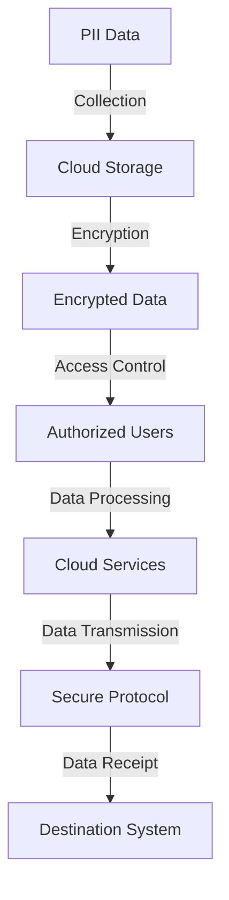
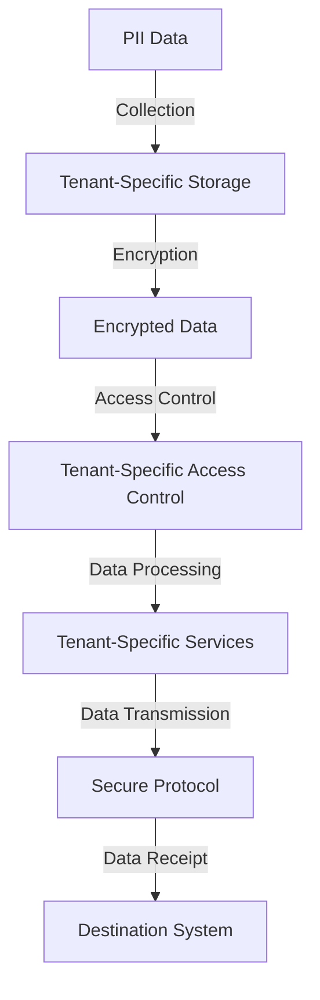
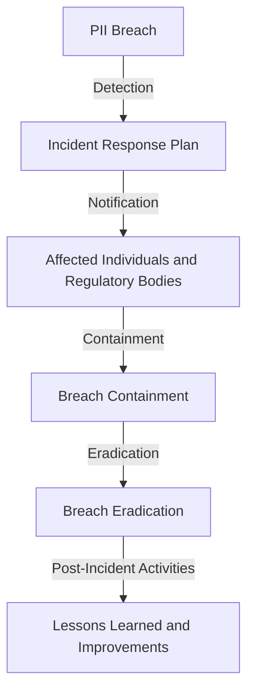

## Part 2: Advanced PII Handling - Edge Cases and Architectural Considerations

In the first part of this series, we explored the fundamentals of safely handling Personally Identifiable Information (PII). We discussed best practices such as encryption, access control, and secure storage. However, there are advanced edge cases and architectural considerations that require special attention. In this article, we will delve into these complex scenarios and provide guidance on how to mitigate potential risks.

## Handling PII in Cloud Environments

As more organizations move their data to cloud environments, the risk of PII exposure increases. To mitigate this risk, it's essential to implement robust security controls, such as:

* Data encryption at rest and in transit
* Access controls, including multi-factor authentication and role-based access control
* Regular security audits and compliance checks

To illustrate the flow of PII in a cloud environment, consider the following Mermaid.js diagram:

As shown in the diagram, PII data is collected, stored, and processed in the cloud, and then transmitted to a destination system using a secure protocol.

## PII Handling in Multi-Tenant Environments

In multi-tenant environments, where multiple organizations share the same cloud resources, the risk of PII exposure is even higher. To mitigate this risk, it's essential to implement:

* Logical separation of tenant data
* Access controls, including tenant-specific authentication and authorization
* Regular security audits and compliance checks

To illustrate the flow of PII in a multi-tenant environment, consider the following Mermaid.js diagram:

As shown in the diagram, PII data is collected, stored, and processed in a tenant-specific environment, and then transmitted to a destination system using a secure protocol.

## Incident Response and PII Breach Notification

In the event of a PII breach, it's essential to have an incident response plan in place. This plan should include:

* Notification of affected individuals and regulatory bodies
* Containment and eradication of the breach
* Post-incident activities, including lessons learned and improvements to security controls

To illustrate the incident response process, consider the following Mermaid.js diagram:

As shown in the diagram, the incident response process involves detection, notification, containment, eradication, and post-incident activities.

## Visual Insights Gallery
The following images provide additional insights into advanced PII handling:
* 
* 
* 