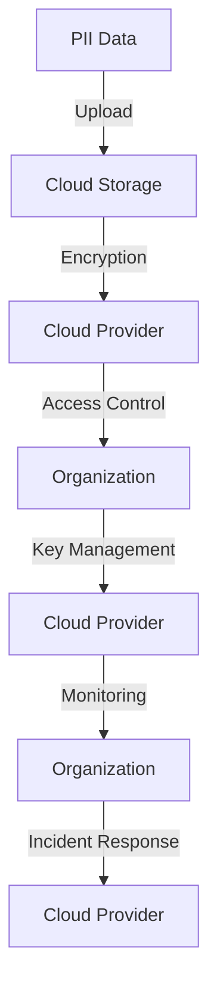
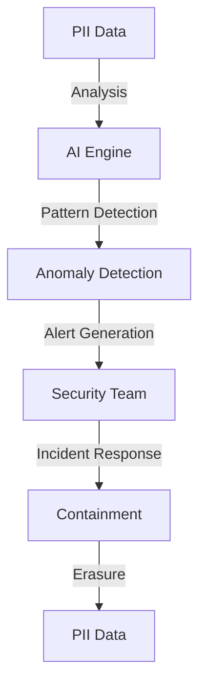
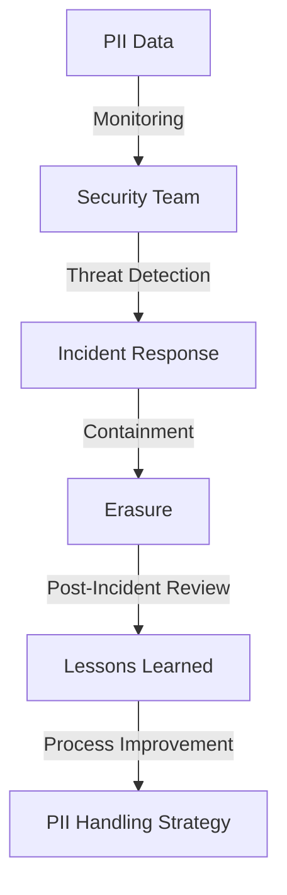

## Part 2: Advanced PII Handling - Edge Cases and Architectural Considerations

In the first part of this series, we explored the fundamentals of safely handling Personally Identifiable Information (PII). However, as organizations continue to navigate the complex landscape of data protection, it's essential to delve into advanced edge cases and architectural considerations. In this article, we'll examine the nuances of PII handling in cloud-based environments, explore the role of artificial intelligence (AI) in PII protection, and discuss the importance of continuous monitoring and incident response.

## Cloud-Based PII Handling

As more organizations migrate to cloud-based infrastructure, the handling of PII in these environments becomes increasingly critical. Cloud providers offer various security measures, such as encryption and access controls, but it's crucial to understand the shared responsibility model. This model dictates that both the cloud provider and the organization are responsible for securing PII data.

To illustrate the complexities of cloud-based PII handling, consider the following Mermaid.js diagram:

```mermaid
flowchart TD
    id["PII Data"] -->|Upload| id1["Cloud Storage"]
    id1 -->|Encryption| id2["Cloud Provider"]
    id2 -->|Access Control| id3["Organization"]
    id3 -->|Key Management| id4["Cloud Provider"]
    id4 -->|Monitoring| id5["Organization"]
    id5 -->|Incident Response| id6["Cloud Provider"]
```
As shown in this diagram, both the cloud provider and the organization play critical roles in securing PII data in cloud-based environments.

## AI-Driven PII Protection

Artificial intelligence (AI) can be a powerful tool in protecting PII data. AI-driven solutions can detect and respond to security threats in real-time, reducing the risk of data breaches. Additionally, AI can help organizations identify and classify PII data, ensuring that it's properly secured and handled.

To explore the role of AI in PII protection, consider the following Mermaid.js diagram:

```mermaid
flowchart TD
    id["PII Data"] -->|Analysis| id1["AI Engine"]
    id1 -->|Pattern Detection| id2["Anomaly Detection"]
    id2 -->|Alert Generation| id3["Security Team"]
    id3 -->|Incident Response| id4["Containment"]
    id4 -->|Erasure| id5["PII Data"]
```
As shown in this diagram, AI can play a critical role in detecting and responding to security threats, protecting PII data from unauthorized access.

## Continuous Monitoring and Incident Response

Continuous monitoring and incident response are essential components of a comprehensive PII handling strategy. Organizations must regularly monitor their systems and data for potential security threats, responding quickly and effectively in the event of a breach.

To illustrate the importance of continuous monitoring and incident response, consider the following Mermaid.js diagram:

```mermaid
flowchart TD
    id["PII Data"] -->|Monitoring| id1["Security Team"]
    id1 -->|Threat Detection| id2["Incident Response"]
    id2 -->|Containment| id3["Erasure"]
    id3 -->|Post-Incident Review| id4["Lessons Learned"]
    id4 -->|Process Improvement| id5["PII Handling Strategy"]
```
As shown in this diagram, continuous monitoring and incident response are critical components of a comprehensive PII handling strategy.

## Visual Insights Gallery
### Image 1: PII Data Flow

### Image 2: Cloud Security Architecture

### Image 3: AI-Driven PII Protection
