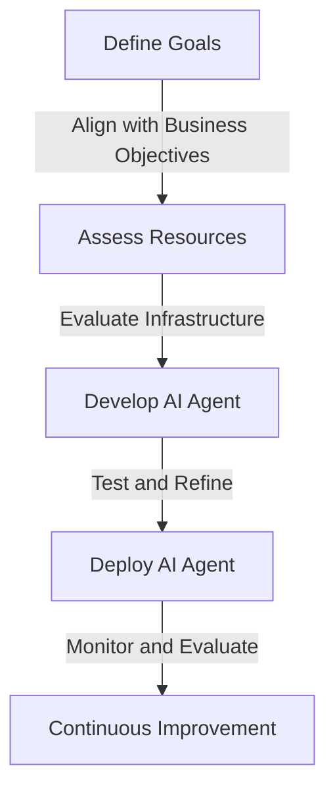
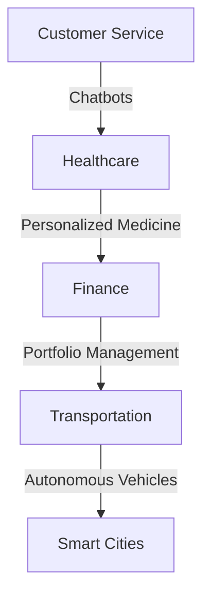

As AI continues to transform industries, senior tech leaders must develop strategies to harness the power of AI agents. In this article, we will delve into the world of AI agents, exploring their applications, benefits, and challenges.

## Table of Contents
1. [Introduction to AI Agents](#introduction-to-ai-agents)
2. [Strategies for Implementing AI Agents](#strategies-for-implementing-ai-agents)
3. [Benefits and Challenges of AI Agents](#benefits-and-challenges-of-ai-agents)
4. [Real-World Applications of AI Agents](#real-world-applications-of-ai-agents)
5. [Conclusion and Future Directions](#conclusion-and-future-directions)

## Introduction to AI Agents
AI agents are software programs that use artificial intelligence and machine learning to perform tasks autonomously. They can be used in a variety of applications, from customer service chatbots to complex decision-making systems.


```markdown
### Key Characteristics of AI Agents
* Autonomy: AI agents can operate independently, making decisions without human intervention.
* Adaptability: AI agents can learn from experience and adapt to changing environments.
* Reactivity: AI agents can respond to changes in their environment, such as user input or sensor data.
```

## Strategies for Implementing AI Agents
To successfully implement AI agents, senior tech leaders must develop a strategic plan that takes into account the organization's goals, resources, and infrastructure.

> **Note:** A well-defined strategy is crucial for ensuring the successful implementation of AI agents. Senior tech leaders must consider factors such as data quality, computational resources, and talent acquisition.

## Benefits and Challenges of AI Agents
AI agents offer numerous benefits, including improved efficiency, enhanced customer experience, and increased competitiveness. However, they also pose challenges, such as data privacy concerns, job displacement, and potential biases.


| Benefits | Challenges |
| --- | --- |
| Improved Efficiency | Data Privacy Concerns |
| Enhanced Customer Experience | Job Displacement |
| Increased Competitiveness | Potential Biases |

## Real-World Applications of AI Agents
AI agents have numerous real-world applications, including customer service, healthcare, finance, and transportation.

> **Tip:** Senior tech leaders can leverage AI agents to drive innovation and growth in their organizations. By exploring real-world applications, they can identify opportunities to improve efficiency, enhance customer experience, and gain a competitive edge.

## Visual Insights Gallery
## Visual Insights Gallery


## Conclusion and Future Directions
In conclusion, mastering AI agents requires a deep understanding of their applications, benefits, and challenges. Senior tech leaders must develop strategic plans, leverage real-world applications, and address challenges to harness the power of AI agents. As AI continues to evolve, we can expect to see more innovative applications of AI agents in various industries.

## FAQ
Q: What are AI agents?
A: AI agents are software programs that use artificial intelligence and machine learning to perform tasks autonomously.
Q: What are the benefits of AI agents?
A: AI agents offer numerous benefits, including improved efficiency, enhanced customer experience, and increased competitiveness.
Q: What are the challenges of AI agents?
A: AI agents pose challenges, such as data privacy concerns, job displacement, and potential biases.
Q: What are the real-world applications of AI agents?
A: AI agents have numerous real-world applications, including customer service, healthcare, finance, and transportation.