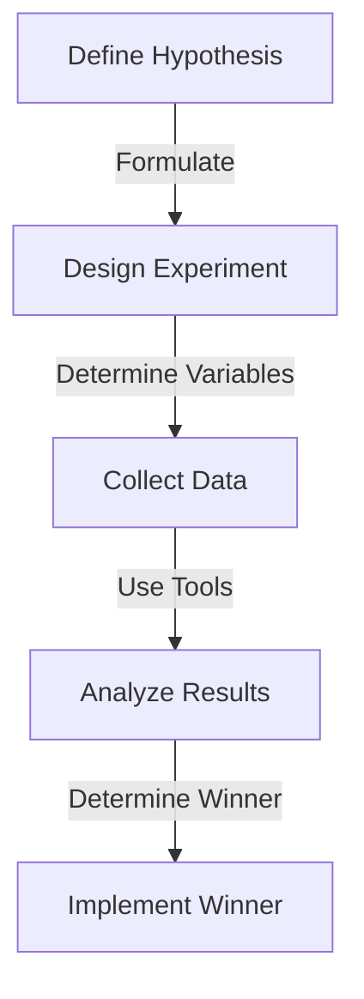
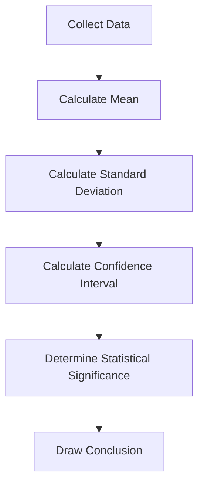

As a senior tech leader, making data-driven decisions is crucial for the success of your organization. A/B testing, also known as split testing, is a powerful technique used to compare two or more versions of a product, feature, or process to determine which one performs better. In this article, we will delve into the world of A/B testing, exploring its benefits, strategies, and best practices for senior tech leaders.

## Table of Contents
1. [Introduction to A/B Testing](#introduction-to-ab-testing)
2. [Benefits of A/B Testing](#benefits-of-ab-testing)
3. [A/B Testing Strategies](#ab-testing-strategies)
4. [Implementing A/B Testing](#implementing-ab-testing)
5. [Analyzing A/B Testing Results](#analyzing-ab-testing-results)
6. [Visual Insights Gallery](#visual-insights-gallery)
7. [Summary and Conclusion](#summary-and-conclusion)
8. [FAQ](#faq)

## Introduction to A/B Testing
A/B testing is a method of comparing two versions of a product, feature, or process to determine which one performs better. This technique is widely used in various industries, including e-commerce, software development, and marketing. The goal of A/B testing is to identify the version that yields the best results, whether it's increasing conversions, improving user engagement, or enhancing customer satisfaction.


## Benefits of A/B Testing
A/B testing offers numerous benefits for organizations, including:
* Improved decision-making: A/B testing provides data-driven insights, enabling senior tech leaders to make informed decisions.
* Increased conversions: By identifying the most effective version of a product or feature, organizations can increase conversions and revenue.
* Enhanced user experience: A/B testing helps organizations understand user behavior and preferences, enabling them to create a more user-friendly experience.
* Reduced risk: A/B testing allows organizations to test new ideas and features without fully committing to them, reducing the risk of failure.
> **Note:** A/B testing is not limited to product development; it can also be applied to marketing campaigns, email newsletters, and other business processes.

## A/B Testing Strategies
There are several A/B testing strategies that senior tech leaders can employ, including:
* **Split testing**: Divide users into two groups, with each group receiving a different version of the product or feature.
* **Multivariate testing**: Test multiple variables simultaneously to identify the most effective combination.
* **Bandit testing**: Use machine learning algorithms to dynamically allocate traffic to the best-performing version.
```python
import pandas as pd

# Sample A/B testing data
data = {
    'Version': ['A', 'B'],
    'Conversions': [100, 120],
    'Users': [1000, 1000]
}

df = pd.DataFrame(data)
print(df)
```
## Implementing A/B Testing
To implement A/B testing, senior tech leaders should follow these steps:
1. **Define the hypothesis**: Identify the problem or opportunity and formulate a hypothesis to test.
2. **Design the experiment**: Determine the variables to test, the sample size, and the duration of the experiment.
3. **Collect data**: Use tools like Google Analytics or custom tracking scripts to collect data on user behavior and conversions.
4. **Analyze results**: Use statistical methods to analyze the data and determine the winner.


## Analyzing A/B Testing Results
When analyzing A/B testing results, senior tech leaders should consider the following:
* **Statistical significance**: Ensure that the results are statistically significant to avoid false positives.
* **Confidence intervals**: Use confidence intervals to estimate the range of possible values for the metric being tested.
* **Sample size**: Ensure that the sample size is sufficient to detect meaningful differences between the versions.


## Visual Insights Gallery
Here are some visual insights to help illustrate the concepts discussed in this article:


## Summary and Conclusion
A/B testing is a powerful technique for senior tech leaders to make data-driven decisions and improve the performance of their products and features. By understanding the benefits, strategies, and best practices of A/B testing, organizations can increase conversions, enhance user experience, and reduce risk. Remember to define a clear hypothesis, design a robust experiment, collect and analyze data, and draw meaningful conclusions from the results.

## FAQ
Q: What is A/B testing?
A: A/B testing is a method of comparing two versions of a product, feature, or process to determine which one performs better.
Q: What are the benefits of A/B testing?
A: The benefits of A/B testing include improved decision-making, increased conversions, enhanced user experience, and reduced risk.
Q: How do I implement A/B testing?
A: To implement A/B testing, define a clear hypothesis, design a robust experiment, collect and analyze data, and draw meaningful conclusions from the results.