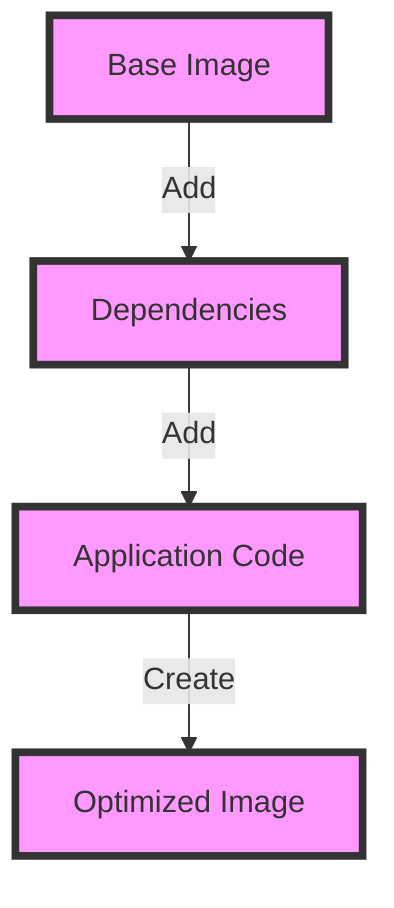

As technology continues to evolve, senior tech leaders must stay ahead of the curve to ensure their organizations remain competitive. One crucial aspect of this is mastering Docker optimization, which enables businesses to streamline their software development and deployment processes. In this article, we'll delve into the world of Docker optimization, exploring strategies and best practices for senior tech leaders to elevate their Docker game.

## Table of Contents
1. [Introduction to Docker Optimization](#introduction-to-docker-optimization)
2. [Understanding Docker Architecture](#understanding-docker-architecture)
3. [Optimizing Docker Images](#optimizing-docker-images)
4. [Streamlining Docker Containers](#streamlining-docker-containers)
5. [Implementing Docker Security Best Practices](#implementing-docker-security-best-practices)
6. [Visual Insights Gallery](#visual-insights-gallery)
7. [Summary and Conclusion](#summary-and-conclusion)
8. [FAQ](#faq)

## Introduction to Docker Optimization
Docker optimization is a critical process that involves fine-tuning Docker containers, images, and overall infrastructure to achieve maximum efficiency, performance, and reliability. By optimizing Docker, organizations can reduce costs, improve deployment speed, and enhance the overall quality of their software applications.

## Understanding Docker Architecture
Before diving into optimization strategies, it's essential to understand the Docker architecture. Docker consists of several key components, including the Docker daemon, Docker client, Docker images, and Docker containers.

## Optimizing Docker Images
Optimizing Docker images is a critical step in the Docker optimization process. This involves reducing image size, improving image creation time, and ensuring images are secure and up-to-date. Some strategies for optimizing Docker images include:

* Using multi-stage builds to separate build and runtime environments
* Minimizing image layers to reduce image size
* Utilizing caching to speed up image creation

## Streamlining Docker Containers
Streamlining Docker containers is another essential aspect of Docker optimization. This involves ensuring containers are running efficiently, securely, and with minimal overhead. Some strategies for streamlining Docker containers include:

* Utilizing resource constraints to limit container resources
* Implementing container monitoring and logging
* Using container orchestration tools to manage container lifecycles

> **Tip:** Use Docker Compose to simplify container orchestration and management.

## Implementing Docker Security Best Practices
Implementing Docker security best practices is critical to ensuring the security and integrity of Docker containers and applications. Some strategies for implementing Docker security best practices include:

* Utilizing Docker secrets to manage sensitive data
* Implementing container network policies to control traffic flow
* Regularly updating and patching Docker images and containers

> **Warning:** Failing to implement Docker security best practices can result in significant security risks and vulnerabilities.

## Visual Insights Gallery
Here are some visual insights to help illustrate key concepts and strategies in Docker optimization:

## Summary and Conclusion
Mastering Docker optimization is a critical process that requires a deep understanding of Docker architecture, images, containers, and security best practices. By implementing the strategies and best practices outlined in this article, senior tech leaders can elevate their Docker game, streamline their software development and deployment processes, and improve the overall quality and reliability of their software applications.

## FAQ
Q: What is Docker optimization?
A: Docker optimization is the process of fine-tuning Docker containers, images, and infrastructure to achieve maximum efficiency, performance, and reliability.
Q: Why is Docker optimization important?
A: Docker optimization is critical to reducing costs, improving deployment speed, and enhancing the overall quality of software applications.
Q: What are some strategies for optimizing Docker images?
A: Some strategies for optimizing Docker images include using multi-stage builds, minimizing image layers, and utilizing caching.