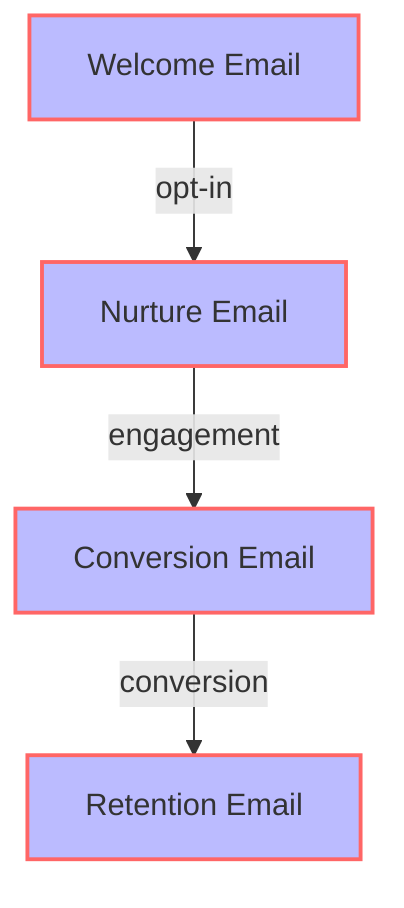
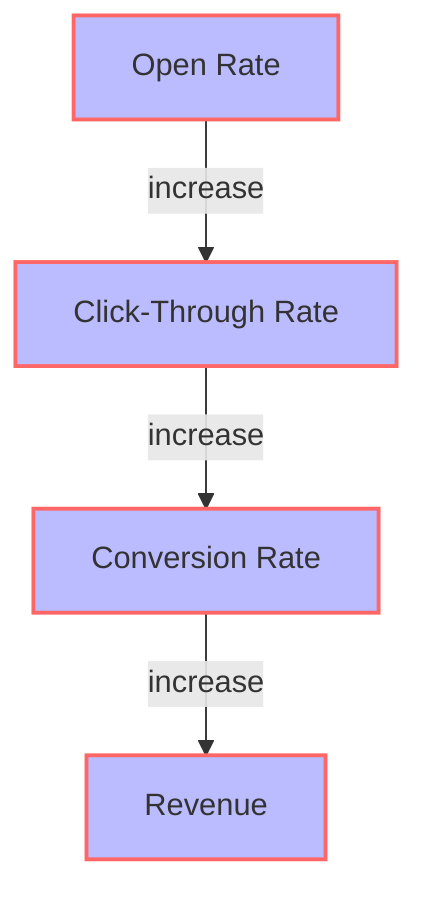

As a senior tech leader, you understand the importance of effective communication in driving business growth. Email campaigns are a crucial aspect of this, allowing you to reach and engage with your target audience, build brand awareness, and ultimately drive conversions. However, with the ever-evolving landscape of digital marketing, it can be challenging to stay ahead of the curve and maximize the potential of your email campaigns.

## Table of Contents
1. [Introduction to Email Campaigns](#introduction-to-email-campaigns)
2. [Understanding Your Audience](#understanding-your-audience)
3. [Crafting Compelling Email Content](#crafting-compelling-email-content)
4. [Email Campaign Architecture](#email-campaign-architecture)
5. [Measuring Success and Optimization](#measuring-success-and-optimization)
6. [Visual Insights Gallery](#visual-insights-gallery)
7. [Summary and Conclusion](#summary-and-conclusion)
8. [FAQ](#faq)

## Introduction to Email Campaigns
Email campaigns are a powerful tool for B2B marketing, offering a personalized and targeted approach to reaching potential customers. To master email campaigns, senior tech leaders must first understand the fundamentals of email marketing, including list building, segmentation, and automation. 


> **Note:** Effective email campaigns begin with a well-defined target audience and a clear understanding of their needs and preferences.

## Understanding Your Audience
Understanding your audience is critical to the success of your email campaigns. This involves segmenting your email list based on demographics, behavior, and preferences, and creating buyer personas to guide your content creation. By tailoring your content to the specific needs and interests of each segment, you can increase engagement and conversion rates.
```markdown
| Segment | Characteristics | Preferences |
| --- | --- | --- |
| Tech Executives | Senior leadership roles, tech industry | Industry insights, thought leadership |
| Marketing Professionals | Marketing roles, tech industry | Marketing strategies, trends |
```
> **Tip:** Use data and analytics to inform your audience understanding and adjust your segmentation strategy accordingly.

## Crafting Compelling Email Content
Crafting compelling email content is essential to capturing the attention of your audience and driving engagement. This involves using personalized subject lines, optimizing email design for mobile devices, and using clear and concise language in your email copy. 

```javascript
// Example of personalized email subject line
const subjectLine = `Hello ${name}, check out our latest industry insights`;
```
> **Warning:** Avoid using spammy keywords and overly promotional language in your email content, as this can lead to high unsubscribe rates and damage to your brand reputation.

## Email Campaign Architecture
The architecture of your email campaign is crucial to its success. This involves designing a flow that guides the reader through a series of emails, each with a specific goal and call-to-action. 

> **Interview:** "Email campaigns are a key component of our marketing strategy. By using personalized content and automation, we've seen significant increases in engagement and conversion rates." - Senior Marketing Executive

## Measuring Success and Optimization
Measuring the success of your email campaigns is critical to understanding what's working and what areas need improvement. This involves tracking key metrics such as open rates, click-through rates, and conversion rates, and using A/B testing to optimize your email content and design. 


> **Tip:** Use data and analytics to inform your optimization strategy and make data-driven decisions.

## Visual Insights Gallery
Here are some visual insights to help you master email campaigns:


## Summary and Conclusion
Mastering email campaigns requires a deep understanding of your audience, compelling email content, and a well-designed campaign architecture. By using personalized content, automation, and data-driven optimization, senior tech leaders can drive significant increases in engagement and conversion rates. Remember to stay focused on your target audience, continuously measure and optimize your campaigns, and always keep your content fresh and engaging.

## FAQ
Q: What is the key to a successful email campaign?
A: The key to a successful email campaign is understanding your audience and crafting compelling email content that resonates with them.
Q: How do I measure the success of my email campaigns?
A: You can measure the success of your email campaigns by tracking key metrics such as open rates, click-through rates, and conversion rates.
Q: What is the importance of automation in email campaigns?
A: Automation is critical to email campaigns, as it allows you to personalize content, optimize workflows, and increase efficiency.