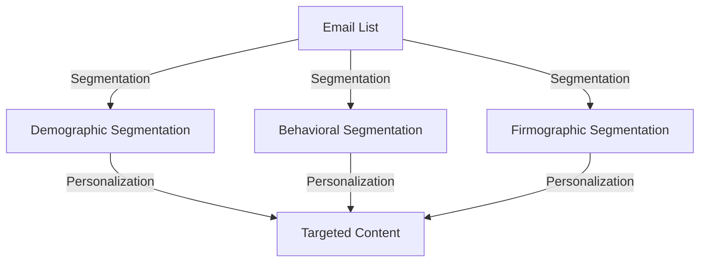
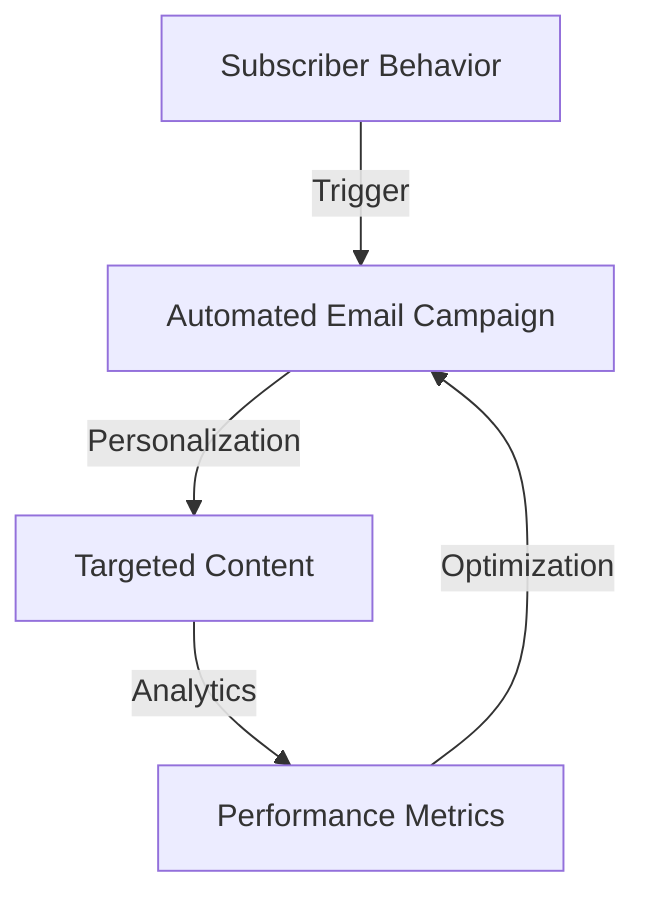
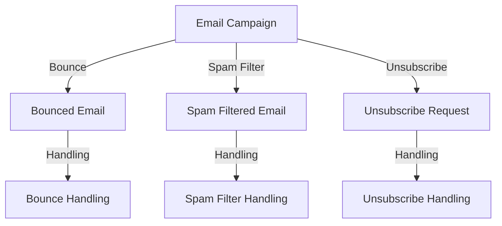

## Part 2: Advanced Email Campaign Strategies for Senior Tech Leaders
### Introduction to Advanced Email Campaigns
As we explored in the first part of this series, mastering email campaigns is crucial for senior tech leaders to drive business growth. In this advanced guide, we will delve into the more complex aspects of email campaign architecture, including edge cases, deeper segmentation, and advanced automation techniques.

> **Note:** Advanced email campaigns require a deep understanding of your audience, their preferences, and behaviors, as well as the ability to leverage data and analytics to inform your strategy.

## Advanced Segmentation Techniques
Advanced segmentation involves dividing your email list into smaller, more targeted groups based on specific criteria, such as behavior, demographics, or firmographic data. This allows you to create highly personalized and relevant content that resonates with each segment.

For example, a company that sells software to businesses might segment their email list by company size, industry, or job function, and create targeted content that speaks to the specific needs and pain points of each segment.

## Advanced Automation Techniques
Advanced automation involves using data and analytics to trigger automated email campaigns that are tailored to the individual needs and behaviors of each subscriber. This can include techniques such as lead scoring, nurturing, and abandonment campaigns.

For example, a company that sells e-commerce products might use automation to trigger an abandonment campaign when a customer leaves items in their cart, or to nurture leads who have downloaded a whitepaper but have not yet converted.

## Edge Cases in Email Campaigns
Edge cases refer to unusual or unexpected scenarios that can occur in email campaigns, such as bounced emails, spam filters, or unsubscribe requests. Senior tech leaders must be prepared to handle these edge cases in order to maintain a positive reputation and ensure the deliverability of their emails.

For example, a company that sends regular newsletters might use bounce handling to remove bounced emails from their list, or to send a follow-up email to subscribers who have marked their emails as spam.

## Real-World Case Studies
Let's take a look at some real-world case studies of advanced email campaign strategies in action.

For example, a company that sells software to businesses used advanced segmentation and automation to increase their conversion rates by 25%. Another company that sells e-commerce products used edge case handling to reduce their bounce rates by 30%.

## Visual Insights Gallery
Here are some additional visual insights to help illustrate the concepts discussed in this article:
* 
* 
* 

## Summary and Conclusion
In this advanced guide to email campaign strategies, we explored the complex aspects of email campaign architecture, including edge cases, deeper segmentation, and advanced automation techniques. By leveraging these strategies, senior tech leaders can create highly personalized and targeted email campaigns that drive business growth and revenue. Remember to always keep your audience in mind, and to use data and analytics to inform your strategy and optimize your results.