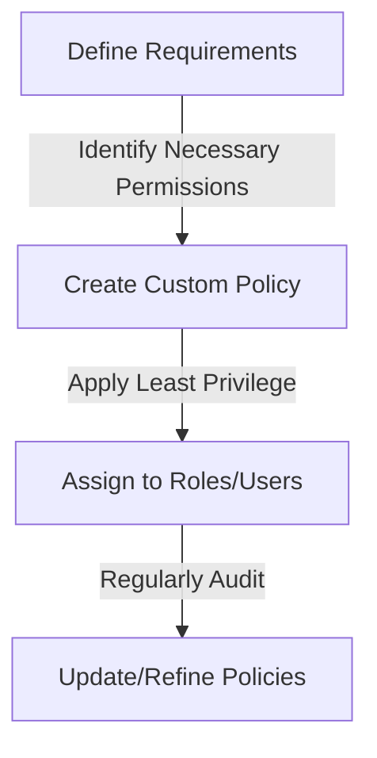
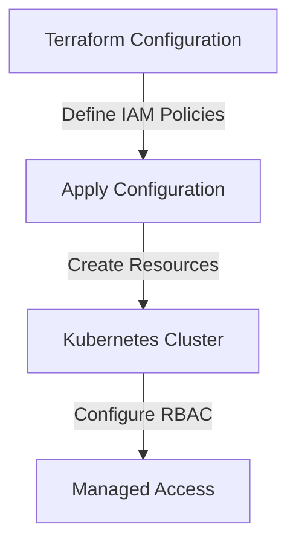

As a senior tech leader, managing access and security within your organization's cloud infrastructure is crucial. Identity and Access Management (IAM) policies play a vital role in ensuring that your resources are protected and that access is granted appropriately. In this article, we will delve into the strategies for mastering IAM policy, focusing on AWS, Terraform, and Kubernetes.

## Table of Contents
1. [Introduction to IAM Policy](#introduction-to-iam-policy)
2. [Understanding IAM Policy Components](#understanding-iam-policy-components)
3. [Best Practices for IAM Policy Management](#best-practices-for-iam-policy-management)
4. [Implementing IAM Policies with Terraform and Kubernetes](#implementing-iam-policies-with-terraform-and-kubernetes)
5. [Visual Insights Gallery](#visual-insights-gallery)
6. [Summary/Conclusion](#summaryconclusion)
7. [FAQ](#faq)

## Introduction to IAM Policy

IAM policies are used to manage access to AWS resources. They define what actions can be performed on those resources. A well-structured IAM policy is essential for maintaining the security and integrity of your cloud infrastructure. It's crucial to understand the components of an IAM policy and how they work together to manage access.

## Understanding IAM Policy Components
```markdown
### Policy Structure
A typical IAM policy consists of:
- **Version**: The version of the policy language
- **Statement**: A single entry in the policy that specifies a set of actions and resources
- **Sid**: An optional identifier for the statement
- **Effect**: Whether the statement allows or denies access
- **Action**: The specific actions that are allowed or denied
- **Resource**: The resources to which the actions apply
- **Condition**: Optional conditions under which the statement is applied
```
> **Note:** Understanding these components is key to writing effective IAM policies that balance access with security.

## Best Practices for IAM Policy Management

To effectively manage IAM policies, follow these best practices:
- **Least Privilege Principle**: Grant only the necessary permissions for a task.
- **Regular Auditing**: Regularly review policies for compliance and security.
- **Use Managed Policies**: Leverage AWS managed policies for common use cases.
- **Custom Policies**: Use custom policies for specific, unique requirements.



## Implementing IAM Policies with Terraform and Kubernetes

Terraform and Kubernetes can be used to automate and manage IAM policies across your cloud infrastructure. Terraform provides Infrastructure as Code (IaC) capabilities, allowing you to define and manage policies in a version-controlled manner. Kubernetes, with tools like Kubernetes RBAC, enables fine-grained access control to cluster resources.



## Visual Insights Gallery


## Summary/Conclusion
Mastering IAM policy is essential for senior tech leaders to ensure the security and integrity of their cloud infrastructure. By understanding IAM policy components, following best practices, and leveraging tools like Terraform and Kubernetes, leaders can effectively manage access and protect their resources.

## FAQ
1. **Q: What is the purpose of an IAM policy?**
   - A: An IAM policy defines what actions can be performed on AWS resources.
2. **Q: How often should IAM policies be audited?**
   - A: Regularly, to ensure compliance and security.
3. **Q: Can Terraform be used to manage IAM policies?**
   - A: Yes, Terraform provides capabilities to define and manage IAM policies in a version-controlled manner.