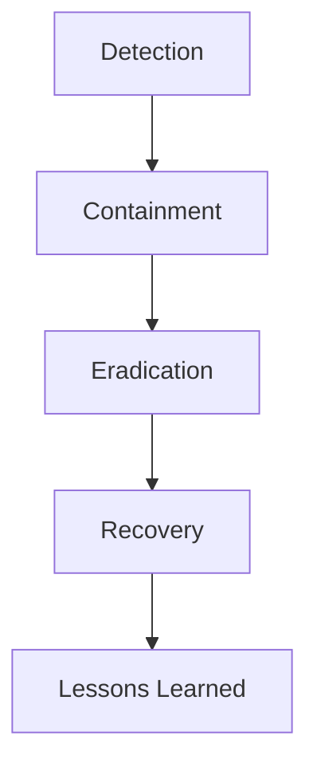
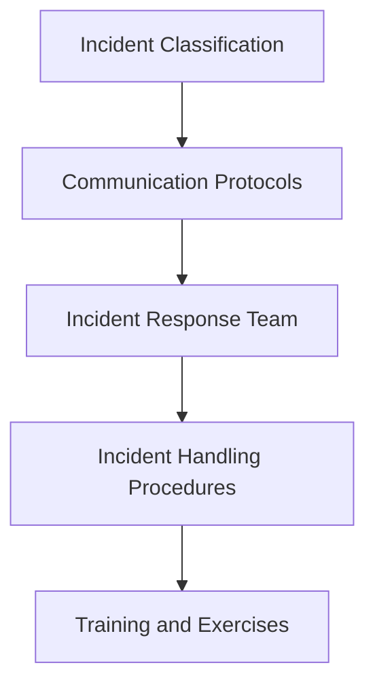

As a senior tech leader, mastering incident response is crucial to minimizing the impact of cybersecurity breaches and ensuring the continuity of your organization's operations. In this article, we will delve into the strategies and best practices for effective incident response, providing you with the knowledge and tools necessary to protect your organization from cyber threats.

## Table of Contents
1. [Introduction to Incident Response](#introduction-to-incident-response)
2. [Understanding the Incident Response Lifecycle](#understanding-the-incident-response-lifecycle)
3. [Developing an Incident Response Plan](#developing-an-incident-response-plan)
4. [Implementing Incident Response Strategies](#implementing-incident-response-strategies)
5. [Visual Insights Gallery](#visual-insights-gallery)
6. [Summary and Conclusion](#summary-and-conclusion)
7. [FAQ](#faq)

## Introduction to Incident Response
Incident response refers to the process of responding to and managing cybersecurity incidents, such as data breaches, malware outbreaks, and denial-of-service (DoS) attacks. Effective incident response requires a combination of technical, operational, and strategic capabilities, as well as a deep understanding of the organization's systems, networks, and data.

## Understanding the Incident Response Lifecycle
The incident response lifecycle typically consists of several phases, including:
* **Detection**: Identifying potential security incidents through monitoring and anomaly detection.
* **Containment**: Limiting the spread of the incident to prevent further damage.
* **Eradication**: Removing the root cause of the incident and restoring systems to a known good state.
* **Recovery**: Restoring systems and services to normal operation.
* **Lessons Learned**: Conducting a post-incident review to identify areas for improvement.

## Developing an Incident Response Plan
A comprehensive incident response plan should include:
* **Incident classification**: Categorizing incidents based on severity and impact.
* **Communication protocols**: Establishing clear communication channels and procedures.
* **Incident response team**: Defining roles and responsibilities for incident response team members.
* **Incident handling procedures**: Outlining steps for containment, eradication, recovery, and lessons learned.

## Implementing Incident Response Strategies
Implementing incident response strategies requires a combination of technical, operational, and strategic capabilities. Some key strategies include:
* **Encryption**: Protecting sensitive data through encryption.
* **Access control**: Limiting access to sensitive systems and data.
* **Monitoring and anomaly detection**: Identifying potential security incidents through monitoring and anomaly detection.
> **Tip:** Regularly review and update your incident response plan to ensure it remains effective and relevant.

## Visual Insights Gallery
## Visual Insights Gallery

## Summary and Conclusion
Mastering incident response requires a deep understanding of the incident response lifecycle, as well as the development and implementation of a comprehensive incident response plan. By following the strategies and best practices outlined in this article, senior tech leaders can minimize the impact of cybersecurity breaches and ensure the continuity of their organization's operations.

## FAQ
* Q: What is incident response?
A: Incident response refers to the process of responding to and managing cybersecurity incidents.
* Q: What are the phases of the incident response lifecycle?
A: The phases of the incident response lifecycle include detection, containment, eradication, recovery, and lessons learned.
* Q: What should be included in an incident response plan?
A: An incident response plan should include incident classification, communication protocols, incident response team, incident handling procedures, and training and exercises.