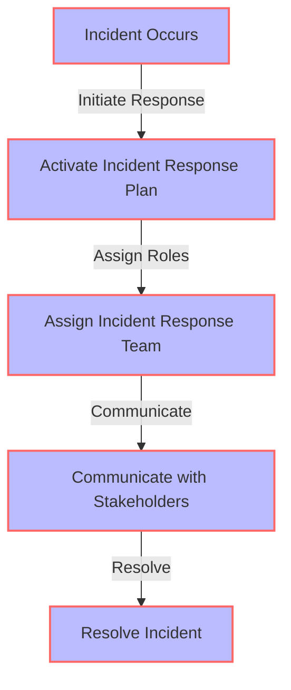
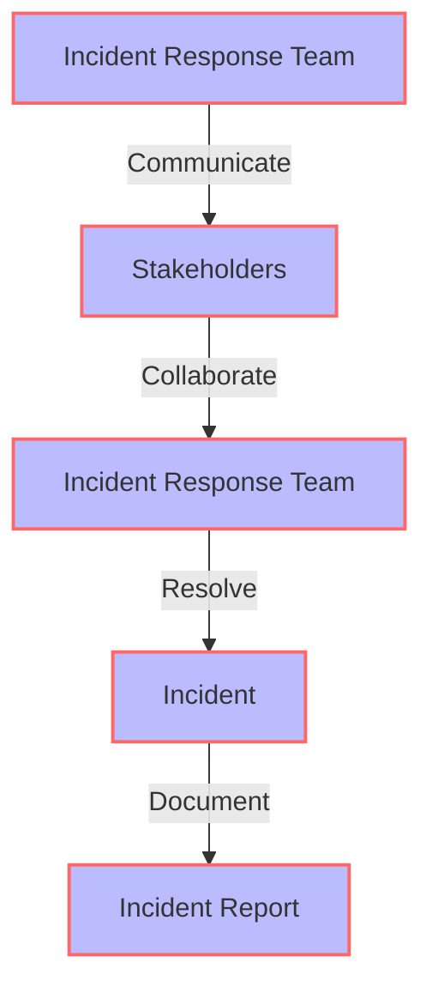

Incident support is a critical aspect of ensuring the reliability and availability of systems and services in the tech industry. As a senior tech leader, mastering incident support is essential to minimize downtime, reduce the impact on customers, and maintain the overall well-being of your team. In this article, we will delve into the strategies and best practices for effective incident support, with a focus on the mental health and wellness of senior tech leaders.

## Introduction to Incident Support
Incident support involves a set of processes and procedures designed to quickly respond to and resolve unexpected events or disruptions to systems and services. Effective incident support requires a combination of technical expertise, communication skills, and strategic planning. 


## Understanding the Impact of Incident Support on Mental Health
Incident support can be stressful and demanding, particularly for senior tech leaders who are responsible for overseeing the entire process. The pressure to resolve incidents quickly and minimize downtime can take a toll on mental health and wellness. 

```markdown
| **Stress Factor** | **Description** |
| --- | --- |
| Time Pressure | The need to resolve incidents quickly can create significant time pressure |
| Responsibility | Senior tech leaders may feel responsible for the entire incident support process |
| Communication | Effective communication is critical during incident support, but can also be a source of stress |
```
> **Note:** It is essential for senior tech leaders to prioritize their mental health and wellness during incident support.

## Strategies for Effective Incident Support
To master incident support, senior tech leaders should consider the following strategies:
### Incident Response Planning
Develop a comprehensive incident response plan that outlines the procedures and protocols for responding to incidents. This plan should include:
* Clear roles and responsibilities
* Communication protocols
* Incident classification and prioritization
* Escalation procedures
```markdown

### Incident Classification and Prioritization
Establish a system for classifying and prioritizing incidents based on their severity and impact. This will help ensure that the most critical incidents are addressed first.


### Communication and Collaboration
Effective communication and collaboration are critical during incident support. Senior tech leaders should establish clear communication protocols and ensure that all team members are aware of their roles and responsibilities.

> **Tip:** Regular training and exercises can help ensure that the incident response team is prepared and effective.

## Maintaining Mental Health and Wellness
To maintain mental health and wellness during incident support, senior tech leaders should:
* Prioritize self-care and stress management
* Establish a support network of peers and mentors
* Encourage open communication and feedback within the team


## Visual Insights Gallery
## Visual Insights Gallery


## Summary and Conclusion
Mastering incident support requires a combination of technical expertise, strategic planning, and effective communication. Senior tech leaders must prioritize their mental health and wellness during incident support, while also ensuring that their teams are prepared and effective. By following the strategies and best practices outlined in this article, senior tech leaders can minimize downtime, reduce the impact on customers, and maintain the overall well-being of their teams.

## FAQ
Q: What is incident support?
A: Incident support involves a set of processes and procedures designed to quickly respond to and resolve unexpected events or disruptions to systems and services.
Q: Why is mental health and wellness important during incident support?
A: Incident support can be stressful and demanding, and senior tech leaders must prioritize their mental health and wellness to maintain their effectiveness and overall well-being.
Q: How can senior tech leaders maintain mental health and wellness during incident support?
A: Senior tech leaders can maintain mental health and wellness by prioritizing self-care and stress management, establishing a support network, and encouraging open communication and feedback within the team.