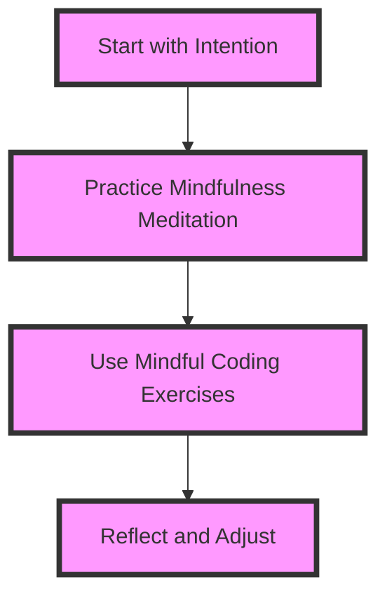

As a senior tech leader, it's easy to get caught up in the demands of managing a team, meeting deadlines, and driving innovation. However, neglecting your own well-being can have severe consequences, including burnout, decreased productivity, and poor mental health. In this article, we'll explore the importance of mindful coding and provide actionable strategies for senior tech leaders to prioritize their well-being and thrive in their roles.

## Table of Contents
1. [Introduction to Mindful Coding](#introduction-to-mindful-coding)
2. [The Benefits of Mindful Coding](#the-benefits-of-mindful-coding)
3. [Strategies for Mindful Coding](#strategies-for-mindful-coding)
4. [Creating a Mindful Coding Culture](#creating-a-mindful-coding-culture)
5. [Visual Insights Gallery](#visual-insights-gallery)
6. [Conclusion and FAQ](#conclusion-and-faq)

## Introduction to Mindful Coding
Mindful coding is the practice of being fully present and engaged in the coding process, while also cultivating a sense of awareness and compassion for oneself and others. It's about recognizing the interconnectedness of our thoughts, emotions, and actions, and using this awareness to create a more positive and productive coding experience.


## The Benefits of Mindful Coding
The benefits of mindful coding are numerous and well-documented. Some of the most significant advantages include:
* Improved focus and concentration
* Increased productivity and efficiency
* Enhanced creativity and problem-solving skills
* Better stress management and reduced burnout
* Improved collaboration and communication with team members
```markdown
| Benefit | Description |
| --- | --- |
| Improved Focus | Increased ability to concentrate and stay on task |
| Increased Productivity | Enhanced efficiency and ability to complete tasks |
| Enhanced Creativity | Improved ability to think outside the box and come up with innovative solutions |
```
> **Note:** Mindful coding is not just about individual benefits; it can also have a positive impact on team dynamics and overall project success.

## Strategies for Mindful Coding
So, how can senior tech leaders incorporate mindful coding into their daily practice? Here are some actionable strategies to get you started:
* **Start with intention**: Begin each coding session with a clear intention, such as what you want to achieve or what problems you want to solve.
* **Practice mindfulness meditation**: Regular mindfulness meditation practice can help you develop greater awareness and presence in your coding practice.
* **Use mindful coding exercises**: Incorporate mindful coding exercises, such as focused coding sessions or coding challenges, to help you stay present and engaged.

> **Tip:** Start small and be consistent. Begin with short, focused coding sessions and gradually increase the duration as you become more comfortable with the practice.

## Creating a Mindful Coding Culture
As a senior tech leader, you have the power to create a mindful coding culture within your team or organization. Here are some strategies to help you get started:
* **Lead by example**: Model mindful coding behaviors and practices, such as taking regular breaks or prioritizing self-care.
* **Provide resources and support**: Offer resources and support for team members to practice mindful coding, such as mindfulness meditation classes or coding workshops.
* **Encourage open communication**: Foster an open and supportive team culture, where team members feel comfortable sharing their thoughts, feelings, and concerns.

> **Interview:** "Mindful coding has been a game-changer for our team. It's helped us stay focused, work more efficiently, and support each other's well-being." - Senior Tech Leader

## Visual Insights Gallery
Here are some visual insights to help you better understand the concepts and strategies discussed in this article:


## Conclusion and FAQ
In conclusion, mindful coding is a powerful practice that can have a significant impact on individual and team well-being, productivity, and success. By incorporating mindful coding strategies into your daily practice and creating a mindful coding culture within your team or organization, you can:
* Improve focus and concentration
* Increase productivity and efficiency
* Enhance creativity and problem-solving skills
* Reduce stress and burnout
* Improve collaboration and communication
> **Warning:** Neglecting your own well-being and the well-being of your team members can have severe consequences, including burnout, decreased productivity, and poor mental health.

### FAQ
Q: What is mindful coding?
A: Mindful coding is the practice of being fully present and engaged in the coding process, while also cultivating a sense of awareness and compassion for oneself and others.
Q: How can I incorporate mindful coding into my daily practice?
A: Start with intention, practice mindfulness meditation, and use mindful coding exercises to help you stay present and engaged.
Q: How can I create a mindful coding culture within my team or organization?
A: Lead by example, provide resources and support, and encourage open communication to foster a supportive and mindful coding culture.