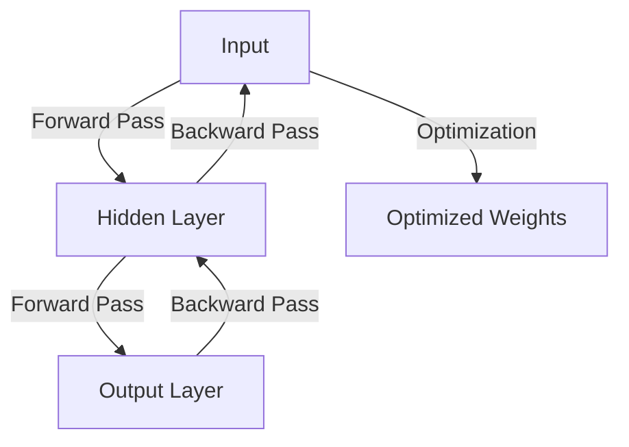
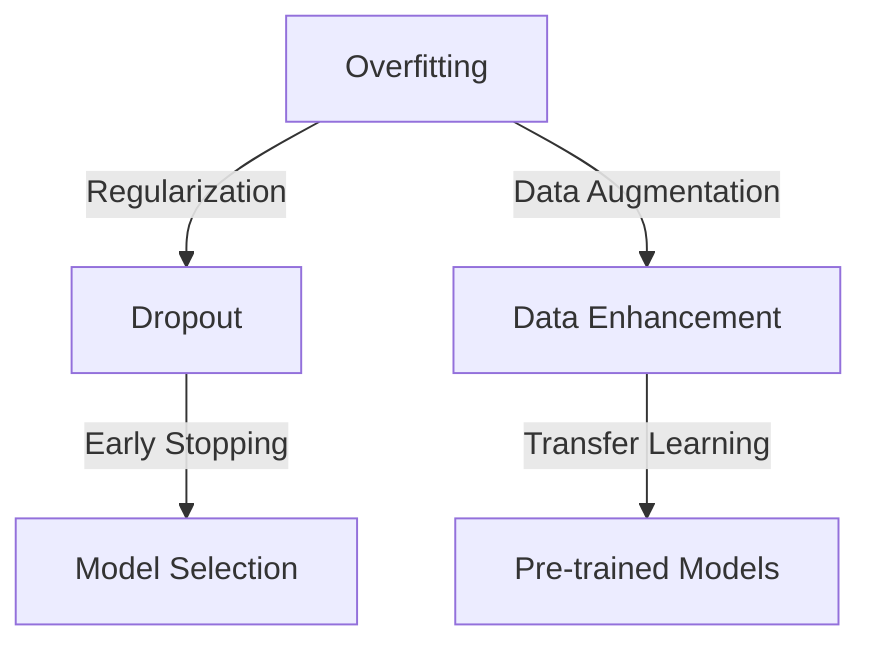

As we continue to navigate the complexities of the digital age, one thing is clear: neural networks are revolutionizing the way we approach data science and analytics. For senior tech leaders, understanding the intricacies of neural networks is no longer a luxury, but a necessity. In this article, we will delve into the world of neural networks, exploring the strategies and techniques that senior tech leaders need to master in order to stay ahead of the curve.

## Table of Contents
1. [Introduction to Neural Networks](#introduction-to-neural-networks)
2. [Building a Neural Network from Scratch](#building-a-neural-network-from-scratch)
3. [Training and Optimizing Neural Networks](#training-and-optimizing-neural-networks)
4. [Common Challenges and Solutions](#common-challenges-and-solutions)
5. [Real-World Applications of Neural Networks](#real-world-applications-of-neural-networks)

## Introduction to Neural Networks
Neural networks are a type of machine learning model inspired by the structure and function of the human brain. They consist of layers of interconnected nodes or "neurons," which process and transmit information. Neural networks can be used for a wide range of tasks, including image and speech recognition, natural language processing, and predictive analytics.


## Building a Neural Network from Scratch
Building a neural network from scratch requires a deep understanding of the underlying mathematics and algorithms. The process typically involves the following steps:
1. Data preparation: collecting and preprocessing the data that will be used to train the network.
2. Model definition: defining the architecture of the network, including the number of layers and the number of nodes in each layer.
3. Weights initialization: initializing the weights and biases of the network.
4. Training: training the network using a suitable algorithm, such as stochastic gradient descent.
```python
# Import necessary libraries
import numpy as np

# Define the neural network architecture
class NeuralNetwork:
    def __init__(self, input_dim, hidden_dim, output_dim):
        self.input_dim = input_dim
        self.hidden_dim = hidden_dim
        self.output_dim = output_dim
        self.weights1 = np.random.rand(input_dim, hidden_dim)
        self.weights2 = np.random.rand(hidden_dim, output_dim)
        self.bias1 = np.zeros((1, hidden_dim))
        self.bias2 = np.zeros((1, output_dim))

    def sigmoid(self, x):
        return 1 / (1 + np.exp(-x))

    def forward_pass(self, inputs):
        hidden_layer = self.sigmoid(np.dot(inputs, self.weights1) + self.bias1)
        output_layer = self.sigmoid(np.dot(hidden_layer, self.weights2) + self.bias2)
        return output_layer
```
> **Tip:** When building a neural network from scratch, it's essential to use a suitable activation function, such as the sigmoid or ReLU function, to introduce non-linearity into the model.

## Training and Optimizing Neural Networks
Training a neural network involves adjusting the weights and biases to minimize the error between the predicted output and the actual output. The process typically involves the following steps:
1. Forward pass: passing the input through the network to obtain the predicted output.
2. Backward pass: computing the error between the predicted output and the actual output, and adjusting the weights and biases accordingly.
3. Optimization: using a suitable optimization algorithm, such as stochastic gradient descent, to minimize the error.

> **Note:** When training a neural network, it's essential to use a suitable optimization algorithm and to monitor the performance of the network on a validation set to avoid overfitting.

## Common Challenges and Solutions
Neural networks can be challenging to work with, and there are several common issues that can arise, including:
* Overfitting: when the network becomes too specialized to the training data and fails to generalize to new data.
* Underfitting: when the network is too simple and fails to capture the underlying patterns in the data.
* Vanishing gradients: when the gradients of the loss function become too small, making it difficult to train the network.

> **Warning:** When working with neural networks, it's essential to be aware of the potential challenges and to use suitable techniques, such as regularization and early stopping, to avoid overfitting and underfitting.

## Real-World Applications of Neural Networks
Neural networks have a wide range of real-world applications, including:
* Image recognition: neural networks can be used to recognize objects in images, such as self-driving cars.
* Speech recognition: neural networks can be used to recognize spoken words, such as virtual assistants.
* Natural language processing: neural networks can be used to analyze and generate text, such as chatbots.


## Visual Insights Gallery
In this section, we will provide a visual representation of the concepts and techniques discussed in this article.


## Summary/Conclusion
In this article, we have explored the world of neural networks, including the strategies and techniques that senior tech leaders need to master in order to stay ahead of the curve. We have discussed the basics of neural networks, including the architecture and the training process, and we have explored some of the common challenges and solutions that can arise when working with neural networks. We have also provided a visual representation of the concepts and techniques discussed in this article.

## FAQ Section
Q: What is a neural network?
A: A neural network is a type of machine learning model inspired by the structure and function of the human brain.
Q: What are the common challenges when working with neural networks?
A: The common challenges when working with neural networks include overfitting, underfitting, and vanishing gradients.
Q: What are the real-world applications of neural networks?
A: The real-world applications of neural networks include image recognition, speech recognition, and natural language processing.