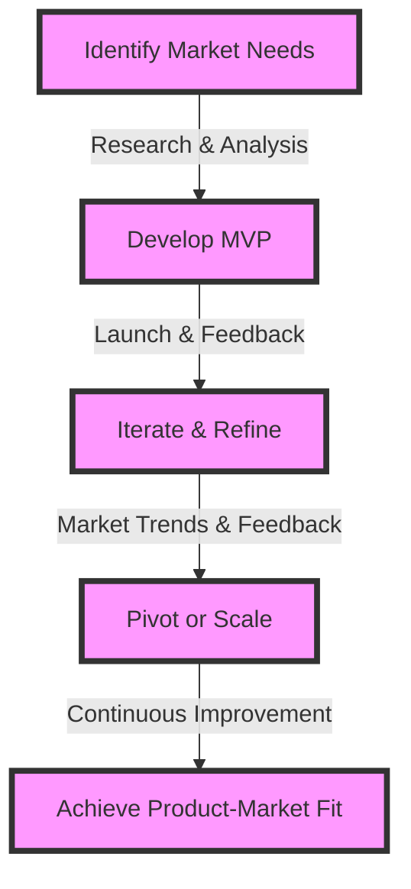
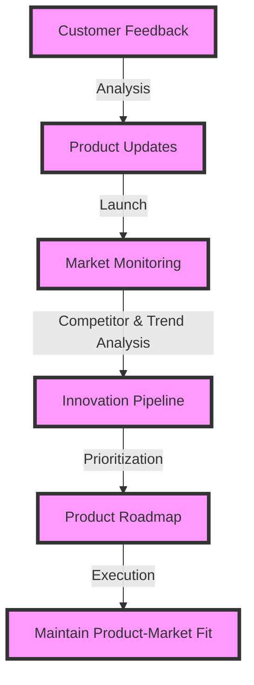

Product-market fit is the holy grail for startups and established companies alike, representing the perfect alignment between a product or service and the demands of its target market. Achieving this fit is crucial for any business aiming to succeed, grow, and sustain itself in a competitive landscape. In this article, we will delve into the strategies and insights that senior tech leaders can employ to master product-market fit, ensuring their products not only meet but exceed market expectations.

## Understanding Product-Market Fit

Product-market fit is about creating a product that satisfies the needs and wants of your target audience. It's a concept popularized by Marc Andreessen, co-founder of Andreessen Horowitz, who emphasized its importance in the success of any startup. Understanding your market, identifying genuine needs, and developing a product that perfectly addresses these needs are key components of achieving product-market fit.

### Identifying Market Needs
To identify market needs, leaders must conduct thorough market research, engage with potential customers, and analyze competitors. This involves:
- **Customer Interviews:** Direct conversations with potential or existing customers to understand their pain points and aspirations.
- **Market Surveys:** Gathering data through surveys to understand broader trends and preferences.
- **Competitor Analysis:** Studying competitors to identify gaps in the market that your product can fill.

## Achieving Product-Market Fit

Achieving product-market fit is a continuous process that involves iteration and refinement based on feedback and market analysis. Here are key strategies:
- **MVP (Minimum Viable Product):** Launching a basic version of your product to test hypotheses and gather feedback.
- **Iterative Development:** Continuously updating and refining your product based on user feedback and market trends.
- **Pivoting:** Being ready to make significant changes in your product or business model if initial strategies do not yield the desired results.

### Flow of Achieving Product-Market Fit

## Maintaining Product-Market Fit

Once product-market fit is achieved, the challenge shifts to maintaining it. Markets evolve, and customer needs change. Strategies for maintaining product-market fit include:
- **Continuous Customer Engagement:** Regularly engaging with customers to understand their evolving needs.
- **Innovation:** Continuously innovating and updating the product to stay ahead of the competition and meet changing market demands.
- **Data-Driven Decision Making:** Using data analytics to inform product development and business strategy decisions.

### Architecture of Product-Market Fit Maintenance

## Visual Insights Gallery
### Market Research

### Customer Engagement

### Product Iteration

## Summary/Conclusion
Mastering product-market fit is a journey that requires dedication, continuous learning, and a customer-centric approach. By understanding market needs, achieving product-market fit through MVPs and iteration, and maintaining this fit through innovation and customer engagement, senior tech leaders can ensure their products thrive in competitive markets. The key to success lies in embracing a culture of continuous improvement and staying agile in response to market changes.

## FAQ
- **Q: What is product-market fit?**
  A: Product-market fit refers to the situation where a product satisfies the needs and wants of its target market, leading to high customer satisfaction and business success.
- **Q: How do I identify market needs?**
  A: Identify market needs by conducting thorough market research, engaging with potential customers, and analyzing competitors.
- **Q: What role does innovation play in maintaining product-market fit?**
  A: Innovation is crucial for maintaining product-market fit as it allows companies to stay ahead of the competition and meet changing market demands.