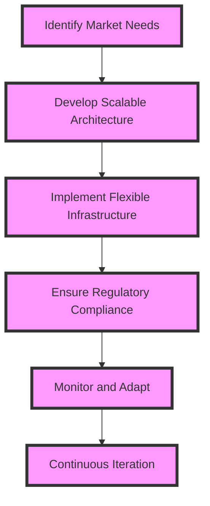

## Introduction to Advanced Product-Market Fit Strategies

In the first part of this series, we explored the foundational elements of product-market fit, including understanding market needs, achieving product-market fit, and the importance of continuous iteration. In this advanced segment, we will delve into the intricacies of product-market fit, exploring edge cases, and discussing deeper architectural considerations that senior tech leaders must be aware of to propel their products to success.

## Edge Cases in Product-Market Fit
Edge cases represent scenarios that are outside the norm but still crucial for a product's overall success. These can include:
- **Niche Markets:** Sometimes, the most profitable opportunities lie in serving niche markets with very specific needs.
- **Emerging Technologies:** Integrating emerging technologies like AI, blockchain, or IoT into a product can create new market opportunities.
- **Global Expansion:** Expanding into global markets introduces new challenges and opportunities, requiring products to be adaptable to different cultural and regulatory environments.

### Architectural Considerations for Scalability
To achieve product-market fit in edge cases, products must be architecturally sound to scale efficiently. This involves:

- **Microservices Architecture:** Allows for the development of applications as a suite of small services, each running its own process and communicating with lightweight mechanisms.
- **Cloud Computing:** Provides on-demand access to a shared pool of configurable computing resources, facilitating scalability and reducing costs.
- **DevOps Practices:** Combines software development and operations to improve the speed, quality, and reliability of software releases and deployments.

## Case Studies in Advanced Product-Market Fit

Several companies have successfully achieved advanced product-market fit by focusing on edge cases and employing scalable architectures. For instance:
- **Netflix:** By focusing on streaming services and adapting its product to meet the needs of a global market, Netflix has achieved remarkable success.
- **Airbnb:** This company identified a niche in the vacation rental market and scaled its product globally, ensuring that it complies with local regulations.

## Conclusion
Achieving product-market fit is not a one-time accomplishment but a continuous process that requires deep understanding, strategic planning, and the ability to adapt to changing market conditions. By understanding edge cases and implementing scalable architectures, senior tech leaders can position their products for long-term success.

## Visual Insights Gallery
Here are some visual insights related to advanced product-market fit strategies:
- 
- 
- 