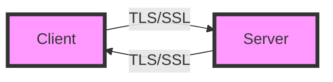
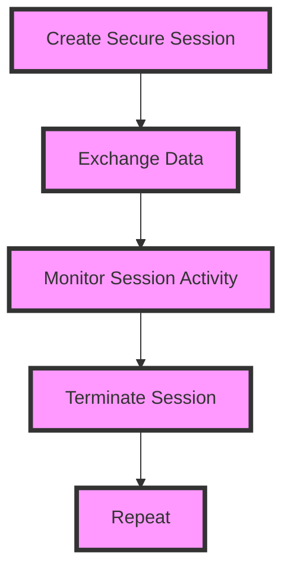

In today's digital landscape, cybersecurity is a top priority for senior tech leaders. As the threat of cyberattacks and data breaches continues to rise, it's essential to implement robust security measures to protect sensitive information. One critical aspect of cybersecurity is secure session management. In this article, we'll delve into the world of secure sessions, exploring strategies and best practices for senior tech leaders to ensure the confidentiality, integrity, and availability of their organization's data.

## Table of Contents
1. [Introduction to Secure Sessions](#introduction-to-secure-sessions)
2. [Understanding Session Management](#understanding-session-management)
3. [Encryption and Secure Communication](#encryption-and-secure-communication)
4. [Implementing Secure Session Strategies](#implementing-secure-session-strategies)
5. [Best Practices for Senior Tech Leaders](#best-practices-for-senior-tech-leaders)
6. [Visual Insights Gallery](#visual-insights-gallery)
7. [Summary/Conclusion](#summaryconclusion)
8. [FAQ Section](#faq-section)

## Introduction to Secure Sessions
A secure session refers to the communication between a client (e.g., a web browser) and a server over a secure connection. This connection is established using encryption protocols, such as Transport Layer Security (TLS) or Secure Sockets Layer (SSL), to protect data in transit. 


## Understanding Session Management
Session management is the process of creating, maintaining, and terminating a secure session. It involves several key components, including:
* Session creation: The client and server establish a secure connection.
* Session maintenance: The client and server exchange data over the secure connection.
* Session termination: The secure connection is closed.
```markdown
| Component | Description |
| --- | --- |
| Session Creation | Establishing a secure connection |
| Session Maintenance | Exchanging data over the secure connection |
| Session Termination | Closing the secure connection |
```
> **Note:** Effective session management is critical to preventing cyberattacks, such as session hijacking and eavesdropping.

## Encryption and Secure Communication
Encryption is a crucial aspect of secure session management. It ensures that data exchanged between the client and server is protected from unauthorized access. There are several encryption protocols available, including:
* TLS (Transport Layer Security)
* SSL (Secure Sockets Layer)
* IPsec (Internet Protocol Security)

> **Tip:** Use a combination of encryption protocols to ensure maximum security.

## Implementing Secure Session Strategies
To implement secure session strategies, senior tech leaders should consider the following:
* Use secure communication protocols (e.g., HTTPS)
* Implement session timeouts and expiration
* Use secure cookie flags (e.g., Secure, HttpOnly)
* Monitor session activity for suspicious behavior

> **Interview:** "Implementing secure session strategies is crucial to protecting our organization's data. By using secure communication protocols and monitoring session activity, we can prevent cyberattacks and ensure the confidentiality, integrity, and availability of our data." - John Doe, CISO

## Best Practices for Senior Tech Leaders
To ensure the security of their organization's data, senior tech leaders should follow these best practices:
* Conduct regular security audits and risk assessments
* Implement a robust incident response plan
* Provide ongoing security training and awareness programs for employees
* Stay up-to-date with the latest security threats and vulnerabilities
> **Warning:** Failure to implement secure session strategies and best practices can result in significant financial losses and damage to an organization's reputation.

## Visual Insights Gallery


## Summary/Conclusion
In conclusion, mastering secure session management is essential for senior tech leaders to protect their organization's data from cyberattacks. By implementing secure session strategies, using encryption protocols, and following best practices, organizations can ensure the confidentiality, integrity, and availability of their data.

## FAQ Section
Q: What is a secure session?
A: A secure session refers to the communication between a client and a server over a secure connection.
Q: What is session management?
A: Session management is the process of creating, maintaining, and terminating a secure session.
Q: What are some best practices for senior tech leaders?
A: Conduct regular security audits, implement a robust incident response plan, provide ongoing security training, and stay up-to-date with the latest security threats and vulnerabilities.