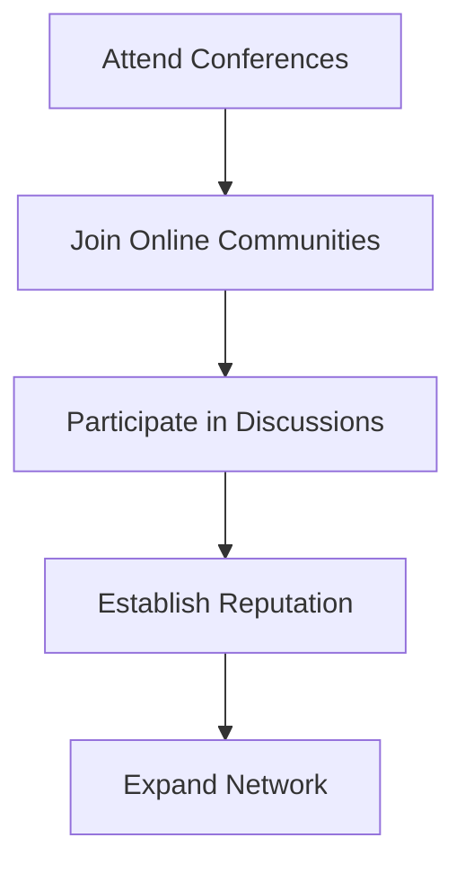
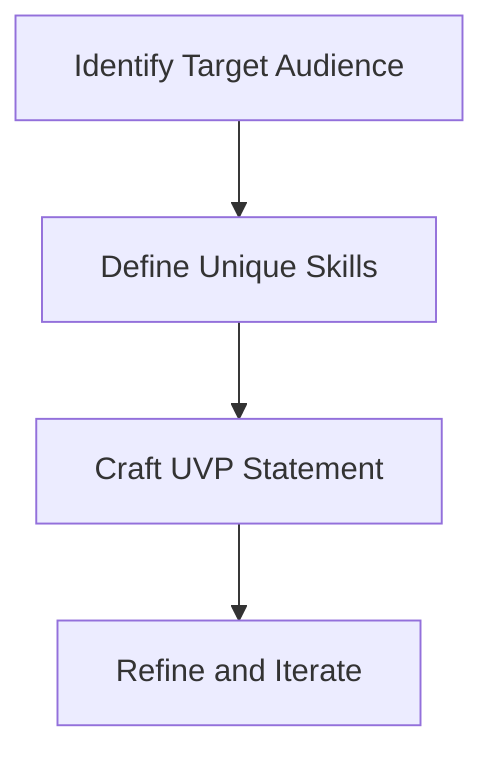

# Mastering Your Personal Brand as a Technical Freelancer
As a technical freelancer, establishing a strong personal brand is crucial for attracting high-quality clients, standing out in a competitive market, and achieving long-term career growth. In this article, we will delve into the strategies and techniques for mastering your personal brand, helping you to build a successful and sustainable freelance career.

## Table of Contents
1. [Introduction to Personal Branding](#introduction-to-personal-branding)
2. [Building Your Online Presence](#building-your-online-presence)
3. [Networking and Community Engagement](#networking-and-community-engagement)
4. [Crafting Your Unique Value Proposition](#crafting-your-unique-value-proposition)
5. [Visual Insights Gallery](#visual-insights-gallery)
6. [Summary and Conclusion](#summary-and-conclusion)
7. [FAQ](#faq)

## Introduction to Personal Branding
Personal branding is the process of creating and maintaining a unique identity, reputation, and image that showcases your skills, expertise, and values as a technical freelancer. It's essential to understand that your personal brand is not just about self-promotion, but about building trust, credibility, and relationships with your audience.
[IMAGE: A professional headshot of a freelancer with a friendly smile, surrounded by coding books and a laptop, conveying a sense of approachability and expertise]

## Building Your Online Presence
Your online presence is a critical component of your personal brand. It's vital to have a professional website, LinkedIn profile, and other social media accounts that accurately reflect your brand and expertise. Consider the following tips:
* Use a consistent tone, voice, and visual identity across all your online platforms.
* Showcase your portfolio, skills, and experience in a clear and concise manner.
* Engage with your audience by responding to comments, answering questions, and sharing valuable content.
```markdown
| Platform | Purpose | Key Features |
| --- | --- | --- |
| Website | Showcase portfolio and services | Custom design, easy navigation, contact form |
| LinkedIn | Networking and community engagement | Complete profile, regular updates, engagement with others |
| Twitter | Real-time engagement and news sharing | Relevant hashtags, timely responses, valuable content |
```
[IMAGE: A screenshot of a well-designed website with a clear navigation menu, showcasing a freelancer's portfolio and services]

## Networking and Community Engagement
Networking and community engagement are essential for building relationships, establishing your reputation, and staying up-to-date with industry trends. Attend conferences, join online communities, and participate in discussions to expand your network and showcase your expertise.

[IMAGE: A photo of a conference hall with freelancers networking and engaging in discussions, conveying a sense of community and collaboration]

## Crafting Your Unique Value Proposition
Your unique value proposition (UVP) is a statement that clearly communicates your value, expertise, and benefits to potential clients. It's essential to craft a compelling UVP that differentiates you from others and resonates with your target audience.

[IMAGE: A diagram illustrating the process of crafting a UVP, with arrows connecting the different stages and a lightbulb symbolizing creativity]

## Visual Insights Gallery
Here are some visual insights to help you master your personal brand as a technical freelancer:
[IMAGE: A minimalist workspace with a laptop, notebook, and pen, conveying a sense of focus and productivity]
[IMAGE: A screenshot of a well-designed LinkedIn profile, showcasing a freelancer's skills and experience]
[IMAGE: A photo of a freelancer engaging with their audience, responding to comments and answering questions, conveying a sense of approachability and expertise]

## Summary and Conclusion
Mastering your personal brand as a technical freelancer requires a deep understanding of your unique value proposition, online presence, and networking strategy. By building a strong personal brand, you can attract high-quality clients, establish your reputation, and achieve long-term career growth. Remember to stay focused, adaptable, and committed to your goals, and always keep your audience in mind.

## FAQ
Q: What is the importance of having a professional website as a technical freelancer?
A: A professional website is essential for showcasing your portfolio, skills, and experience, and establishing your online presence.
Q: How can I craft a compelling unique value proposition?
A: Identify your target audience, define your unique skills, and craft a clear and concise UVP statement that resonates with your audience.
Q: What are some effective ways to engage with my audience on social media?
A: Respond to comments, answer questions, share valuable content, and use relevant hashtags to increase your visibility and build relationships with your audience.