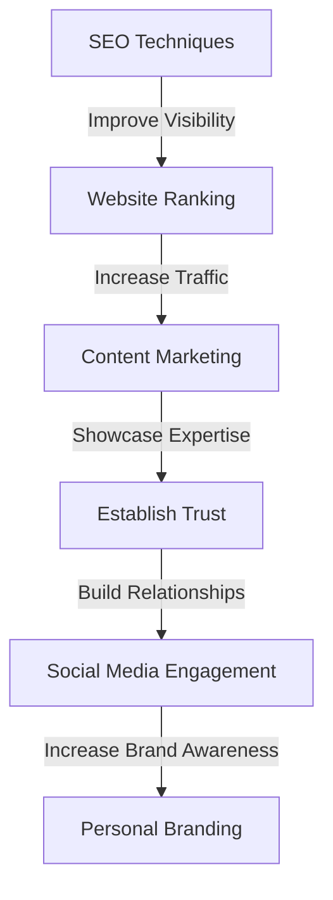
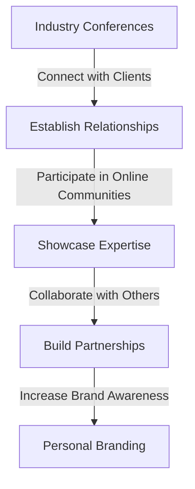

## Introduction to Advanced Personal Branding
In the first part of this series, we explored the fundamentals of personal branding as a technical freelancer. In this article, we will delve deeper into advanced strategies, real-world case studies, and the latest trends in online presence, networking, and unique value proposition. We will also examine the importance of continuous learning, adaptability, and resilience in maintaining a strong personal brand.

## Advanced Online Presence Strategies
To take your online presence to the next level, consider the following advanced strategies:
* Utilize search engine optimization (SEO) techniques to improve your website's visibility and ranking
* Leverage content marketing to showcase your expertise and provide value to your audience
* Engage with your audience through social media and blog comments to build relationships and establish trust

## Real-World Case Studies
Let's examine a few real-world case studies of technical freelancers who have successfully advanced their personal branding:
* A software engineer who built a personal website and blog to showcase their expertise and attract high-quality clients
* A data scientist who utilized social media to build a community and establish themselves as a thought leader in their field
* A web developer who created a podcast to share their knowledge and showcase their personality

## Networking and Community Engagement
Networking and community engagement are critical components of advanced personal branding. Consider the following strategies:
* Attend industry conferences and events to connect with potential clients and establish relationships
* Participate in online communities and forums to showcase your expertise and provide value to others
* Collaborate with other freelancers and businesses to build relationships and establish partnerships

## Crafting a Unique Value Proposition
A unique value proposition (UVP) is a critical component of advanced personal branding. Consider the following strategies:
* Identify your strengths and weaknesses to determine your UVP
* Develop a clear and concise message that showcases your UVP
* Utilize your UVP to differentiate yourself from others and attract high-quality clients

## Visual Insights Gallery
Here are a few visual insights to help you deepen your understanding of advanced personal branding:
* [A technical freelancer's website, showcasing their expertise and services](https://picsum.photos/seed/a-technical-freelancers-website/800/400)
* [A social media post from a technical freelancer, showcasing their personality and expertise](https://picsum.photos/seed/a-social-media-post-from-a-technical-freelancer/800/400)
* [A graph showing the importance of continuous learning and adaptability in maintaining a strong personal brand](https://picsum.photos/seed/a-graph-showing-the-importance-of-continuous-learning/800/400)

## Summary and Conclusion
In this article, we explored advanced strategies, real-world case studies, and the latest trends in online presence, networking, and unique value proposition. We also examined the importance of continuous learning, adaptability, and resilience in maintaining a strong personal brand. By implementing these strategies and staying up-to-date with the latest trends, you can take your personal branding to the next level and achieve long-term career growth.

## FAQ
Q: What is the most important component of advanced personal branding?
A: The most important component of advanced personal branding is continuous learning and adaptability.
Q: How can I utilize SEO techniques to improve my website's visibility and ranking?
A: You can utilize SEO techniques such as keyword research, on-page optimization, and link building to improve your website's visibility and ranking.
Q: What is the best way to showcase my expertise and provide value to my audience?
A: The best way to showcase your expertise and provide value to your audience is through content marketing, such as blogging, podcasting, or video creation.

## Visual Insights Gallery
Here are a few more visual insights to help you deepen your understanding of advanced personal branding:

