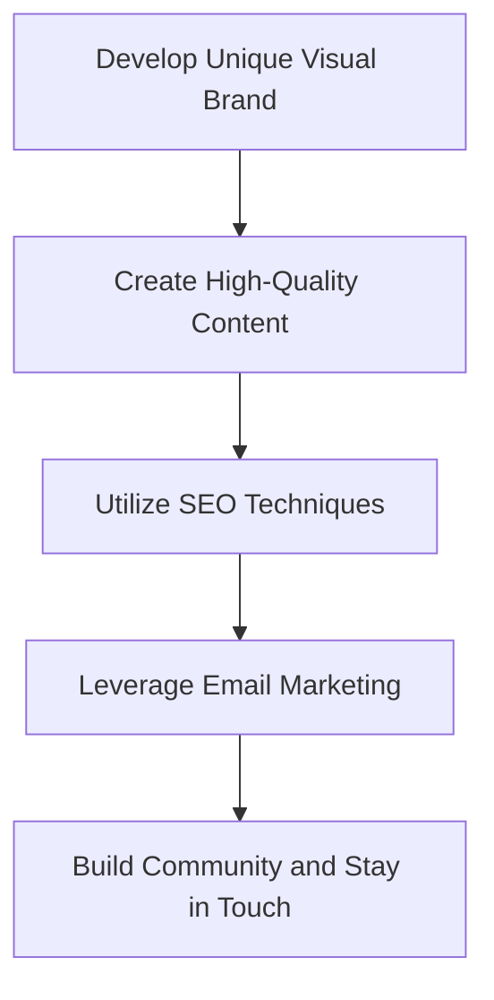
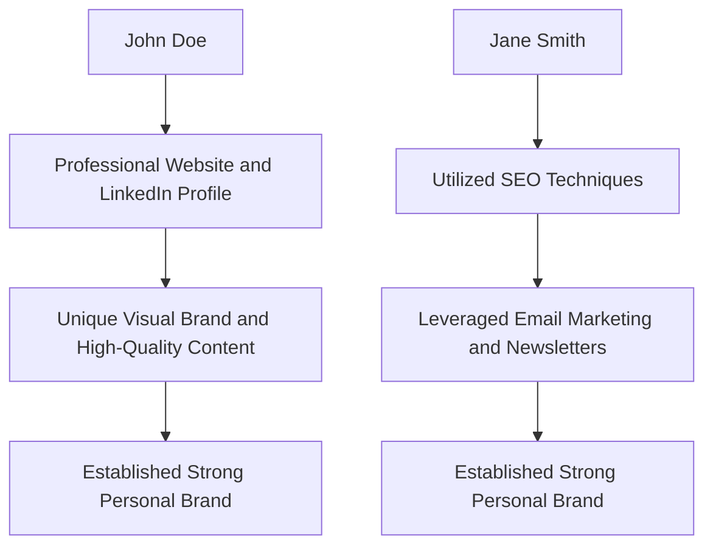
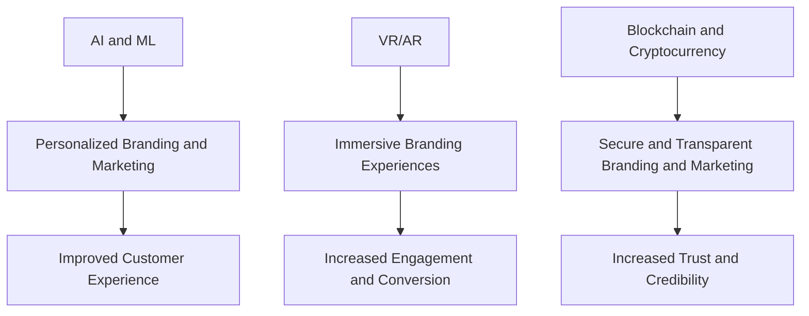
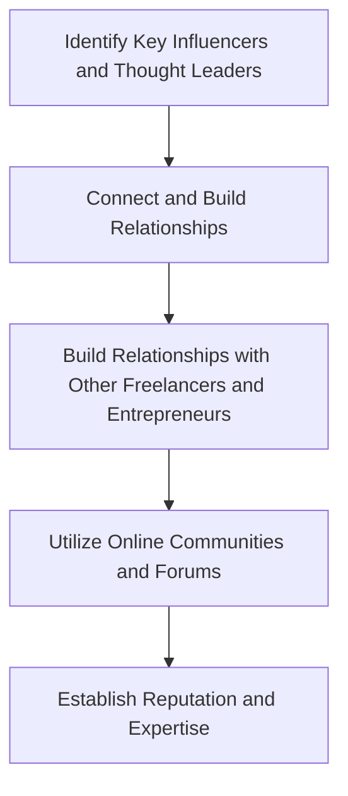

## Introduction to Advanced Personal Branding
In the first part of this series, we explored the fundamentals of personal branding for technical freelancers. In this article, we will delve into the advanced strategies and techniques for taking your personal brand to the next level. We will examine real-world case studies, discuss cutting-edge trends, and provide actionable advice for establishing a strong online presence, networking, and crafting a unique value proposition.

## Advanced Online Presence Strategies
To establish a strong online presence, technical freelancers need to go beyond just having a professional website and social media accounts. They need to create a cohesive brand identity that showcases their skills, expertise, and values. This can be achieved by:
* Developing a unique visual brand, including a logo, color scheme, and typography
* Creating high-quality, engaging content that showcases their expertise and provides value to their audience
* Utilizing search engine optimization (SEO) techniques to improve their website's visibility and ranking
* Leveraging email marketing and newsletters to build a community and stay in touch with their audience

## Real-World Case Studies
Let's take a look at a few real-world case studies of technical freelancers who have successfully established a strong personal brand:
* John Doe, a freelance software developer, created a professional website and LinkedIn profile that showcased his skills and expertise. He also developed a unique visual brand and created high-quality content that provided value to his audience.
* Jane Smith, a freelance data scientist, utilized SEO techniques to improve her website's visibility and ranking. She also leveraged email marketing and newsletters to build a community and stay in touch with her audience.

## Cutting-Edge Trends
The personal branding landscape is constantly evolving, and technical freelancers need to stay up-to-date with the latest trends and technologies. Some of the cutting-edge trends that are currently shaping the industry include:
* Artificial intelligence (AI) and machine learning (ML) for personalized branding and marketing
* Virtual and augmented reality (VR/AR) for immersive branding experiences
* Blockchain and cryptocurrency for secure and transparent branding and marketing

## Advanced Networking Strategies
Networking is a critical component of personal branding, and technical freelancers need to go beyond just attending industry events and conferences. They need to create a strategic networking plan that includes:
* Identifying and connecting with key influencers and thought leaders in their industry
* Building relationships with other freelancers and entrepreneurs
* Utilizing online communities and forums to build their reputation and establish themselves as experts

## Visual Insights Gallery
Here are a few visual insights that illustrate the importance of advanced personal branding for technical freelancers:
* 
* 
* 

## Visual Insights Gallery
### Example 1: Professional Website

### Example 2: Social Media Accounts

### Example 3: Unique Visual Brand
