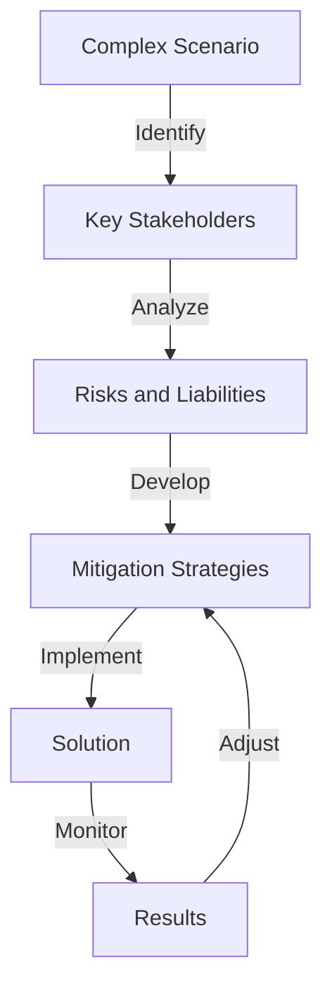
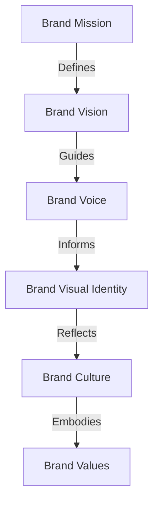

## Advanced Personal Branding for Technical Freelancers: Part 3
### Edge Cases and Deeper Architecture
In the previous articles, we explored the fundamentals and advanced strategies of personal branding for technical freelancers. In this article, we will delve into the advanced edge cases and deeper architecture of personal branding, including complex scenarios, niche markets, and emerging trends.

## Navigating Complex Scenarios
Technical freelancers often face complex scenarios that require advanced problem-solving and strategic thinking. For example:
* How to handle multiple clients with conflicting demands and deadlines
* How to navigate the ethics of working with clients in regulated industries, such as healthcare or finance
* How to manage the risks and liabilities associated with working on high-stakes projects
To navigate these complex scenarios, technical freelancers need to develop advanced skills in:
* Project management and coordination
* Risk assessment and mitigation
* Communication and conflict resolution

## Emerging Trends and Technologies
The personal branding landscape is constantly evolving, with emerging trends and technologies that technical freelancers need to stay ahead of. For example:
* The rise of artificial intelligence and machine learning in personal branding
* The growing importance of sustainability and social responsibility in personal branding
* The increasing use of virtual and augmented reality in personal branding
To stay ahead of these emerging trends and technologies, technical freelancers need to:
* Continuously update their skills and knowledge
* Stay informed about industry developments and trends
* Experiment with new tools and technologies

## Advanced Brand Architecture
Technical freelancers need to develop a deep understanding of brand architecture to create a cohesive and effective personal brand. This includes:
* Defining a clear brand mission and vision
* Developing a unique brand voice and tone
* Creating a consistent brand visual identity
* Establishing a strong brand culture and values

## Visual Insights Gallery
Here are some additional visual insights into advanced personal branding for technical freelancers:
* 
* 
* 