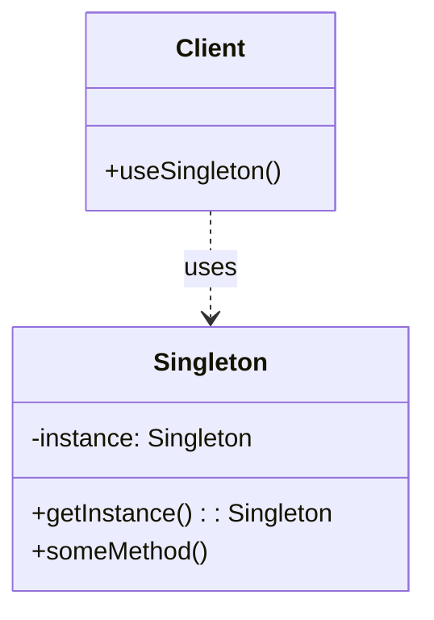
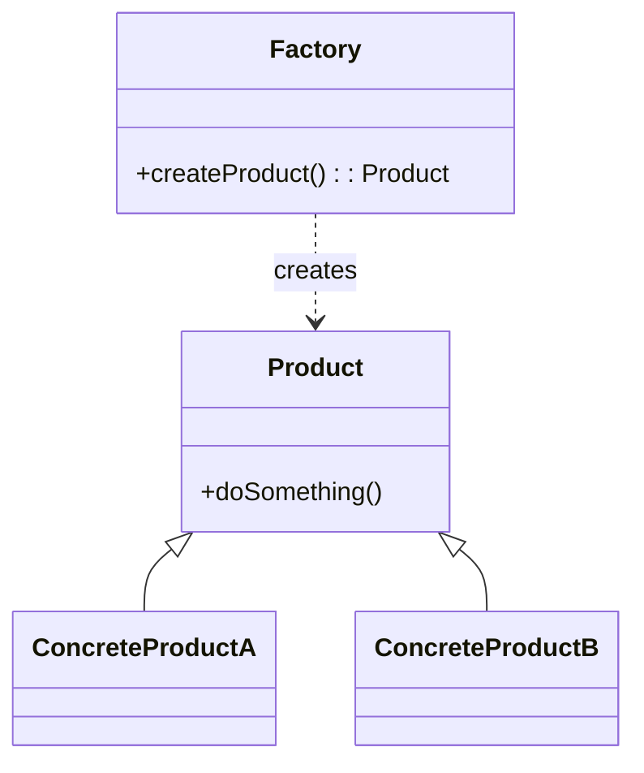
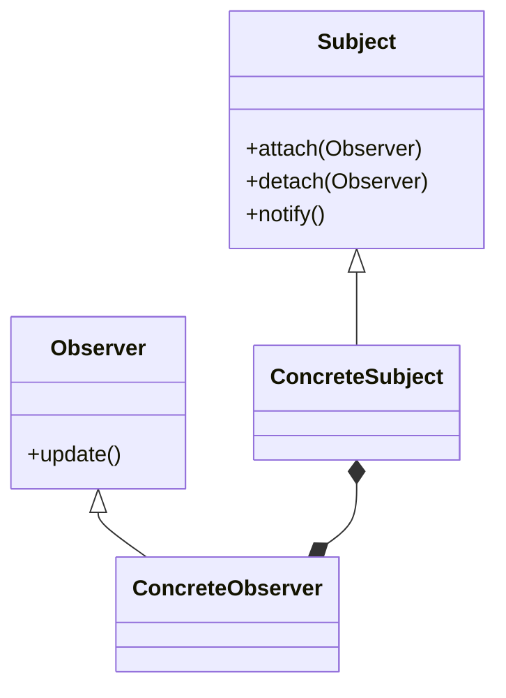
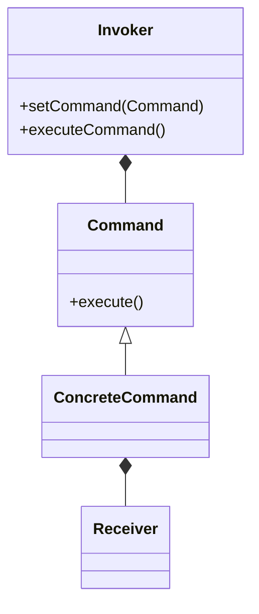
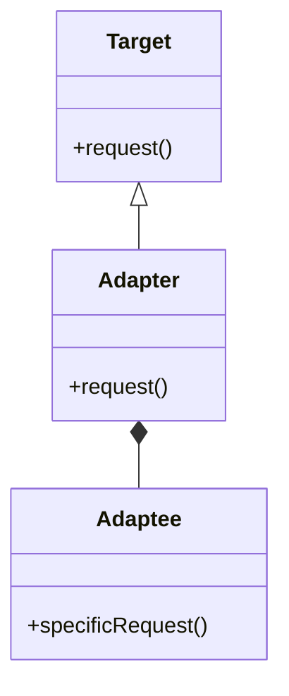
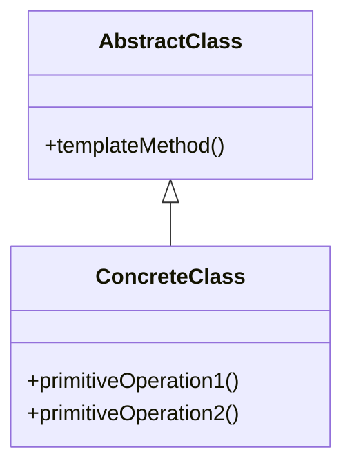
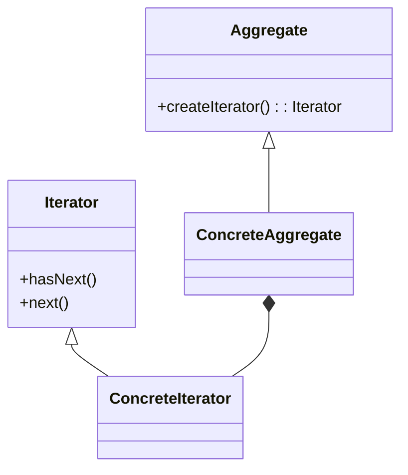
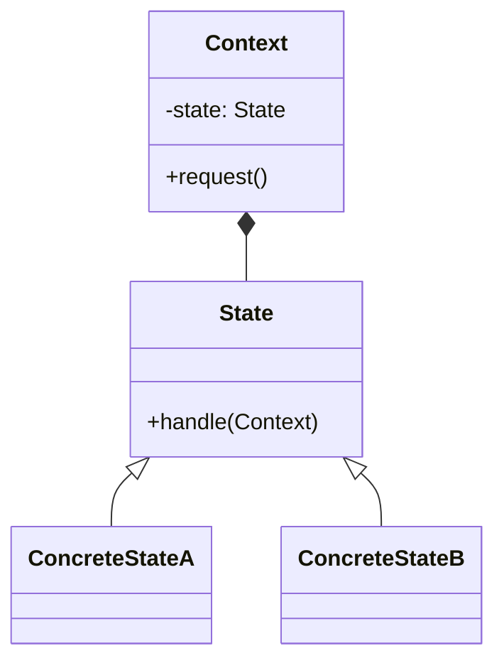
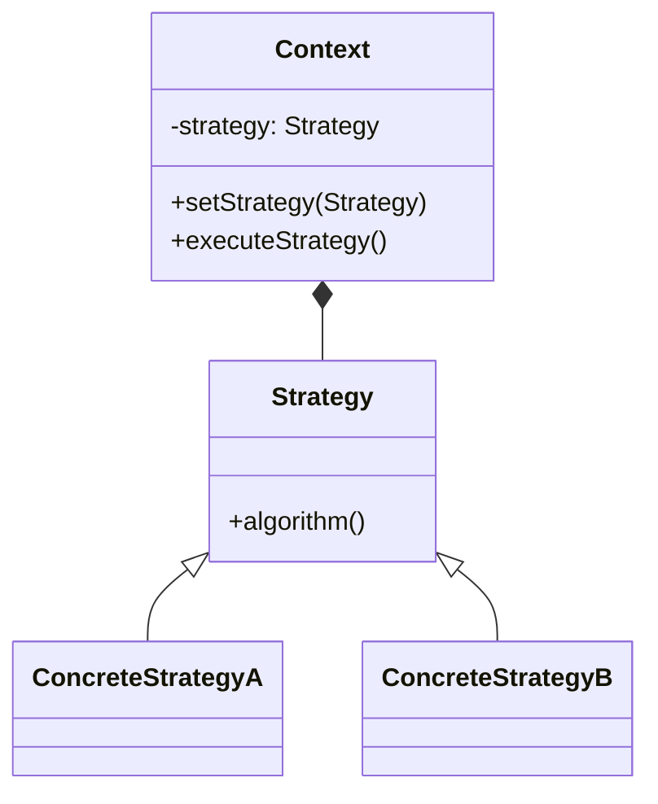
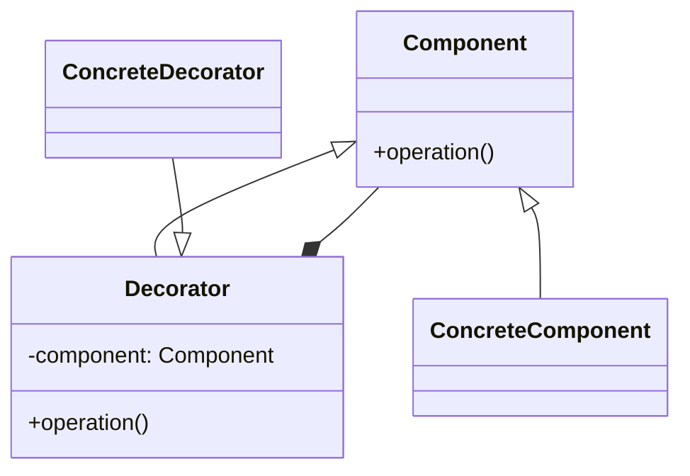

In the realm of technical interviews, the ability to recognize and apply coding patterns is crucial for success. As a candidate, being well-versed in these patterns not only demonstrates your problem-solving skills but also your ability to write efficient, scalable, and maintainable code. In this article, we will delve into 10 advanced coding patterns that are frequently encountered in technical interviews, providing you with the insights and practice you need to master these challenges.

## Table of Contents
1. [Introduction to Coding Patterns](#introduction-to-coding-patterns)
2. [1. Singleton Pattern](#1-singleton-pattern)
3. [2. Factory Pattern](#2-factory-pattern)
4. [3. Observer Pattern](#3-observer-pattern)
5. [4. Command Pattern](#4-command-pattern)
6. [5. Adapter Pattern](#5-adapter-pattern)
7. [6. Template Method Pattern](#6-template-method-pattern)
8. [7. Iterator Pattern](#7-iterator-pattern)
9. [8. State Pattern](#8-state-pattern)
10. [9. Strategy Pattern](#9-strategy-pattern)
11. [10. Decorator Pattern](#10-decorator-pattern)
12. [Visual Insights Gallery](#visual-insights-gallery)
13. [Summary/Conclusion](#summary/conclusion)
14. [FAQ](#faq)

## Introduction to Coding Patterns

Coding patterns are reusable solutions to common problems that arise during software development. They provide a proven development paradigm, helping developers create more maintainable, flexible, and scalable software systems. Mastering coding patterns is essential for any software developer, especially when it comes to technical interviews.

## 1. Singleton Pattern
The Singleton pattern restricts a class from instantiating its multiple objects. It creates a single object that can be accessed globally. This pattern is useful when a single object is needed to coordinate actions across the system.
```markdown

> **Note:** The Singleton pattern is often considered an anti-pattern due to its potential for misuse and the tight coupling it can introduce between classes.

## 2. Factory Pattern
The Factory pattern provides a way to create objects without specifying the exact class of object that will be created. It allows for the decoupling of object creation from the specific class of object being created.
```markdown

> **Tip:** Use the Factory pattern when you need to create objects without exposing the underlying logic of object creation.

## 3. Observer Pattern
The Observer pattern allows objects to be notified of changes to other objects without having a direct reference to each other. It defines a one-to-many dependency between objects so that when one object changes state, all its dependents are notified.
```markdown

> **Interview:** Be prepared to explain how the Observer pattern helps in achieving loose coupling between objects.

## 4. Command Pattern
The Command pattern encapsulates a request or an action as a separate object, allowing for more flexibility and extensibility in handling requests.
```markdown

> **Warning:** Avoid overusing the Command pattern, as it can lead to an explosion of command classes.

## 5. Adapter Pattern
The Adapter pattern allows two incompatible objects to work together by converting the interface of one object into an interface expected by the other object.
```markdown

> **Tip:** Use the Adapter pattern when you want to use an existing class, but its interface does not match the one you need.

## 6. Template Method Pattern
The Template Method pattern defines the skeleton of an algorithm in a method, deferring some steps to subclasses. It lets subclasses redefine certain steps of an algorithm without changing the algorithm's structure.
```markdown

> **Note:** The Template Method pattern is particularly useful for providing a way to perform an algorithm that has some invariant parts and some variant parts.

## 7. Iterator Pattern
The Iterator pattern allows you to traverse elements of an aggregate object without exposing its underlying representation.
```markdown

> **Warning:** Be cautious of iterator invalidation when using the Iterator pattern, especially in multi-threaded environments.

## 8. State Pattern
The State pattern allows an object to alter its behavior when its internal state changes. It appears as if the object has changed its class.
```markdown

> **Tip:** Use the State pattern when you have an object that needs to change its behavior based on its internal state.

## 9. Strategy Pattern
The Strategy pattern defines a family of algorithms, encapsulates each one, and makes them interchangeable. It lets the algorithm vary independently of the clients that use it.
```markdown

> **Interview:** Be prepared to explain how the Strategy pattern helps in achieving polymorphic behavior without using inheritance.

## 10. Decorator Pattern
The Decorator pattern allows you to dynamically add new behaviors or responsibilities to an object without modifying its implementation. It provides an alternative to subclassing for extending the behavior of an object.
```markdown

> **Tip:** Use the Decorator pattern when you want to add additional responsibilities to an object without affecting the existing class structure.

## Visual Insights Gallery


## Summary/Conclusion
Mastering advanced coding patterns is essential for success in technical interviews. By understanding and applying these patterns, you can demonstrate your ability to write efficient, scalable, and maintainable code. Remember to practice explaining the patterns and their applications, as this will help you articulate your thoughts clearly during interviews.

## FAQ
1. **What is the purpose of coding patterns?**
   - Coding patterns provide reusable solutions to common problems that arise during software development, helping developers create more maintainable, flexible, and scalable software systems.
2. **How do I choose the right coding pattern for a problem?**
   - To choose the right coding pattern, you need to understand the problem you are trying to solve and the trade-offs of each pattern. Consider factors such as complexity, scalability, and maintainability.
3. **Can coding patterns be used in conjunction with each other?**
   - Yes, coding patterns can be used together to solve complex problems. This is known as pattern composition, and it requires a deep understanding of each pattern and how they interact with each other.