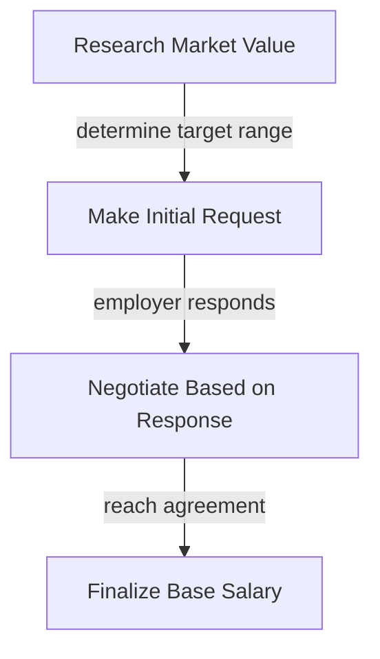
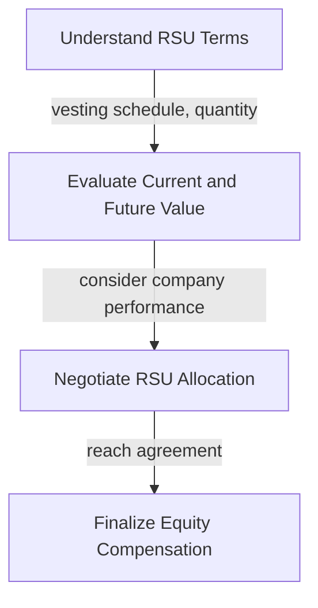

As a tech professional, navigating the job market can be challenging, especially when it comes to negotiating job offers. With the rise of remote work and the increasing demand for skilled tech talent, it's essential to understand how to effectively negotiate your compensation package. In this article, we'll delve into the world of base salary, RSUs (Restricted Stock Units), and benefits, providing you with the insights and strategies you need to secure the best possible deal.

## Table of Contents
1. [Understanding Your Worth](#understanding-your-worth)
2. [Breaking Down the Compensation Package](#breaking-down-the-compensation-package)
3. [Negotiating Base Salary](#negotiating-base-salary)
4. [Understanding and Negotiating RSUs](#understanding-and-negotiating-rsus)
5. [Benefits and Perks](#benefits-and-perks)
6. [Visual Insights Gallery](#visual-insights-gallery)
7. [Summary and Conclusion](#summary-and-conclusion)
8. [FAQ](#faq)

## Understanding Your Worth
Before entering into any negotiation, it's crucial to understand your worth in the job market. This involves researching your market value, considering your skills, experience, and the demand for your expertise. 


> **Note:** Utilize online resources such as Glassdoor, LinkedIn, and Payscale to get an accurate estimate of your market value. This data will serve as the foundation for your negotiation strategy.

## Breaking Down the Compensation Package
A typical tech job offer includes a combination of base salary, RSUs, and benefits. Understanding each component and how they contribute to your overall compensation is vital for effective negotiation.

```markdown
| Component | Description |
| --- | --- |
| Base Salary | Annual salary paid in cash |
| RSUs | Restricted Stock Units that vest over time |
| Benefits | Health insurance, retirement plans, etc. |
```

## Negotiating Base Salary
Negotiating your base salary is often the most straightforward part of the compensation package. It's essential to have a clear idea of your target salary range based on your research.



> **Tip:** Be prepared to explain why you deserve your requested salary, focusing on your skills, experience, and the value you bring to the company.

## Understanding and Negotiating RSUs
RSUs are a form of equity compensation that can significantly impact your long-term financial situation. Understanding how RSUs work and negotiating their value requires careful consideration.




> **Warning:** Always consider the vesting schedule and the potential risks associated with RSUs, as they can impact your financial situation significantly.

## Benefits and Perks
Benefits and perks, such as health insurance, retirement plans, and flexible working hours, can add substantial value to your compensation package. Don't overlook these when negotiating your offer.


> **Interview:** "Benefits are often overlooked but can make a huge difference in your quality of life and financial security. Make sure to ask about all the benefits and perks the company offers," says Jane Doe, a seasoned tech recruiter.

## Visual Insights Gallery
Here are some additional visual insights to help you better understand the negotiation process:


## Summary and Conclusion
Negotiating a tech job offer is a complex process that requires understanding your worth, breaking down the compensation package, and effectively negotiating each component. By following the strategies and insights outlined in this article, you'll be better equipped to secure a compensation package that reflects your value and supports your long-term career goals.

## FAQ
1. **Q: How do I determine my market value?**
   - A: Utilize online resources such as Glassdoor, LinkedIn, and Payscale to research your market value based on your skills, experience, and location.
2. **Q: What are RSUs, and how do they work?**
   - A: RSUs (Restricted Stock Units) are a form of equity compensation that vest over time, allowing you to purchase company stock at a predetermined price.
3. **Q: Can I negotiate benefits and perks?**
   - A: Yes, benefits and perks are negotiable. Consider what's important to you and make a case for why certain benefits would improve your job satisfaction and performance.