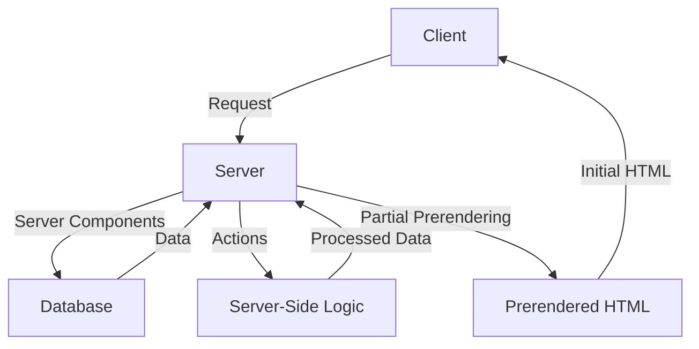
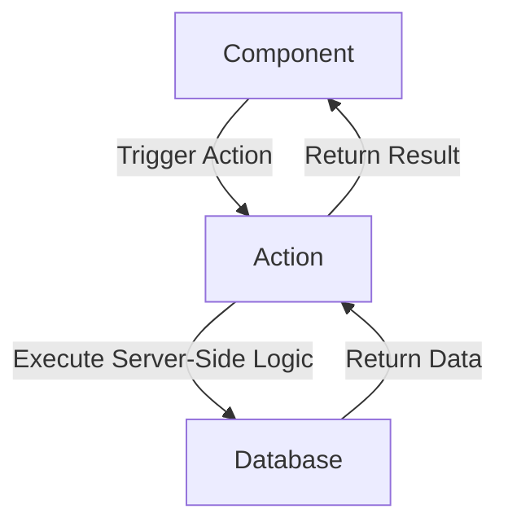

# Next.js 15 Deep Dive: Server Components, Actions, and Partial Prerendering

Next.js 15 has revolutionized the way we build server-side rendered (SSR) applications, introducing groundbreaking features like Server Components, Actions, and Partial Prerendering. In this article, we'll delve into the depths of these innovations, exploring their architecture, patterns, and strategies for implementation.

## Table of Contents
1. [Introduction to Next.js 15](#introduction-to-nextjs-15)
2. [Server Components: A New Era in SSR](#server-components-a-new-era-in-ssr)
3. [Actions: Simplifying Server-Side Logic](#actions-simplifying-server-side-logic)
4. [Partial Prerendering: The Best of Both Worlds](#partial-prerendering-the-best-of-both-worlds)
5. [Implementing Next.js 15: Best Practices and Patterns](#implementing-nextjs-15-best-practices-and-patterns)
6. [Visual Insights Gallery](#visual-insights-gallery)
7. [Summary and Conclusion](#summary-and-conclusion)
8. [FAQ](#faq)

## Introduction to Next.js 15
Next.js 15 is the latest iteration of the popular React-based web framework, boasting an array of exciting features that enhance performance, scalability, and developer experience. With Server Components, Actions, and Partial Prerendering, Next.js 15 empowers developers to build fast, efficient, and highly interactive applications.



## Server Components: A New Era in SSR
Server Components are a game-changer in the world of SSR, allowing developers to build reusable, server-side rendered components that can be easily integrated into their applications. By leveraging Server Components, developers can:
* Improve performance by reducing the amount of data transferred between the client and server
* Enhance security by keeping sensitive data on the server-side
* Simplify development by using a single codebase for both client-side and server-side rendering

```javascript
// server-component.js
import { useState } from 'react';

export default function ServerComponent() {
  const [data, setData] = useState(null);

  // Fetch data from database or API
  const fetchData = async () => {
    const response = await fetch('/api/data');
    const data = await response.json();
    setData(data);
  };

  // Render component with fetched data
  return (
    <div>
      {data ? (
        <ul>
          {data.map((item) => (
            <li key={item.id}>{item.name}</li>
          ))}
        </ul>
      ) : (
        <p>Loading...</p>
      )}
    </div>
  );
}
```

## Actions: Simplifying Server-Side Logic
Actions are a new concept in Next.js 15, designed to simplify server-side logic and make it more manageable. By using Actions, developers can:
* Decouple server-side logic from their components
* Reuse server-side logic across multiple components
* Improve code organization and maintainability



## Partial Prerendering: The Best of Both Worlds
Partial Prerendering is a feature in Next.js 15 that allows developers to prerender specific parts of their application, while still maintaining the benefits of dynamic rendering. By using Partial Prerendering, developers can:
* Improve SEO by providing search engines with prerendered HTML
* Enhance user experience by reducing the time it takes to render dynamic content
* Simplify development by using a single codebase for both prerendered and dynamic content

```javascript
// pages/index.js
import { useState, useEffect } from 'react';

export default function HomePage() {
  const [data, setData] = useState(null);

  // Prerender initial HTML
  useEffect(() => {
    const fetchData = async () => {
      const response = await fetch('/api/data');
      const data = await response.json();
      setData(data);
    };
    fetchData();
  }, []);

  // Render dynamic content
  return (
    <div>
      {data ? (
        <ul>
          {data.map((item) => (
            <li key={item.id}>{item.name}</li>
          ))}
        </ul>
      ) : (
        <p>Loading...</p>
      )}
    </div>
  );
}
```

## Implementing Next.js 15: Best Practices and Patterns
To get the most out of Next.js 15, it's essential to follow best practices and patterns when implementing its features. Some key takeaways include:
* Using Server Components to build reusable, server-side rendered components
* Leveraging Actions to simplify server-side logic and improve code organization
* Utilizing Partial Prerendering to enhance SEO and user experience
* Following established patterns and guidelines for coding, testing, and deployment


> **Tip:** When implementing Next.js 15, make sure to thoroughly test and debug your application to ensure optimal performance and functionality.

## Visual Insights Gallery
### Server Components in Action

### Actions Simplifying Server-Side Logic

### Partial Prerendering in Next.js 15


## Summary and Conclusion
Next.js 15 is a powerful tool for building fast, efficient, and highly interactive applications. By leveraging Server Components, Actions, and Partial Prerendering, developers can create complex applications with ease. Remember to follow best practices and patterns when implementing these features, and don't hesitate to reach out if you have any questions or need further guidance.

## FAQ
Q: What is Next.js 15, and how does it differ from previous versions?
A: Next.js 15 is the latest iteration of the popular React-based web framework, boasting an array of exciting features like Server Components, Actions, and Partial Prerendering.
Q: How do I get started with Next.js 15, and what are the system requirements?
A: To get started with Next.js 15, make sure you have Node.js and npm installed on your machine. Then, create a new project using the `npx create-next-app` command, and follow the official documentation for further guidance.
Q: What are the benefits of using Server Components, Actions, and Partial Prerendering in Next.js 15?
A: Server Components, Actions, and Partial Prerendering offer numerous benefits, including improved performance, enhanced security, simplified development, and better SEO. By leveraging these features, developers can build fast, efficient, and highly interactive applications with ease.