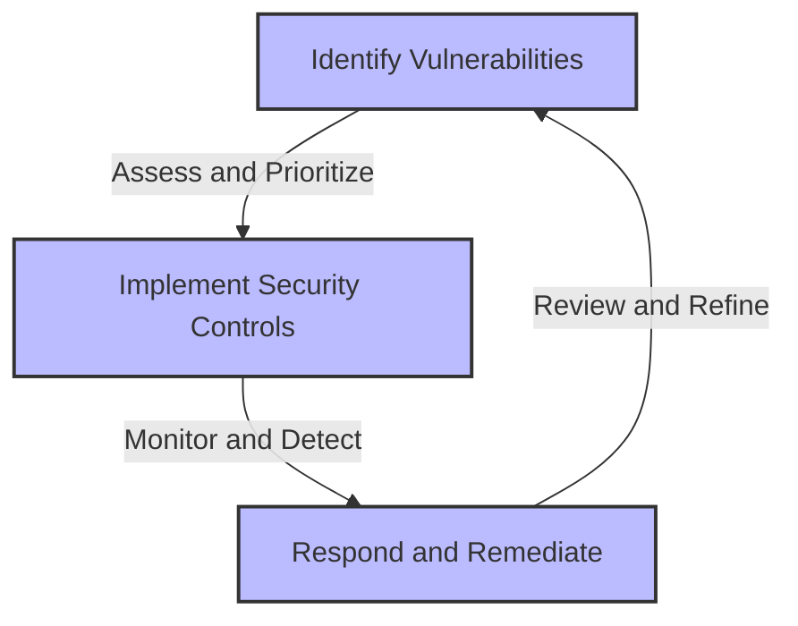
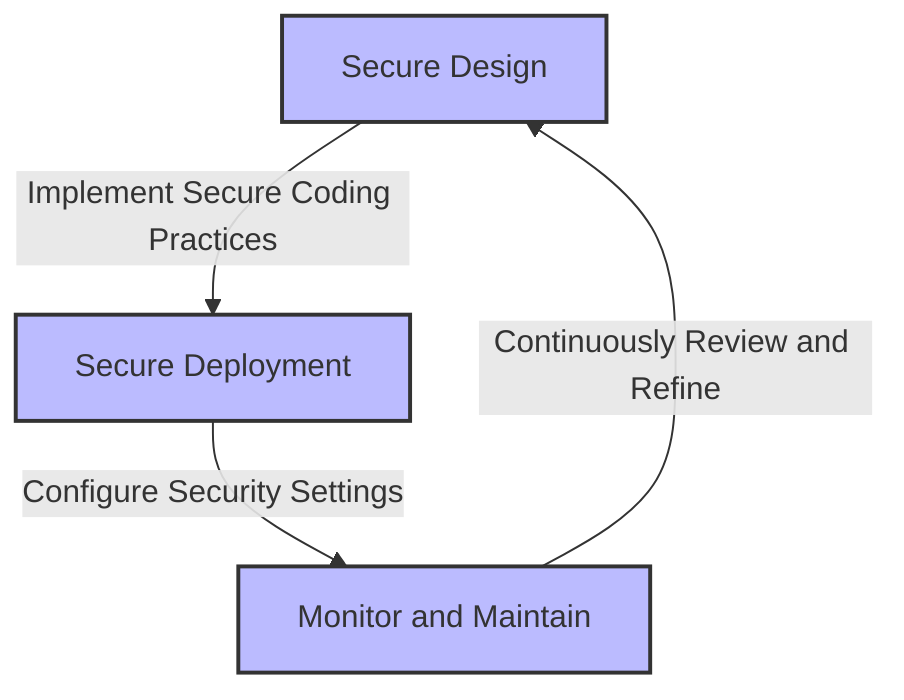

The digital landscape is evolving at an unprecedented pace, with new technologies and innovations emerging every day. However, this rapid growth also introduces new security risks and vulnerabilities, making it essential for organizations to stay vigilant and proactive in protecting their assets. The Open Web Application Security Project (OWASP) Top 10 is a widely recognized standard for identifying and mitigating the most critical web application security risks. In this article, we will delve into the OWASP Top 10 in 2026, exploring the latest vulnerabilities and providing actionable strategies for protecting against modern threats.

## Table of Contents
1. [Introduction to OWASP Top 10](#introduction-to-owasp-top-10)
2. [Top 10 Vulnerabilities in 2026](#top-10-vulnerabilities-in-2026)
3. [Protecting Against Modern Vulnerabilities](#protecting-against-modern-vulnerabilities)
4. [Implementation and Best Practices](#implementation-and-best-practices)
5. [Visual Insights Gallery](#visual-insights-gallery)
6. [Summary and Conclusion](#summary-and-conclusion)
7. [FAQ](#faq)

## Introduction to OWASP Top 10

The OWASP Top 10 is a comprehensive guide that highlights the most critical web application security risks. First published in 2003, the list is updated every three years to reflect the evolving threat landscape. The OWASP Top 10 is widely adopted across industries and is considered a de facto standard for web application security.

## Top 10 Vulnerabilities in 2026

The OWASP Top 10 in 2026 includes the following vulnerabilities:
* A1: Broken Access Control
* A2: Cryptographic Failures
* A3: Injection
* A4: Insecure Design
* A5: Security Misconfiguration
* A6: Vulnerable and Outdated Components
* A7: Identification and Authentication Failures
* A8: Software and Data Integrity Failures
* A9: Security Logging and Monitoring Failures
* A10: Server-Side Request Forgery (SSRF)

```markdown
| Vulnerability | Description |
| --- | --- |
| A1: Broken Access Control | Restricting access to sensitive data and functionality |
| A2: Cryptographic Failures | Ensuring proper encryption and decryption of data |
| A3: Injection | Preventing injection of malicious code or data |
| A4: Insecure Design | Implementing secure design principles and patterns |
| A5: Security Misconfiguration | Configuring security settings and parameters correctly |
| A6: Vulnerable and Outdated Components | Keeping software components up-to-date and secure |
| A7: Identification and Authentication Failures | Ensuring secure identification and authentication mechanisms |
| A8: Software and Data Integrity Failures | Maintaining software and data integrity through secure development and deployment practices |
| A9: Security Logging and Monitoring Failures | Implementing effective security logging and monitoring |
| A10: Server-Side Request Forgery (SSRF) | Preventing unauthorized access to internal resources |
```

## Protecting Against Modern Vulnerabilities

To protect against modern vulnerabilities, it is essential to adopt a proactive and multi-layered approach to security. This includes:

* Implementing secure design principles and patterns
* Conducting regular security assessments and penetration testing
* Deploying effective security controls, such as firewalls and intrusion detection systems
* Monitoring and detecting security incidents in real-time
* Responding and remediating security incidents quickly and effectively

## Implementation and Best Practices

To implement the OWASP Top 10 effectively, consider the following best practices:

* Adopt a secure design approach, incorporating security into every stage of the development lifecycle
* Implement secure coding practices, such as input validation and error handling
* Configure security settings and parameters correctly, using secure defaults and configurations
* Monitor and maintain security controls, ensuring they are up-to-date and effective
* Continuously review and refine security practices, staying informed about emerging threats and vulnerabilities

## Visual Insights Gallery
## Visual Insights Gallery


## Summary and Conclusion
In conclusion, the OWASP Top 10 in 2026 highlights the most critical web application security risks, providing a comprehensive guide for protecting against modern vulnerabilities. By adopting a proactive and multi-layered approach to security, implementing secure design principles and patterns, and following best practices, organizations can effectively mitigate these risks and ensure the security and integrity of their web applications.

## FAQ
> **Q: What is the OWASP Top 10?**
> A: The OWASP Top 10 is a comprehensive guide that highlights the most critical web application security risks.
> **Q: How often is the OWASP Top 10 updated?**
> A: The OWASP Top 10 is updated every three years to reflect the evolving threat landscape.
> **Q: What are the top 10 vulnerabilities in 2026?**
> A: The top 10 vulnerabilities in 2026 include Broken Access Control, Cryptographic Failures, Injection, Insecure Design, Security Misconfiguration, Vulnerable and Outdated Components, Identification and Authentication Failures, Software and Data Integrity Failures, Security Logging and Monitoring Failures, and Server-Side Request Forgery (SSRF).
> **Q: How can organizations protect against modern vulnerabilities?**
> A: Organizations can protect against modern vulnerabilities by adopting a proactive and multi-layered approach to security, implementing secure design principles and patterns, conducting regular security assessments and penetration testing, deploying effective security controls, monitoring and detecting security incidents, and responding and remediating security incidents quickly and effectively.