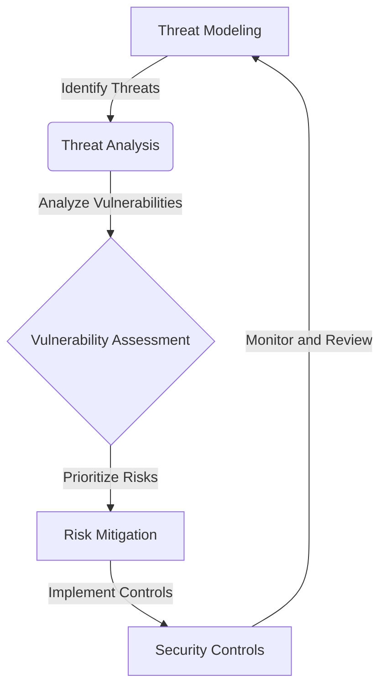
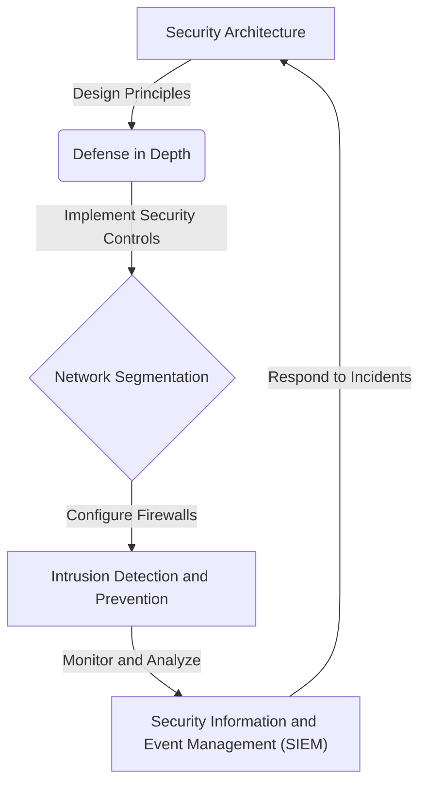

## Introduction to Advanced OWASP Top 10

In our previous article, we explored the OWASP Top 10 in 2026, highlighting the most critical web application security risks and providing actionable strategies for protection. However, as the digital landscape continues to evolve, it's essential to delve deeper into advanced edge cases and architectural considerations. This article will provide a comprehensive deep dive into the OWASP Top 10, exploring complex scenarios and providing insights into protecting against modern vulnerabilities.

## Advanced Vulnerability Analysis

To effectively protect against modern vulnerabilities, it's crucial to conduct a thorough analysis of advanced edge cases. This includes considering scenarios such as:
* Complex authentication mechanisms
* Multi-factor authentication (MFA) bypass techniques
* Advanced persistent threats (APTs)
* Zero-day exploits

### Advanced Threat Modeling

Threat modeling is a critical component of advanced vulnerability analysis. By identifying potential threats and analyzing vulnerabilities, organizations can prioritize risks and implement effective security controls.

## Architectural Considerations

When designing and implementing web applications, it's essential to consider architectural factors that can impact security. This includes:
* Microservices architecture
* Containerization and orchestration
* Cloud-based infrastructure
* Serverless computing

### Advanced Security Architecture

A well-designed security architecture is critical for protecting against modern vulnerabilities. By implementing defense-in-depth principles, network segmentation, and security controls, organizations can reduce the risk of security breaches.

## Case Studies and Real-World Examples

To illustrate the importance of advanced vulnerability analysis and architectural considerations, let's examine some real-world case studies:
* A recent study by a leading cybersecurity firm found that 75% of organizations had experienced a security breach due to a vulnerability in their web application.
* A major e-commerce company was hacked due to a vulnerability in their authentication mechanism, resulting in the theft of sensitive customer data.

## Implementation and Best Practices

To protect against modern vulnerabilities, it's essential to implement best practices and follow industry-recognized standards. This includes:
* Regularly updating and patching software
* Implementing secure coding practices
* Conducting thorough security testing and vulnerability assessments
* Providing security awareness training for developers and employees

## Visual Insights Gallery

For a deeper understanding of advanced OWASP Top 10 concepts, explore the following visual insights:
* [OWASP Top 10 2026](https://picsum.photos/seed/owasp-top-10-2026/800/400)
* [Advanced Threat Modeling](https://picsum.photos/seed/advanced-threat-modeling/800/400)
* [Security Architecture](https://picsum.photos/seed/security-architecture/800/400)

## Summary and Conclusion
In this article, we explored advanced edge cases and architectural considerations for the OWASP Top 10 in 2026. By conducting thorough vulnerability analysis, considering architectural factors, and implementing best practices, organizations can effectively protect against modern vulnerabilities and reduce the risk of security breaches.

## FAQ
For additional information and answers to frequently asked questions, please refer to our [FAQ section](https://picsum.photos/seed/faq/800/400).

## Visual Insights Gallery
### Gallery Images

