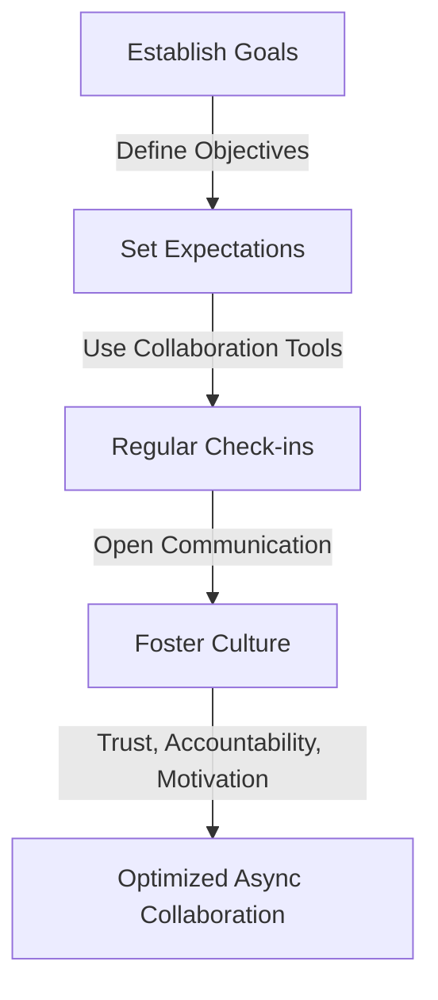
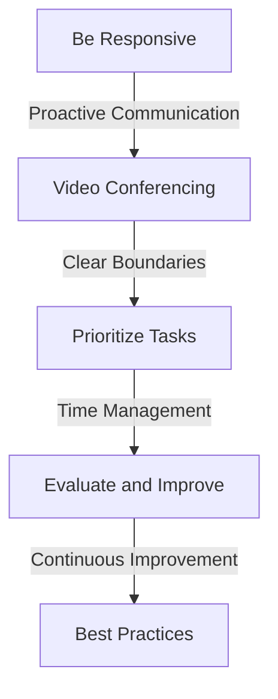

Asynchronous collaboration has become the norm in today's fast-paced, globally distributed work environment. However, optimizing async collaboration for extreme performance and reliability can be a challenge. In this article, we will delve into the strategies and techniques for achieving high-performance async collaboration.

## Table of Contents
1. [Introduction to Async Collaboration](#introduction-to-async-collaboration)
2. [Benefits of Async Collaboration](#benefits-of-async-collaboration)
3. [Challenges of Async Collaboration](#challenges-of-async-collaboration)
4. [Optimizing Async Collaboration](#optimizing-async-collaboration)
5. [Best Practices for Async Collaboration](#best-practices-for-async-collaboration)
6. [Visual Insights Gallery](#visual-insights-gallery)
7. [Conclusion and FAQ](#conclusion-and-faq)

## Introduction to Async Collaboration
Async collaboration refers to the process of working together with others on a project or task without being physically present or working in real-time. This can include working with remote teams, using collaboration tools, or communicating through email or messaging apps.


## Benefits of Async Collaboration
Async collaboration offers several benefits, including:
* Increased flexibility and autonomy
* Improved work-life balance
* Enhanced productivity
* Reduced distractions and interruptions
* Ability to work with global teams and talent
```markdown
| Benefits | Description |
| --- | --- |
| Flexibility | Work from anywhere, at any time |
| Autonomy | More control over work schedule and tasks |
| Productivity | Reduced distractions and improved focus |
| Global Teams | Access to global talent and expertise |
```
## Challenges of Async Collaboration
Despite the benefits, async collaboration also presents several challenges, including:
* Communication breakdowns
* Lack of face-to-face interaction
* Difficulty in building trust and rapport
* Managing different time zones and schedules
* Ensuring accountability and motivation
> **Note:** Effective communication is key to overcoming these challenges and achieving successful async collaboration.

## Optimizing Async Collaboration
To optimize async collaboration, consider the following strategies:
* Establish clear goals, objectives, and expectations
* Use collaboration tools and platforms
* Set regular check-ins and progress updates
* Encourage open and transparent communication
* Foster a culture of trust, accountability, and motivation


## Best Practices for Async Collaboration
To ensure successful async collaboration, follow these best practices:
* Be responsive and proactive
* Use video conferencing for face-to-face interaction
* Set clear boundaries and expectations
* Prioritize tasks and manage time effectively
* Continuously evaluate and improve processes


## Visual Insights Gallery
Here are some visual insights into async collaboration:


## Conclusion and FAQ
In conclusion, optimizing async collaboration requires careful planning, effective communication, and a willingness to adapt to new challenges. By following the strategies and best practices outlined in this article, you can achieve extreme performance and reliability in your async collaboration efforts.
### FAQ
Q: What are the benefits of async collaboration?
A: The benefits of async collaboration include increased flexibility, autonomy, productivity, and access to global talent.
Q: What are the challenges of async collaboration?
A: The challenges of async collaboration include communication breakdowns, lack of face-to-face interaction, difficulty in building trust and rapport, and managing different time zones and schedules.
Q: How can I optimize async collaboration?
A: To optimize async collaboration, establish clear goals and expectations, use collaboration tools, set regular check-ins, and foster a culture of trust and accountability.