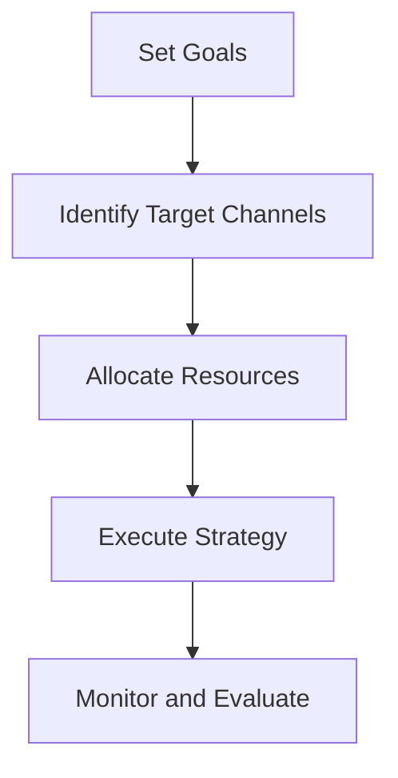
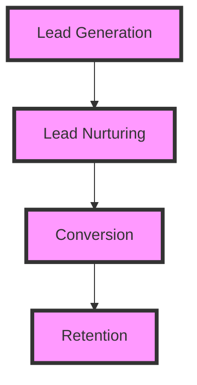

In the fast-paced world of startups and entrepreneurship, acquiring customers is a crucial aspect of any business's success. With the rise of SaaS (Software as a Service) companies, the competition for customers has become increasingly fierce. To stay ahead of the curve, businesses must optimize their customer acquisition strategies for extreme performance and reliability. In this article, we will delve into the world of customer acquisition, exploring the latest trends, strategies, and technologies that can help businesses achieve their goals.

## Table of Contents
1. [Introduction to Customer Acquisition](#introduction-to-customer-acquisition)
2. [Understanding Your Target Audience](#understanding-your-target-audience)
3. [Building a Customer Acquisition Strategy](#building-a-customer-acquisition-strategy)
4. [Optimizing Your Sales Funnel](#optimizing-your-sales-funnel)
5. [Leveraging Technology for Customer Acquisition](#leveraging-technology-for-customer-acquisition)
6. [Measuring and Analyzing Performance](#measuring-and-analyzing-performance)
7. [Conclusion](#conclusion)
8. [Visual Insights Gallery](#visual-insights-gallery)
9. [FAQ](#faq)

## Introduction to Customer Acquisition
Customer acquisition is the process of attracting and converting new customers into paying clients. It involves a range of activities, from marketing and advertising to sales and customer support. In today's digital age, customer acquisition has become increasingly complex, with businesses facing a multitude of challenges, including intense competition, changing consumer behaviors, and evolving technologies.


## Understanding Your Target Audience
To develop an effective customer acquisition strategy, businesses must first understand their target audience. This involves identifying demographics, needs, preferences, and pain points. By gaining a deep understanding of their target audience, businesses can create tailored marketing campaigns, develop relevant products and services, and build strong relationships with their customers.
```markdown
| Demographic | Description |
| --- | --- |
| Age | 25-45 |
| Location | Urban |
| Interests | Technology, entrepreneurship |
```
> **Tip:** Use social media analytics tools to gain insights into your target audience's behavior, preferences, and interests.

## Building a Customer Acquisition Strategy
A customer acquisition strategy outlines the steps a business will take to attract and retain new customers. It involves setting clear goals, identifying target channels, and allocating resources. A well-planned strategy can help businesses optimize their customer acquisition efforts, reduce costs, and improve ROI.

> **Warning:** A poorly planned strategy can lead to wasted resources, low conversion rates, and a negative impact on the business's bottom line.

## Optimizing Your Sales Funnel
The sales funnel represents the customer's journey from initial awareness to conversion. Optimizing the sales funnel involves streamlining each stage, from lead generation to conversion, to ensure a seamless and efficient customer experience.

> **Note:** Use A/B testing to identify areas for improvement and optimize the sales funnel for maximum conversion rates.

## Leveraging Technology for Customer Acquisition
Technology has revolutionized the customer acquisition process, providing businesses with a range of tools and platforms to attract and engage with their target audience. From social media and content marketing to email marketing and CRM systems, technology can help businesses streamline their customer acquisition efforts, improve efficiency, and reduce costs.


## Measuring and Analyzing Performance
Measuring and analyzing performance is critical to evaluating the effectiveness of a customer acquisition strategy. Businesses must track key metrics, such as conversion rates, customer lifetime value, and ROI, to identify areas for improvement and optimize their strategy for maximum impact.
```markdown
| Metric | Description |
| --- | --- |
| Conversion Rate | 2% |
| Customer Lifetime Value | $1000 |
| ROI | 300% |
```
> **Interview:** "Measuring and analyzing performance is essential to understanding the effectiveness of our customer acquisition strategy. By tracking key metrics, we can identify areas for improvement and optimize our strategy for maximum impact." - CEO, SaaS Company

## Conclusion
Optimizing customer acquisition for extreme performance and reliability requires a deep understanding of the target audience, a well-planned strategy, and the effective use of technology. By streamlining the sales funnel, leveraging technology, and measuring and analyzing performance, businesses can attract and retain new customers, reduce costs, and improve ROI.

## Visual Insights Gallery


## FAQ
1. What is customer acquisition?
Customer acquisition is the process of attracting and converting new customers into paying clients.
2. How do I develop an effective customer acquisition strategy?
To develop an effective customer acquisition strategy, businesses must first understand their target audience, set clear goals, identify target channels, and allocate resources.
3. What is the sales funnel?
The sales funnel represents the customer's journey from initial awareness to conversion.
4. How do I optimize my sales funnel?
To optimize your sales funnel, streamline each stage, from lead generation to conversion, to ensure a seamless and efficient customer experience.
5. What role does technology play in customer acquisition?
Technology provides businesses with a range of tools and platforms to attract and engage with their target audience, streamline their customer acquisition efforts, and improve efficiency.