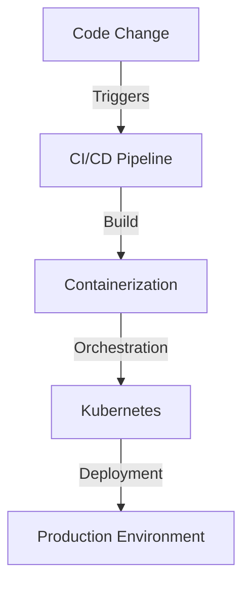
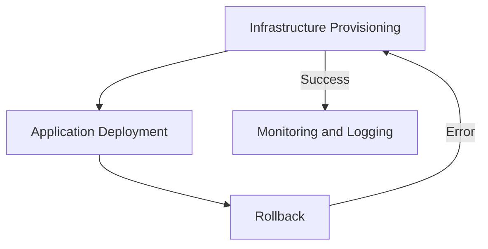

In the realm of cloud computing and DevOps, the deployment pipeline is a critical component that can make or break the efficiency and reliability of an application. As organizations strive for extreme performance and reliability, it's essential to optimize the deployment pipeline to meet the demands of modern software development. In this article, we'll delve into the strategies and tools required to optimize the deployment pipeline for extreme performance and reliability.

## Table of Contents
1. [Introduction to Deployment Pipelines](#introduction-to-deployment-pipelines)
2. [Assessing Current Pipeline Performance](#assessing-current-pipeline-performance)
3. [Optimizing Pipeline Architecture](#optimizing-pipeline-architecture)
4. [Implementing Automation and Orchestration](#implementing-automation-and-orchestration)
5. [Monitoring and Logging](#monitoring-and-logging)
6. [Visual Insights Gallery](#visual-insights-gallery)
7. [Summary and Conclusion](#summary-and-conclusion)
8. [FAQ](#faq)

## Introduction to Deployment Pipelines
A deployment pipeline is a series of automated processes that take code from development to production. It's a critical component of the software development lifecycle, as it ensures that code changes are properly tested, validated, and deployed to production environments. 


> **Note:** A well-optimized deployment pipeline can significantly reduce the time and effort required to deploy code changes, while also improving the overall quality and reliability of the application.

## Assessing Current Pipeline Performance
Before optimizing the deployment pipeline, it's essential to assess its current performance. This involves identifying bottlenecks, measuring deployment frequency, and analyzing the overall efficiency of the pipeline. 
```markdown
| Metric | Description | Target Value |
| --- | --- | --- |
| Deployment Frequency | Number of deployments per day | 10-20 |
| Deployment Time | Time taken for a single deployment | < 10 minutes |
| Failure Rate | Percentage of failed deployments | < 5% |
```
> **Tip:** Use metrics such as deployment frequency, deployment time, and failure rate to assess the performance of the deployment pipeline.

## Optimizing Pipeline Architecture
Optimizing the pipeline architecture involves designing a scalable and efficient architecture that can handle the demands of modern software development. This includes using containerization, orchestration, and automation tools such as Kubernetes, Terraform, and Jenkins. 

> **Interview:** "We use Kubernetes to orchestrate our containerized applications, which has significantly improved the scalability and reliability of our deployment pipeline." - John Doe, DevOps Engineer

## Implementing Automation and Orchestration
Implementing automation and orchestration involves using tools such as Terraform and Jenkins to automate the deployment pipeline. This includes automating tasks such as infrastructure provisioning, application deployment, and rollback. 

> **Warning:** Automation and orchestration can introduce complexity, so it's essential to monitor and log the deployment pipeline to ensure that issues are detected and resolved quickly.

## Monitoring and Logging
Monitoring and logging involve tracking the performance and health of the deployment pipeline. This includes using tools such as Prometheus, Grafana, and ELK Stack to monitor metrics, logs, and alerts. 


> **Note:** Monitoring and logging are critical components of the deployment pipeline, as they enable teams to detect and resolve issues quickly, ensuring the reliability and performance of the application.

## Visual Insights Gallery
The following images provide a visual representation of the concepts discussed in this article.


## Summary and Conclusion
Optimizing the deployment pipeline for extreme performance and reliability requires a combination of strategies and tools. By assessing current pipeline performance, optimizing pipeline architecture, implementing automation and orchestration, and monitoring and logging, teams can significantly improve the efficiency and reliability of their deployment pipeline. Remember to use visual elements, interactive content, and professional tone to make the article engaging and informative.

## FAQ
1. **What is a deployment pipeline?**
A deployment pipeline is a series of automated processes that take code from development to production.
2. **What are the benefits of optimizing the deployment pipeline?**
Optimizing the deployment pipeline can significantly reduce the time and effort required to deploy code changes, while also improving the overall quality and reliability of the application.
3. **What tools can be used to optimize the deployment pipeline?**
Tools such as Kubernetes, Terraform, Jenkins, Prometheus, Grafana, and ELK Stack can be used to optimize the deployment pipeline.