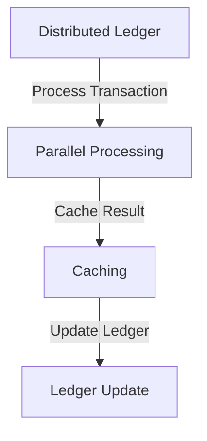
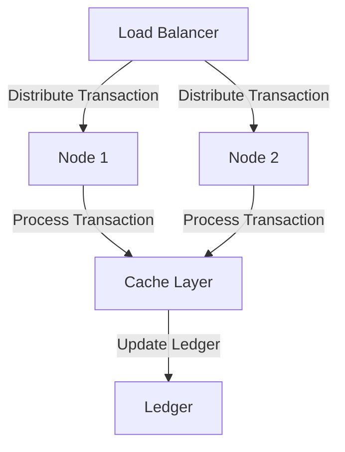

The double-entry ledger is a fundamental concept in accounting, where every financial transaction is recorded twice, once as a debit and once as a credit. This system ensures that the accounting equation (Assets = Liabilities + Equity) always holds true. However, as financial systems grow and become more complex, the double-entry ledger can become a bottleneck, hindering performance and reliability. In this article, we will explore strategies for optimizing the double-entry ledger for extreme performance and reliability, with a focus on fintech applications, such as those using Stripe for payment processing.

## Table of Contents
1. [Introduction to Double-Entry Ledger](#introduction-to-double-entry-ledger)
2. [Challenges in Double-Entry Ledger](#challenges-in-double-entry-ledger)
3. [Optimization Strategies](#optimization-strategies)
4. [Architecture for High-Performance Ledger](#architecture-for-high-performance-ledger)
5. [Implementing Compliance and Security](#implementing-compliance-and-security)
6. [Visual Insights Gallery](#visual-insights-gallery)
7. [Summary and Conclusion](#summary-and-conclusion)
8. [FAQ](#faq)

## Introduction to Double-Entry Ledger
The double-entry ledger system has been the cornerstone of accounting for centuries. It provides a robust framework for recording financial transactions, ensuring that the books always balance. However, with the increasing volume and velocity of financial transactions, the traditional double-entry ledger system can become a performance bottleneck.


## Challenges in Double-Entry Ledger
The double-entry ledger system faces several challenges in modern fintech applications:
- **Scalability**: As the volume of transactions increases, the ledger system must be able to handle the load without compromising performance.
- **Concurrency**: Multiple transactions may occur simultaneously, requiring the ledger system to handle concurrent updates efficiently.
- **Data Consistency**: Ensuring that the ledger remains consistent and balanced across all transactions is crucial.

```markdown
| Challenge | Description |
| --- | --- |
| Scalability | Handle increasing volume of transactions |
| Concurrency | Manage simultaneous transactions efficiently |
| Data Consistency | Ensure ledger balance and consistency |
```

## Optimization Strategies
To optimize the double-entry ledger for extreme performance and reliability, several strategies can be employed:
- **Distributed Ledger**: Implement a distributed ledger system, where multiple nodes work together to process transactions.
- **Parallel Processing**: Utilize parallel processing techniques to handle multiple transactions concurrently.
- **Caching**: Implement caching mechanisms to reduce the load on the ledger system.



## Architecture for High-Performance Ledger
A high-performance ledger architecture should include the following components:
- **Load Balancer**: Distributes incoming transactions across multiple nodes.
- **Node Cluster**: A cluster of nodes that process transactions in parallel.
- **Cache Layer**: A caching layer to reduce the load on the ledger system.



## Implementing Compliance and Security
Compliance and security are critical aspects of any fintech application. To ensure compliance with regulations, such as those related to Stripe, and to maintain the security of the ledger system:
- **Access Control**: Implement strict access controls to ensure that only authorized personnel can access the ledger system.
- **Encryption**: Encrypt all data, both in transit and at rest, to prevent unauthorized access.
- **Auditing**: Regularly audit the ledger system to ensure compliance with regulations.

> **Tip:** Regularly review and update compliance and security measures to ensure the ledger system remains secure and compliant.

## Visual Insights Gallery
The following images provide visual insights into the optimization of the double-entry ledger:


## Summary and Conclusion
Optimizing the double-entry ledger for extreme performance and reliability is crucial for modern fintech applications. By employing strategies such as distributed ledger, parallel processing, and caching, and by implementing a high-performance architecture, the ledger system can handle increasing volumes of transactions while maintaining data consistency and compliance with regulations.

## FAQ
Q: What is the primary challenge in optimizing the double-entry ledger?
A: The primary challenge is to handle the increasing volume and velocity of financial transactions while maintaining data consistency and compliance with regulations.
Q: How can the double-entry ledger be optimized for extreme performance?
A: The double-entry ledger can be optimized by employing strategies such as distributed ledger, parallel processing, and caching, and by implementing a high-performance architecture.
Q: What are the key components of a high-performance ledger architecture?
A: The key components of a high-performance ledger architecture include a load balancer, a node cluster, and a cache layer.