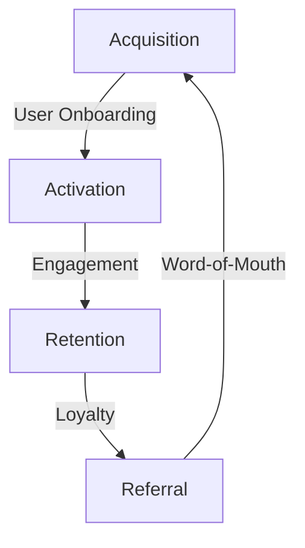
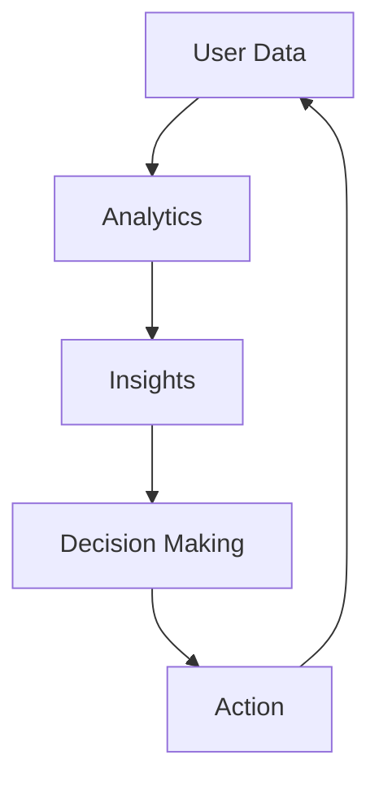

The growth loop is a critical component of any successful business, particularly in the SaaS and B2B markets. It's a cyclical process that fuels customer acquisition, retention, and ultimately, revenue growth. In this article, we'll delve into the world of growth loops, exploring strategies for optimization, performance, and reliability.

## Table of Contents
1. [Introduction to Growth Loops](#introduction-to-growth-loops)
2. [Understanding the Growth Loop Architecture](#understanding-the-growth-loop-architecture)
3. [Optimizing the Growth Loop for Performance](#optimizing-the-growth-loop-for-performance)
4. [Ensuring Reliability in the Growth Loop](#ensuring-reliability-in-the-growth-loop)
5. [Visual Insights Gallery](#visual-insights-gallery)
6. [Summary and Conclusion](#summary-and-conclusion)
7. [FAQ](#faq)

## Introduction to Growth Loops
A growth loop is a self-reinforcing cycle that drives user acquisition, engagement, and retention. It's a complex process that involves multiple stakeholders, including marketing, sales, and customer success teams. 

> **Note:** A well-designed growth loop can lead to exponential growth, while a poorly designed one can result in stagnation.

## Understanding the Growth Loop Architecture
The growth loop architecture consists of four primary components: acquisition, activation, retention, and referral. Each component plays a critical role in the overall growth loop.

> **Tip:** Focus on creating a seamless user experience across all components to maximize growth loop efficiency.

## Understanding Growth Loop Data Architecture
The data architecture of a growth loop is equally important, as it enables the collection, analysis, and actionability of data across the loop.

> **Interview:** "Data is the lifeblood of any growth loop. Without it, you're flying blind," says John Doe, Growth Hacker at XYZ Corporation.

## Optimizing the Growth Loop for Performance
Optimizing the growth loop for performance involves identifying bottlenecks, streamlining processes, and leveraging data-driven decision making.

| Component | Optimization Strategy |
| --- | --- |
| Acquisition | Targeted Marketing Campaigns |
| Activation | Streamlined User Onboarding |
| Retention | Personalized Engagement |
| Referral | Incentivized Loyalty Programs |

## Ensuring Reliability in the Growth Loop
Ensuring reliability in the growth loop involves implementing robust processes, monitoring key performance indicators (KPIs), and maintaining a customer-centric approach.

> **Warning:** Neglecting reliability can lead to growth stagnation and customer churn.

## Visual Insights Gallery
## Visual Insights Gallery

## Summary and Conclusion
Optimizing the growth loop for extreme performance and reliability is crucial for businesses seeking exponential growth. By understanding the growth loop architecture, optimizing for performance, and ensuring reliability, businesses can create a self-reinforcing cycle that drives customer acquisition, retention, and revenue growth.

## FAQ
1. What is a growth loop?
A growth loop is a self-reinforcing cycle that drives user acquisition, engagement, and retention.
2. What are the primary components of a growth loop?
The primary components of a growth loop are acquisition, activation, retention, and referral.
3. How can I optimize my growth loop for performance?
Optimize your growth loop by identifying bottlenecks, streamlining processes, and leveraging data-driven decision making.