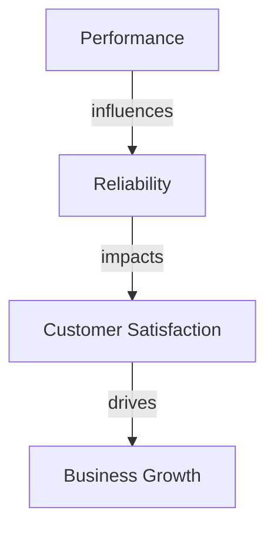
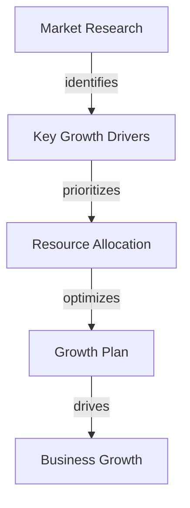

In today's fast-paced business landscape, startups and SaaS companies are constantly striving to outperform their competitors and achieve extreme growth. However, this pursuit of growth often comes with the risk of compromising performance and reliability. In this article, we will delve into the strategies and techniques for optimizing your growth plan to achieve extreme performance and reliability.

## Table of Contents
1. [Introduction to Growth Planning](#introduction-to-growth-planning)
2. [Understanding Performance and Reliability](#understanding-performance-and-reliability)
3. [Identifying Key Growth Drivers](#identifying-key-growth-drivers)
4. [Optimizing Your Growth Plan](#optimizing-your-growth-plan)
5. [Implementing a Data-Driven Approach](#implementing-a-data-driven-approach)
6. [Visual Insights Gallery](#visual-insights-gallery)
7. [Summary and Conclusion](#summary-and-conclusion)
8. [FAQ](#faq)

## Introduction to Growth Planning
Growth planning is a crucial aspect of any business strategy, as it enables companies to scale effectively and achieve their goals. A well-crafted growth plan takes into account various factors, including market trends, customer needs, and internal capabilities. 


## Understanding Performance and Reliability
Performance and reliability are two critical components of a successful growth plan. Performance refers to the ability of a system or process to deliver high-quality results, while reliability refers to its ability to maintain consistency and stability over time. 
```markdown
| **Performance Metrics** | **Reliability Metrics** |
| --- | --- |
| Response Time | Uptime |
| Throughput | Downtime |
| Error Rate | Mean Time To Recovery (MTTR) |
```
To illustrate the relationship between performance and reliability, consider the following Mermaid.js diagram:


## Identifying Key Growth Drivers
Identifying key growth drivers is essential for optimizing your growth plan. These drivers can include factors such as market trends, customer needs, and internal capabilities. 
> **Tip:** Conduct market research and analyze customer feedback to identify areas for improvement and opportunities for growth.

## Optimizing Your Growth Plan
Optimizing your growth plan involves aligning your strategies and resources with your key growth drivers. This can include investments in technology, talent, and processes. 
```markdown
// Example of a growth plan optimization
function optimizeGrowthPlan(drivers) {
  // Prioritize drivers based on impact and feasibility
  const prioritizedDrivers = drivers.sort((a, b) => b.impact - a.impact);
  
  // Allocate resources to prioritize drivers
  const allocatedResources = {};
  prioritizedDrivers.forEach((driver) => {
    allocatedResources[driver.name] = driver.resourceRequirement;
  });
  
  return allocatedResources;
}
```
The following Mermaid.js diagram illustrates the architecture of a growth plan optimization process:


## Implementing a Data-Driven Approach
Implementing a data-driven approach is critical for optimizing your growth plan. This involves collecting and analyzing data on your key growth drivers and using insights to inform your strategies and decisions. 
> **Interview:** "Data-driven decision making has been instrumental in our company's growth. By analyzing customer feedback and market trends, we've been able to identify areas for improvement and optimize our strategies for maximum impact." - CEO, XYZ Corporation

## Visual Insights Gallery
## Visual Insights Gallery
The following images provide visual insights into the concepts discussed in this article:


## Summary and Conclusion
In conclusion, optimizing your growth plan for extreme performance and reliability requires a deep understanding of your key growth drivers, performance and reliability metrics, and a data-driven approach to decision making. By implementing these strategies and techniques, you can achieve extreme growth and outperform your competitors in the market.

## FAQ
1. **What is growth planning?**
Growth planning is the process of developing strategies and plans to achieve business growth and scalability.
2. **Why is performance and reliability important?**
Performance and reliability are critical components of a successful growth plan, as they enable companies to deliver high-quality results and maintain consistency and stability over time.
3. **How can I identify key growth drivers?**
Conduct market research and analyze customer feedback to identify areas for improvement and opportunities for growth.
4. **What is a data-driven approach?**
A data-driven approach involves collecting and analyzing data to inform strategies and decisions.
5. **How can I optimize my growth plan?**
Optimize your growth plan by aligning your strategies and resources with your key growth drivers, investing in technology, talent, and processes, and implementing a data-driven approach to decision making.