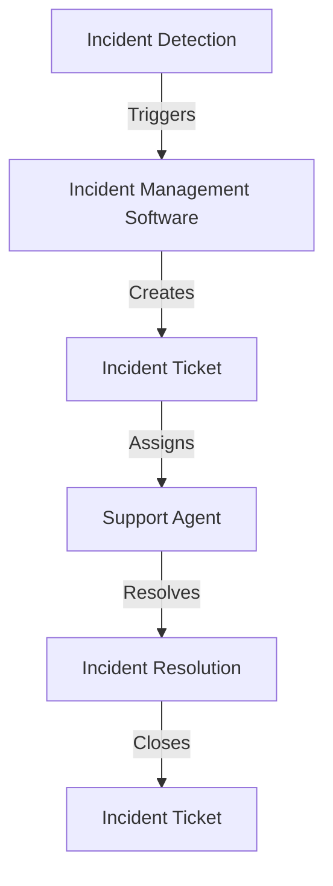

## Part 2: Advanced Incident Support Optimization for Extreme Performance and Reliability
Optimizing incident support for extreme performance and reliability requires a deep understanding of the underlying architecture and edge-cases that can impact the support process. In this article, we will delve into advanced strategies for optimizing incident support, including the use of artificial intelligence, machine learning, and data analytics to improve incident detection, resolution, and prevention.

## Advanced Incident Detection and Resolution
Advanced incident detection and resolution involve the use of cutting-edge technologies to identify and resolve incidents quickly and efficiently. This can include the use of AI-powered chatbots to provide initial support and triage, as well as machine learning algorithms to analyze incident data and identify patterns and trends.


## Incident Support Architecture
The incident support architecture refers to the underlying systems and processes that support the incident management process. This can include IT service management (ITSM) platforms, incident management software, and communication systems. A well-designed incident support architecture is critical for ensuring that incidents are detected, reported, and resolved quickly and efficiently.


## Real-World Case Studies
Several organizations have successfully implemented advanced incident support optimization strategies to improve their incident management processes. For example, a leading financial services company used AI-powered chatbots to provide initial support and triage, resulting in a 30% reduction in incident resolution time. Another company, a major e-commerce retailer, used machine learning algorithms to analyze incident data and identify patterns and trends, resulting in a 25% reduction in incident frequency.


## Data-Driven Incident Support
Data-driven incident support involves the use of data analytics to inform and improve the incident management process. This can include the use of metrics such as incident frequency, resolution time, and customer satisfaction to measure the effectiveness of the incident support process. By analyzing these metrics, organizations can identify areas for improvement and make data-driven decisions to optimize their incident support processes.
```markdown
| Metric | Description |
| --- | --- |
| Incident Frequency | The number of incidents reported per unit of time |
| Resolution Time | The time taken to resolve an incident |
| Customer Satisfaction | The level of satisfaction reported by customers |

## Edge-Cases and Emerging Trends
Several edge-cases and emerging trends are impacting the incident support landscape, including the use of cloud-based incident management software, the rise of remote work, and the increasing importance of cybersecurity. Organizations must be aware of these trends and edge-cases and adapt their incident support strategies accordingly.


## Visual Insights Gallery
The following images provide a visual representation of the concepts and strategies discussed in this article.
* 
* 
* 