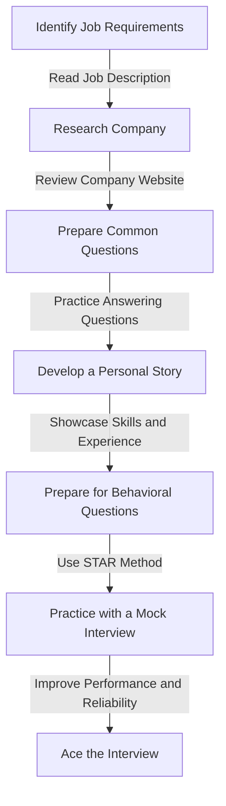
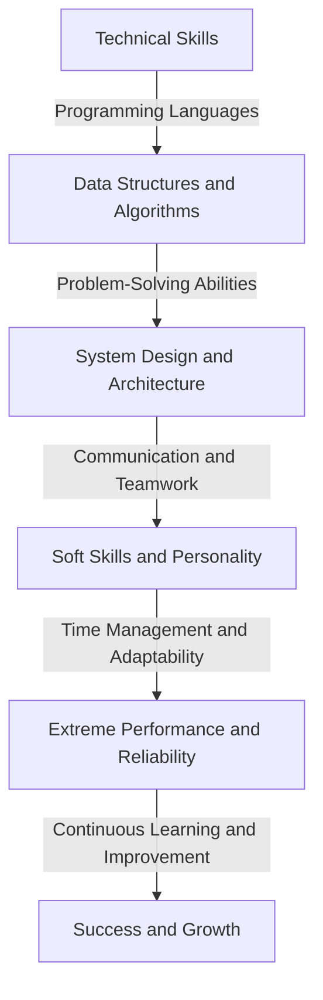

In today's fast-paced and competitive job market, acing an interview is crucial for landing your dream job. However, with the rise of remote work and the ever-increasing number of applicants, standing out from the crowd has become more challenging than ever. To help you succeed, we will delve into the world of optimizing interview patterns for extreme performance and reliability.

## Introduction to Interview Patterns
Interview patterns are a crucial aspect of any job interview. They help the interviewer assess your problem-solving skills, technical expertise, and ability to work under pressure. However, with the traditional interview format, it can be challenging to showcase your skills and personality. 


## Understanding the Importance of Optimization
Optimizing your interview pattern is essential to make a lasting impression on the interviewer. It helps you to:
* Showcase your skills and expertise
* Demonstrate your problem-solving abilities
* Build a strong rapport with the interviewer
* Increase your chances of getting hired
```markdown
| Benefits | Description |
| --- | --- |
| Improved Performance | Showcase your skills and expertise |
| Enhanced Reliability | Demonstrate your problem-solving abilities |
| Increased Confidence | Build a strong rapport with the interviewer |
```
> **Note:** Optimizing your interview pattern is not just about showcasing your technical skills, but also about demonstrating your soft skills, such as communication, teamwork, and problem-solving abilities.

## Flowchart for Interview Optimization
To optimize your interview pattern, you need to follow a structured approach. The following flowchart illustrates the steps involved in optimizing your interview pattern:

## Architecture for Extreme Performance
To achieve extreme performance and reliability in an interview, you need to have a solid architecture in place. The following diagram illustrates the architecture for extreme performance:

> **Warning:** A lack of preparation and practice can lead to poor performance and reliability in an interview. Make sure to practice regularly and seek feedback to improve your skills.

## Tips for Optimizing Interview Pattern
To optimize your interview pattern, follow these tips:
* Research the company and job requirements
* Practice common interview questions
* Develop a personal story and showcase your skills and experience
* Prepare for behavioral questions using the STAR method
* Practice with a mock interview to improve performance and reliability
```python
# Example code for practicing interview questions
def interview_practice():
    # Define a list of common interview questions
    questions = ["What are your strengths and weaknesses?", "Why do you want to work for this company?"]
    
    # Practice answering each question
    for question in questions:
        print("Question:", question)
        answer = input("Your answer: ")
        print("Feedback:", "Great answer!" if answer else "Please try again.")
```
> **Tip:** Use online resources, such as LeetCode and HackerRank, to practice coding challenges and improve your problem-solving skills.

## Visual Insights Gallery
Here are some visual insights to help you optimize your interview pattern:


## Summary and Conclusion
Optimizing your interview pattern is crucial to achieve extreme performance and reliability in a job interview. By following a structured approach, practicing regularly, and seeking feedback, you can improve your chances of getting hired. Remember to research the company and job requirements, practice common interview questions, and develop a personal story to showcase your skills and experience.

## FAQ
Q: What is the most important aspect of an interview?
A: The most important aspect of an interview is to showcase your skills and expertise while demonstrating your problem-solving abilities and building a strong rapport with the interviewer.
Q: How can I prepare for common interview questions?
A: You can prepare for common interview questions by practicing with online resources, such as LeetCode and HackerRank, and seeking feedback from friends or mentors.
Q: What is the STAR method?
A: The STAR method is a framework for answering behavioral questions in an interview. It stands for Situation, Task, Action, and Result, and helps you to structure your answer in a clear and concise manner.