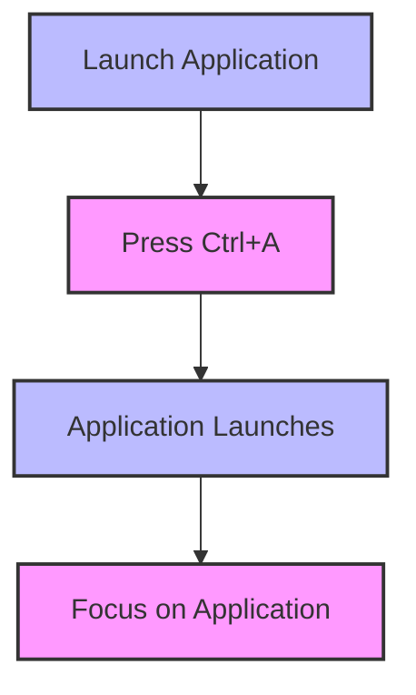

In today's fast-paced digital landscape, maximizing productivity is crucial for achieving success. One often overlooked yet powerful tool for boosting efficiency is the strategic use of keyboard shortcuts. By optimizing keyboard shortcuts, individuals can significantly enhance their performance and reliability, leading to increased productivity and reduced fatigue. In this article, we will delve into the world of keyboard shortcuts, exploring how to optimize them for extreme performance and reliability.

## Introduction to Keyboard Shortcuts
Keyboard shortcuts are combinations of keys that, when pressed simultaneously, perform specific actions. These shortcuts can range from simple tasks such as copying and pasting to complex operations like launching applications or switching between windows. By mastering keyboard shortcuts, users can navigate their digital environment more efficiently, minimizing the need for mouse interactions and streamlining their workflow.


## Understanding the Benefits of Optimized Keyboard Shortcuts
Optimizing keyboard shortcuts offers numerous benefits, including:
- **Increased Speed**: By reducing the need for mouse interactions, users can complete tasks more quickly.
- **Improved Accuracy**: Keyboard shortcuts minimize the risk of human error, as they can be programmed to perform precise actions.
- **Enhanced Productivity**: With optimized keyboard shortcuts, individuals can focus on high-priority tasks, leading to increased productivity and efficiency.
- **Reduced Fatigue**: By minimizing mouse interactions and keystrokes, users can reduce the risk of repetitive strain injuries and fatigue.

## Designing an Optimal Keyboard Shortcut Strategy
To design an optimal keyboard shortcut strategy, follow these steps:
1. **Identify Frequently Used Actions**: Determine which actions you perform most frequently and prioritize creating shortcuts for these tasks.
2. **Assign Logical Shortcuts**: Assign shortcuts that are easy to remember and logically related to the action they perform.
3. **Avoid Conflicts**: Ensure that your custom shortcuts do not conflict with existing system or application shortcuts.
4. **Test and Refine**: Test your shortcuts and refine them as needed to ensure they are efficient and effective.

```markdown
| Action | Default Shortcut | Custom Shortcut |
| --- | --- | --- |
| Copy | Ctrl+C | Ctrl+Shift+C |
| Paste | Ctrl+V | Ctrl+Shift+V |
| Launch Application | Ctrl+Shift+A | Ctrl+A |
```

## Implementing Keyboard Shortcuts with Mermaid.js
To visualize the flow of keyboard shortcuts, we can use Mermaid.js diagrams. The following diagram illustrates a basic flow for launching an application using a custom shortcut:


## Advanced Keyboard Shortcut Techniques
For advanced users, there are several techniques to further optimize keyboard shortcuts:
- **Layered Shortcuts**: Assign multiple shortcuts to a single key combination, with each layer performing a different action.
- **Context-Sensitive Shortcuts**: Create shortcuts that change behavior based on the current application or window.
- **Custom Macro Shortcuts**: Record and assign complex sequences of keystrokes to a single shortcut.

> **Tip:** Use a keyboard shortcut manager to streamline the process of creating and managing custom shortcuts.

## Visual Insights Gallery
## Visual Insights Gallery


## Summary and Conclusion
Optimizing keyboard shortcuts is a powerful way to boost productivity and efficiency. By understanding the benefits of optimized keyboard shortcuts, designing a strategic approach, and implementing advanced techniques, individuals can take their performance to the next level. Remember to continuously test and refine your shortcuts to ensure they remain effective and efficient.

## Frequently Asked Questions
1. **Q: What are the most common keyboard shortcuts?**
A: The most common keyboard shortcuts include Ctrl+C (copy), Ctrl+V (paste), and Ctrl+Z (undo).
2. **Q: How do I create custom keyboard shortcuts?**
A: The process for creating custom keyboard shortcuts varies depending on the operating system and application. Generally, you can access the keyboard shortcut settings through the system preferences or application settings.
3. **Q: Can I use keyboard shortcuts with a mouse?**
A: Yes, many keyboard shortcuts can be used in conjunction with a mouse. For example, you can use the Ctrl key to modify the behavior of a mouse click.