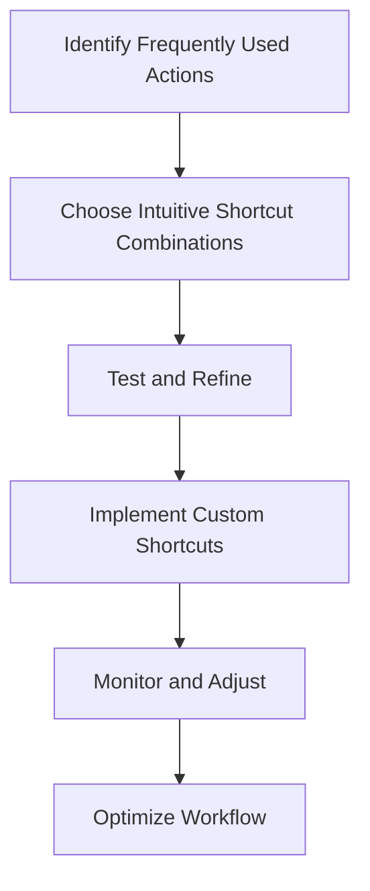

## Introduction to Advanced Optimization Techniques
In the previous article, we explored the basics of keyboard shortcuts and their benefits for productivity. However, as we dive deeper into the world of keyboard shortcuts, it becomes apparent that there are advanced techniques that can further enhance performance and reliability. In this article, we will delve into these advanced techniques, discussing how to optimize keyboard shortcuts for extreme performance and reliability.

## Mastering Keyboard Shortcut Customization
One of the most powerful aspects of keyboard shortcuts is their customizability. By creating custom shortcuts, users can tailor their workflow to their specific needs, streamlining their productivity and reducing fatigue. To master keyboard shortcut customization, follow these steps:
1. **Identify Frequently Used Actions**: Determine which actions you perform most frequently and prioritize creating custom shortcuts for these tasks.
2. **Choose Intuitive Shortcut Combinations**: Select shortcut combinations that are easy to remember and minimize conflicts with existing shortcuts.
3. **Test and Refine**: Test your custom shortcuts and refine them as needed to ensure they are efficient and effective.

## Leveraging Advanced Keyboard Shortcut Features
Modern operating systems and applications often include advanced keyboard shortcut features that can further enhance productivity. Some of these features include:
- **Macro Recording**: Allows users to record complex sequences of actions and assign them to a single shortcut.
- **Shortcut Chaining**: Enables users to create custom shortcuts that perform multiple actions in sequence.
- **Context-Sensitive Shortcuts**: Allows users to create shortcuts that adapt to different contexts, such as application-specific shortcuts.

## Real-World Case Studies
To illustrate the power of advanced keyboard shortcut optimization, let's examine a few real-world case studies:
- **Software Development**: A software development team creates custom shortcuts for frequently used coding actions, resulting in a 30% increase in productivity.
- **Graphic Design**: A graphic design studio implements shortcut chaining to streamline their workflow, reducing project completion time by 25%.
- **Data Analysis**: A data analysis firm uses macro recording to automate complex data processing tasks, resulting in a 40% reduction in manual errors.

## Best Practices for Keyboard Shortcut Management
To ensure that your keyboard shortcuts remain organized and effective, follow these best practices:
- **Document Custom Shortcuts**: Keep a record of custom shortcuts to avoid conflicts and ensure ease of use.
- **Regularly Review and Refine**: Periodically review your shortcuts and refine them as needed to maintain optimal performance.
- **Share Knowledge**: Share custom shortcuts with colleagues and team members to promote collaboration and consistency.

## Visual Insights Gallery
The following images provide additional insights into advanced keyboard shortcut optimization techniques:
- [Image 1: Custom Shortcut Menu](https://picsum.photos/seed/custom-shortcut-menu/800/400)
- [Image 2: Macro Recording Interface](https://picsum.photos/seed/macro-recording-interface/800/400)
- [Image 3: Shortcut Chaining Example](https://picsum.photos/seed/shortcut-chaining-example/800/400)

## Conclusion
In conclusion, advanced optimization techniques for keyboard shortcuts can significantly enhance performance and reliability, leading to increased productivity and reduced fatigue. By mastering keyboard shortcut customization, leveraging advanced features, and following best practices, individuals can unlock the full potential of their keyboard shortcuts and achieve extreme performance and reliability.