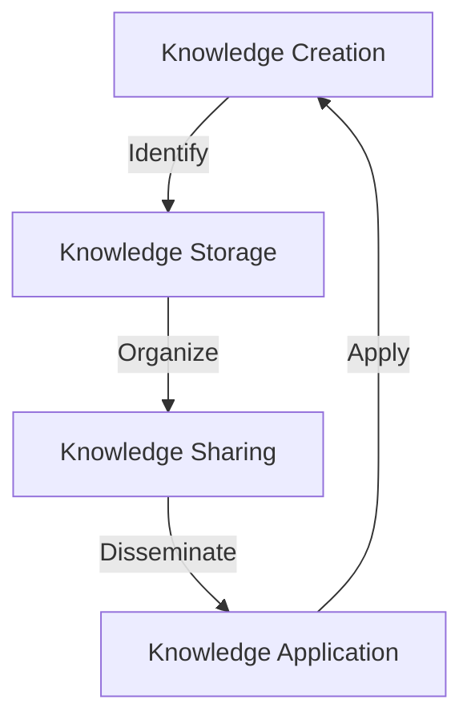
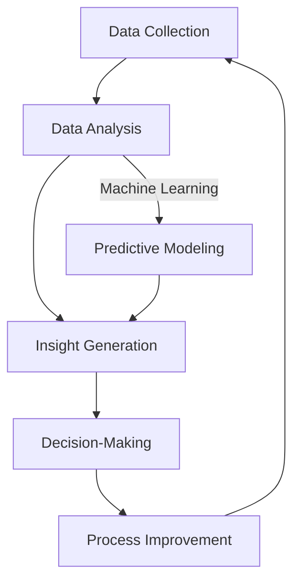

In today's fast-paced, information-driven world, effective knowledge management is crucial for achieving extreme performance and reliability. With the exponential growth of data and the increasing complexity of modern work environments, it's essential to develop a robust knowledge management system that streamlines information flow, enhances collaboration, and fosters a culture of continuous learning.

## Table of Contents
1. [Introduction to Knowledge Management](#introduction-to-knowledge-management)
2. [Understanding the Importance of Knowledge Management](#understanding-the-importance-of-knowledge-management)
3. [Designing an Effective Knowledge Management System](#designing-an-effective-knowledge-management-system)
4. [Implementing Automation and Analytics](#implementing-automation-and-analytics)
5. [Best Practices for Knowledge Management](#best-practices-for-knowledge-management)

## Introduction to Knowledge Management
Knowledge management refers to the process of creating, sharing, using, and managing the knowledge and information of an organization to achieve its objectives. It involves the identification, acquisition, organization, and dissemination of knowledge to improve efficiency, productivity, and innovation.


## Understanding the Importance of Knowledge Management
Effective knowledge management is critical for organizations to stay competitive, adapt to changing market conditions, and drive growth. It helps to:
* Improve decision-making by providing access to relevant information
* Enhance collaboration and communication among teams
* Increase innovation by sharing knowledge and expertise
* Reduce errors and improve quality by leveraging best practices
* Improve customer satisfaction by providing timely and accurate information

```markdown
| Benefits | Description |
| --- | --- |
| Improved Decision-Making | Access to relevant information |
| Enhanced Collaboration | Sharing knowledge and expertise |
| Increased Innovation | Leveraging best practices |
| Reduced Errors | Improving quality and accuracy |
| Improved Customer Satisfaction | Providing timely and accurate information |
```

## Designing an Effective Knowledge Management System
A well-designed knowledge management system should include the following components:
* **Knowledge Creation**: Identifying, acquiring, and generating new knowledge
* **Knowledge Storage**: Organizing and storing knowledge in a structured and accessible manner
* **Knowledge Sharing**: Disseminating knowledge to relevant stakeholders
* **Knowledge Application**: Using knowledge to improve processes, products, and services


## Implementing Automation and Analytics
Automation and analytics can significantly enhance the effectiveness of a knowledge management system. By leveraging tools such as artificial intelligence, machine learning, and data analytics, organizations can:
* Automate routine tasks and processes
* Analyze large datasets to identify trends and patterns
* Provide personalized recommendations and insights
* Improve search and retrieval of knowledge assets


## Best Practices for Knowledge Management
To ensure the success of a knowledge management system, organizations should follow these best practices:
> **Note:** Establish a clear knowledge management strategy and vision
> **Warning:** Ensure the system is user-friendly and accessible to all stakeholders
> **Tip:** Provide ongoing training and support to users
> **Interview:** Encourage feedback and continuous improvement

## Visual Insights Gallery
The following images illustrate the importance of knowledge management in different contexts:


## Summary and Conclusion
In conclusion, optimizing knowledge management is critical for achieving extreme performance and reliability in today's fast-paced and information-driven world. By designing an effective knowledge management system, implementing automation and analytics, and following best practices, organizations can improve decision-making, enhance collaboration, and drive innovation.

## FAQ
Q: What is knowledge management?
A: Knowledge management refers to the process of creating, sharing, using, and managing the knowledge and information of an organization to achieve its objectives.
Q: Why is knowledge management important?
A: Effective knowledge management is critical for organizations to stay competitive, adapt to changing market conditions, and drive growth.
Q: What are the components of a knowledge management system?
A: A well-designed knowledge management system should include knowledge creation, knowledge storage, knowledge sharing, and knowledge application.